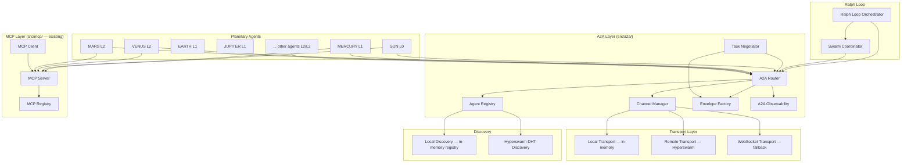

# Design Document: A2A/MCP Protocols for Decentralized Agent Coordination

## Overview

This design introduces a unified A2A (Agent-to-Agent) and MCP (Model Context Protocol) communication layer into Nova26. The layer sits between the Ralph Loop orchestrator and the individual Planetary Agents, enabling direct peer-to-peer messaging, standardized tool access, and decentralized swarm coordination.

The design builds on existing modules rather than replacing them:
- `src/mcp/` — existing MCP client/server with JSON-RPC, tool registry, and transport support
- `src/acp/` — existing Agent Client Protocol with capability discovery and session management
- `src/agents/protocol.ts` — existing in-memory message bus for agent communication
- `src/swarm/swarm-mode.ts` — existing SwarmOrchestrator with dependency scheduling
- `src/hypercore/` — P2P Hypercore layer with Hyperswarm/DHT discovery (from p2p-hypercore-protocol spec)
- `src/orchestrator/hierarchy-config.ts` — L0-L3 tier hierarchy configuration

The new `src/a2a/` module wraps these into a standards-compliant A2A+MCP layer. Local (same-process) communication uses the existing in-memory message bus. Remote (cross-device) communication uses Hyperswarm streams or WebSocket transport. MCP tool/resource sharing is unified across all 21 Planetary Agents through the existing MCP server infrastructure.

### Key Design Decisions

1. **Composition over replacement**: The A2A layer wraps the existing message bus (`src/agents/protocol.ts`) and ACP client/server (`src/acp/`). Existing code continues to work unchanged.
2. **Agent Cards extend ACP descriptors**: Agent_Cards are a superset of the existing `ACPAgentDescriptor`, adding tier level, endpoint info, and A2A protocol version.
3. **Dual transport**: Local agents communicate via in-memory channels (zero-copy). Remote agents communicate via Hyperswarm streams (reusing the P2P Hypercore infrastructure) or WebSocket fallback.
4. **MCP as the tool layer**: All agent tools are exposed through the existing MCP server. A2A handles messaging; MCP handles tool invocation. Clean separation of concerns.
5. **Tier enforcement at the router level**: The A2A_Router checks tier permissions before delivering messages, using the existing hierarchy config from `src/orchestrator/hierarchy-config.ts`.
6. **Sandbox tagging via Agent_Card metadata**: Sandbox boundaries are encoded in Agent_Card metadata, checked by the router on every message delivery.

## Architecture



### Data Flow

1. **Agent registration**: On startup, each Planetary Agent creates an Agent_Card and registers with the Agent_Registry. The registry stores it locally and optionally announces it via Hyperswarm DHT.
2. **Direct messaging**: Agent A creates an A2A_Envelope via the Envelope Factory, sends it to the A2A_Router. The router checks tier permissions, resolves the target via the Agent_Registry, and delivers via the Channel Manager (local or remote transport).
3. **Tool invocation**: Agent A discovers tools via MCP_Client → MCP_Server. Tool calls are routed to the source agent's registered handler. This is separate from A2A messaging.
4. **Task negotiation**: Agent A sends a "task-proposal" envelope to Agent B. Agent B responds with "task-accept" or "task-reject". The Task Negotiator tracks proposal state and deadlines.
5. **Swarm coordination**: Ralph Loop triggers the Swarm_Coordinator, which broadcasts task proposals via A2A, collects acceptances, assigns sub-tasks, and aggregates results.
6. **CRDT sync**: CRDT updates are wrapped in A2A envelopes with "stream-data" type and broadcast to all connected agents via the CRDT_Sync_Channel.

## Components and Interfaces

### AgentCard (src/a2a/types.ts)

Extends the existing `ACPAgentDescriptor` with A2A-specific fields.

```typescript
interface AgentCard {
  // Identity
  id: string;                          // e.g., "sun", "mercury", "venus"
  name: string;                        // e.g., "SUN", "MERCURY"
  version: string;                     // semver
  description: string;

  // A2A-specific
  tier: AgentTier;                     // 0 | 1 | 2 | 3
  protocols: string[];                 // ["a2a/1.0", "mcp/2024-11-05"]
  endpoints: AgentEndpoint[];          // local and/or remote endpoints
  capabilities: CapabilityDescriptor[];
  revision: number;                    // incremented on update

  // Metadata
  sandboxId?: string;                  // if running inside a sandbox
  origin: 'local' | 'remote';
  lastSeenAt: number;                  // unix timestamp
}

type AgentTier = 0 | 1 | 2 | 3;

interface AgentEndpoint {
  transport: 'local' | 'hyperswarm' | 'websocket';
  address?: string;                    // URL or Hyperswarm topic key
}

interface CapabilityDescriptor {
  id: string;                          // e.g., "codegen.react", "schema.design"
  name: string;
  description: string;
  inputSchema: unknown;                // JSON Schema
  outputSchema: unknown;
}
```

### A2AEnvelope (src/a2a/types.ts)

Standardized message wrapper for all A2A communication.

```typescript
interface A2AEnvelope {
  id: string;                          // unique message ID
  schemaVersion: number;               // currently 1
  sender: string;                      // agent ID
  recipient: string;                   // agent ID or "*" for broadcast
  correlationId?: string;              // thread/conversation ID
  type: A2AMessageType;
  timestamp: number;                   // unix ms
  payload: unknown;                    // message-type-specific data
  metadata?: {
    tier: AgentTier;                   // sender's tier
    sandboxId?: string;                // sender's sandbox
    routingHint?: 'capability';        // if recipient is a capability ID
  };
}

type A2AMessageType =
  | 'request'
  | 'response'
  | 'notification'
  | 'task-proposal'
  | 'task-accept'
  | 'task-reject'
  | 'stream-start'
  | 'stream-data'
  | 'stream-end'
  | 'error';
```

### AgentRegistry (src/a2a/registry.ts)

Manages Agent_Card storage, lookup, and distributed discovery.

```typescript
interface AgentRegistry {
  register(card: AgentCard): void;
  unregister(agentId: string): boolean;
  getById(agentId: string): AgentCard | undefined;
  findByCapability(capabilityId: string): AgentCard[];
  findByTier(tier: AgentTier): AgentCard[];
  listAll(): AgentCard[];
  getLocalCards(): AgentCard[];
  getRemoteCards(): AgentCard[];

  // Distributed discovery
  enableHyperswarmDiscovery(manager: HypercoreManager): Promise<void>;
  disableHyperswarmDiscovery(): Promise<void>;

  // Serialization
  serialize(): string;                 // JSON
  static deserialize(json: string): AgentRegistry;
}
```

### A2ARouter (src/a2a/router.ts)

Routes envelopes to the correct agent with tier and sandbox enforcement.

```typescript
interface A2ARouter {
  send(envelope: A2AEnvelope): Promise<RoutingResult>;
  onReceive(agentId: string, handler: (envelope: A2AEnvelope) => void): () => void;

  // Configuration
  setTierConfig(config: TierRoutingConfig): void;
  setSandboxConfig(config: SandboxRoutingConfig): void;
}

interface RoutingResult {
  delivered: boolean;
  path: 'local' | 'remote' | 'broadcast';
  targetAgentId: string | '*';
  latencyMs: number;
  error?: string;
}

interface TierRoutingConfig {
  rules: TierRule[];
}

interface TierRule {
  sourceTier: AgentTier;
  allowedTargetTiers: AgentTier[];
  requiresEscalationJustification: boolean;
}

interface SandboxRoutingConfig {
  enforced: boolean;
  crossSandboxAllowList: string[];     // agent IDs allowed cross-sandbox
}
```

### A2AChannel (src/a2a/channel.ts)

Bidirectional communication link between two agents.

```typescript
type ChannelStatus = 'connecting' | 'open' | 'reconnecting' | 'closed';

interface A2AChannel {
  readonly id: string;
  readonly localAgentId: string;
  readonly remoteAgentId: string;
  readonly status: ChannelStatus;
  readonly transport: 'local' | 'hyperswarm' | 'websocket';

  send(envelope: A2AEnvelope): Promise<void>;
  onMessage(handler: (envelope: A2AEnvelope) => void): () => void;
  close(): Promise<void>;
}

interface ChannelManager {
  openChannel(localAgentId: string, remoteAgentId: string): Promise<A2AChannel>;
  getChannel(channelId: string): A2AChannel | undefined;
  listChannels(): A2AChannel[];
  closeAll(): Promise<void>;
}
```

### TaskNegotiator (src/a2a/task-negotiator.ts)

Manages task proposal/accept/reject flows.

```typescript
interface TaskProposal {
  proposalId: string;
  taskDescription: string;
  requiredCapabilities: string[];
  estimatedComplexity: 'simple' | 'medium' | 'complex';
  deadlineMs: number;                  // response deadline
  proposerAgentId: string;
  status: 'pending' | 'accepted' | 'rejected' | 'timed-out';
  acceptedBy?: string;
  rejectionReason?: string;
  alternativeSuggestion?: string;
  correlationId: string;
}

interface TaskNegotiator {
  propose(proposal: Omit<TaskProposal, 'proposalId' | 'status' | 'correlationId'>): Promise<TaskProposal>;
  accept(proposalId: string, estimatedCompletionMs: number): Promise<void>;
  reject(proposalId: string, reason: string, alternative?: string): Promise<void>;
  getProposal(proposalId: string): TaskProposal | undefined;
  listPending(): TaskProposal[];
  onProposalReceived(handler: (proposal: TaskProposal) => void): () => void;
}
```

### SwarmCoordinator (src/a2a/swarm-coordinator.ts)

Decentralized swarm coordination using A2A messaging.

```typescript
interface SwarmSession {
  id: string;
  taskDescription: string;
  participants: string[];              // agent IDs
  subTasks: SwarmSubTask[];
  status: 'recruiting' | 'active' | 'completing' | 'completed' | 'failed';
  sharedState: Record<string, unknown>;
  createdAt: number;
}

interface SwarmSubTask {
  id: string;
  description: string;
  assignedAgent: string;
  requiredCapabilities: string[];
  status: 'pending' | 'running' | 'completed' | 'failed';
  result?: unknown;
}

interface SwarmCoordinator {
  createSwarm(taskDescription: string, requiredCapabilities: string[]): Promise<SwarmSession>;
  joinSwarm(swarmId: string, agentId: string): Promise<void>;
  completeSubTask(swarmId: string, subTaskId: string, result: unknown): Promise<void>;
  failSubTask(swarmId: string, subTaskId: string, error: string): Promise<void>;
  getSwarm(swarmId: string): SwarmSession | undefined;
  listActiveSwarms(): SwarmSession[];
}
```

### CRDTSyncChannel (src/a2a/crdt-sync.ts)

Specialized A2A channel for CRDT state propagation.

```typescript
interface CRDTSyncMessage {
  sourceAgentId: string;
  vectorClock: Record<string, number>;
  payload: unknown;                    // CRDT update data
  timestamp: number;
}

interface CRDTSyncChannel {
  broadcast(update: unknown, sourceAgentId: string): Promise<void>;
  onUpdate(handler: (message: CRDTSyncMessage) => void): () => void;
  getVectorClock(): Record<string, number>;
  close(): Promise<void>;
}
```

### A2AObservability (src/a2a/observability.ts)

Structured telemetry for all A2A and MCP operations.

```typescript
interface A2ALogEvent {
  type: 'message-sent' | 'message-received' | 'routing-decision' | 'tool-invocation' | 'error';
  envelopeId?: string;
  sender?: string;
  recipient?: string;
  messageType?: A2AMessageType;
  routingPath?: 'local' | 'remote' | 'broadcast';
  toolName?: string;
  duration?: number;
  success?: boolean;
  timestamp: number;
}

interface A2AMetrics {
  totalMessagesSent: number;
  totalMessagesReceived: number;
  messagesByType: Record<A2AMessageType, number>;
  averageRoutingLatencyMs: number;
  errorCount: number;
  totalToolInvocations: number;
  toolInvocationsByTool: Record<string, number>;
  averageToolDurationMs: number;
  toolErrorCount: number;
}

interface A2AObservability {
  emit(event: A2ALogEvent): void;
  getMetrics(): A2AMetrics;
  getRecentEvents(limit?: number): A2ALogEvent[];
  resetMetrics(): void;
}
```

## Data Models

### Zod Schemas (src/a2a/schemas.ts)

```typescript
import { z } from 'zod';

export const AgentTierSchema = z.union([
  z.literal(0), z.literal(1), z.literal(2), z.literal(3)
]);

export const AgentEndpointSchema = z.object({
  transport: z.enum(['local', 'hyperswarm', 'websocket']),
  address: z.string().optional(),
});

export const CapabilityDescriptorSchema = z.object({
  id: z.string(),
  name: z.string(),
  description: z.string(),
  inputSchema: z.unknown(),
  outputSchema: z.unknown(),
});

export const AgentCardSchema = z.object({
  id: z.string(),
  name: z.string(),
  version: z.string(),
  description: z.string(),
  tier: AgentTierSchema,
  protocols: z.array(z.string()),
  endpoints: z.array(AgentEndpointSchema),
  capabilities: z.array(CapabilityDescriptorSchema),
  revision: z.number().int().nonneg(),
  sandboxId: z.string().optional(),
  origin: z.enum(['local', 'remote']),
  lastSeenAt: z.number(),
});

export const A2AMessageTypeSchema = z.enum([
  'request', 'response', 'notification',
  'task-proposal', 'task-accept', 'task-reject',
  'stream-start', 'stream-data', 'stream-end', 'error',
]);

export const A2AEnvelopeSchema = z.object({
  id: z.string(),
  schemaVersion: z.number().int().positive(),
  sender: z.string(),
  recipient: z.string(),
  correlationId: z.string().optional(),
  type: A2AMessageTypeSchema,
  timestamp: z.number(),
  payload: z.unknown(),
  metadata: z.object({
    tier: AgentTierSchema,
    sandboxId: z.string().optional(),
    routingHint: z.literal('capability').optional(),
  }).optional(),
});

export const TaskProposalPayloadSchema = z.object({
  taskDescription: z.string(),
  requiredCapabilities: z.array(z.string()),
  estimatedComplexity: z.enum(['simple', 'medium', 'complex']),
  deadlineMs: z.number().positive(),
  estimatedCompletionMs: z.number().positive().optional(),
  rejectionReason: z.string().optional(),
  alternativeSuggestion: z.string().optional(),
});

export const CRDTSyncMessageSchema = z.object({
  sourceAgentId: z.string(),
  vectorClock: z.record(z.number()),
  payload: z.unknown(),
  timestamp: z.number(),
});

export const A2ALogEventSchema = z.object({
  type: z.enum(['message-sent', 'message-received', 'routing-decision', 'tool-invocation', 'error']),
  envelopeId: z.string().optional(),
  sender: z.string().optional(),
  recipient: z.string().optional(),
  messageType: A2AMessageTypeSchema.optional(),
  routingPath: z.enum(['local', 'remote', 'broadcast']).optional(),
  toolName: z.string().optional(),
  duration: z.number().optional(),
  success: z.boolean().optional(),
  timestamp: z.number(),
});

export const RoutingResultSchema = z.object({
  delivered: z.boolean(),
  path: z.enum(['local', 'remote', 'broadcast']),
  targetAgentId: z.string(),
  latencyMs: z.number(),
  error: z.string().optional(),
});

// Inferred types
export type AgentCard = z.infer<typeof AgentCardSchema>;
export type A2AEnvelope = z.infer<typeof A2AEnvelopeSchema>;
export type A2AMessageType = z.infer<typeof A2AMessageTypeSchema>;
export type AgentTier = z.infer<typeof AgentTierSchema>;
export type CapabilityDescriptor = z.infer<typeof CapabilityDescriptorSchema>;
export type TaskProposalPayload = z.infer<typeof TaskProposalPayloadSchema>;
export type CRDTSyncMessage = z.infer<typeof CRDTSyncMessageSchema>;
export type A2ALogEvent = z.infer<typeof A2ALogEventSchema>;
export type RoutingResult = z.infer<typeof RoutingResultSchema>;
```

### Default Tier Assignments

```typescript
// src/a2a/tier-config.ts
export const DEFAULT_TIER_ASSIGNMENTS: Record<string, AgentTier> = {
  sun: 0,           // L0 — Orchestrator
  mercury: 1,       // L1 — Strategic
  earth: 1,         // L1 — Strategic
  jupiter: 1,       // L1 — Strategic
  venus: 2,         // L2 — Operational
  mars: 2,          // L2 — Operational
  pluto: 2,         // L2 — Operational
  saturn: 2,        // L2 — Operational
  titan: 2,         // L2 — Operational
  enceladus: 3,     // L3 — Specialist
  ganymede: 3,      // L3 — Specialist
  neptune: 3,       // L3 — Specialist
  charon: 3,        // L3 — Specialist
  uranus: 3,        // L3 — Specialist
  europa: 3,        // L3 — Specialist
  mimas: 3,         // L3 — Specialist
  io: 3,            // L3 — Specialist
  triton: 3,        // L3 — Specialist
  callisto: 3,      // L3 — Specialist
  atlas: 3,         // L3 — Specialist
  andromeda: 3,     // L3 — Specialist
};

export const DEFAULT_TIER_RULES: TierRule[] = [
  { sourceTier: 0, allowedTargetTiers: [0, 1, 2, 3], requiresEscalationJustification: false },
  { sourceTier: 1, allowedTargetTiers: [0, 1],       requiresEscalationJustification: false },
  { sourceTier: 2, allowedTargetTiers: [0, 1, 2],    requiresEscalationJustification: true },
  { sourceTier: 3, allowedTargetTiers: [0, 1, 2, 3], requiresEscalationJustification: true },
];
```

### File Layout

```
src/a2a/
  types.ts              # AgentCard, A2AEnvelope, message types
  schemas.ts            # Zod schemas for validation
  tier-config.ts        # Default tier assignments and rules
  registry.ts           # AgentRegistry implementation
  router.ts             # A2ARouter with tier/sandbox enforcement
  channel.ts            # A2AChannel and ChannelManager
  envelope.ts           # EnvelopeFactory for creating envelopes
  task-negotiator.ts    # TaskNegotiator for proposal flows
  swarm-coordinator.ts  # SwarmCoordinator for decentralized swarms
  crdt-sync.ts          # CRDTSyncChannel for CRDT propagation
  observability.ts      # A2AObservability telemetry
  index.ts              # Public API exports
  __tests__/
    registry.test.ts
    registry.property.test.ts
    router.test.ts
    router.property.test.ts
    channel.test.ts
    envelope.test.ts
    envelope.property.test.ts
    task-negotiator.test.ts
    task-negotiator.property.test.ts
    swarm-coordinator.test.ts
    crdt-sync.test.ts
    crdt-sync.property.test.ts
    observability.test.ts
    observability.property.test.ts
    serialization.property.test.ts
```
