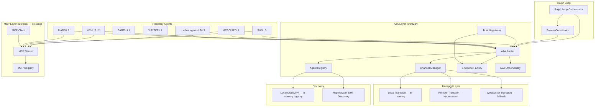

# Design Document: A2A/MCP Protocols for Decentralized Agent Coordination

## Overview

This design introduces a unified A2A (Agent-to-Agent) and MCP (Model Context Protocol) communication layer into Nova26. The layer sits between the Ralph Loop orchestrator and the individual Planetary Agents, enabling direct peer-to-peer messaging, standardized tool access, and decentralized swarm coordination.

The design builds on existing modules rather than replacing them:
- `src/mcp/` — existing MCP client/server with JSON-RPC, tool registry, and transport support
- `src/acp/` — existing Agent Client Protocol with capability discovery and session management
- `src/agents/protocol.ts` — existing in-memory message bus for agent communication
- `src/swarm/swarm-mode.ts` — existing SwarmOrchestrator with dependency scheduling
- `src/hypercore/` — P2P Hypercore layer with Hyperswarm/DHT discovery (from p2p-hypercore-protocol spec)
- `src/orchestrator/hierarchy-config.ts` — L0-L3 tier hierarchy configuration

The new `src/a2a/` module wraps these into a standards-compliant A2A+MCP layer. Local (same-process) communication uses the existing in-memory message bus. Remote (cross-device) communication uses Hyperswarm streams or WebSocket transport. MCP tool/resource sharing is unified across all 21 Planetary Agents through the existing MCP server infrastructure.

### Key Design Decisions

1. **Composition over replacement**: The A2A layer wraps the existing message bus (`src/agents/protocol.ts`) and ACP client/server (`src/acp/`). Existing code continues to work unchanged.
2. **Agent Cards extend ACP descriptors**: Agent_Cards are a superset of the existing `ACPAgentDescriptor`, adding tier level, endpoint info, and A2A protocol version.
3. **Dual transport**: Local agents communicate via in-memory channels (zero-copy). Remote agents communicate via Hyperswarm streams (reusing the P2P Hypercore infrastructure) or WebSocket fallback.
4. **MCP as the tool layer**: All agent tools are exposed through the existing MCP server. A2A handles messaging; MCP handles tool invocation. Clean separation of concerns.
5. **Tier enforcement at the router level**: The A2A_Router checks tier permissions before delivering messages, using the existing hierarchy config from `src/orchestrator/hierarchy-config.ts`.
6. **Sandbox tagging via Agent_Card metadata**: Sandbox boundaries are encoded in Agent_Card metadata, checked by the router on every message delivery.

## Architecture



### Data Flow

1. **Agent registration**: On startup, each Planetary Agent creates an Agent_Card and registers with the Agent_Registry. The registry stores it locally and optionally announces it via Hyperswarm DHT.
2. **Direct messaging**: Agent A creates an A2A_Envelope via the Envelope Factory, sends it to the A2A_Router. The router checks tier permissions, resolves the target via the Agent_Registry, and delivers via the Channel Manager (local or remote transport).
3. **Tool invocation**: Agent A discovers tools via MCP_Client → MCP_Server. Tool calls are routed to the source agent's registered handler. This is separate from A2A messaging.
4. **Task negotiation**: Agent A sends a "task-proposal" envelope to Agent B. Agent B responds with "task-accept" or "task-reject". The Task Negotiator tracks proposal state and deadlines.
5. **Swarm coordination**: Ralph Loop triggers the Swarm_Coordinator, which broadcasts task proposals via A2A, collects acceptances, assigns sub-tasks, and aggregates results.
6. **CRDT sync**: CRDT updates are wrapped in A2A envelopes with "stream-data" type and broadcast to all connected agents via the CRDT_Sync_Channel.

## Components and Interfaces

### AgentCard (src/a2a/types.ts)

Extends the existing `ACPAgentDescriptor` with A2A-specific fields.

```typescript
interface AgentCard {
  // Identity
  id: string;                          // e.g., "sun", "mercury", "venus"
  name: string;                        // e.g., "SUN", "MERCURY"
  version: string;                     // semver
  description: string;

  // A2A-specific
  tier: AgentTier;                     // 0 | 1 | 2 | 3
  protocols: string[];                 // ["a2a/1.0", "mcp/2024-11-05"]
  endpoints: AgentEndpoint[];          // local and/or remote endpoints
  capabilities: CapabilityDescriptor[];
  revision: number;                    // incremented on update

  // Metadata
  sandboxId?: string;                  // if running inside a sandbox
  origin: 'local' | 'remote';
  lastSeenAt: number;                  // unix timestamp
}

type AgentTier = 0 | 1 | 2 | 3;

interface AgentEndpoint {
  transport: 'local' | 'hyperswarm' | 'websocket';
  address?: string;                    // URL or Hyperswarm topic key
}

interface CapabilityDescriptor {
  id: string;                          // e.g., "codegen.react", "schema.design"
  name: string;
  description: string;
  inputSchema: unknown;                // JSON Schema
  outputSchema: unknown;
}
```

### A2AEnvelope (src/a2a/types.ts)

Standardized message wrapper for all A2A communication.

```typescript
interface A2AEnvelope {
  id: string;                          // unique message ID
  schemaVersion: number;               // currently 1
  sender: string;                      // agent ID
  recipient: string;                   // agent ID or "*" for broadcast
  correlationId?: string;              // thread/conversation ID
  type: A2AMessageType;
  timestamp: number;                   // unix ms
  payload: unknown;                    // message-type-specific data
  metadata?: {
    tier: AgentTier;                   // sender's tier
    sandboxId?: string;                // sender's sandbox
    routingHint?: 'capability';        // if recipient is a capability ID
  };
}

type A2AMessageType =
  | 'request'
  | 'response'
  | 'notification'
  | 'task-proposal'
  | 'task-accept'
  | 'task-reject'
  | 'stream-start'
  | 'stream-data'
  | 'stream-end'
  | 'error';
```

### AgentRegistry (src/a2a/registry.ts)

Manages Agent_Card storage, lookup, and distributed discovery.

```typescript
interface AgentRegistry {
  register(card: AgentCard): void;
  unregister(agentId: string): boolean;
  getById(agentId: string): AgentCard | undefined;
  findByCapability(capabilityId: string): AgentCard[];
  findByTier(tier: AgentTier): AgentCard[];
  listAll(): AgentCard[];
  getLocalCards(): AgentCard[];
  getRemoteCards(): AgentCard[];

  // Distributed discovery
  enableHyperswarmDiscovery(manager: HypercoreManager): Promise<void>;
  disableHyperswarmDiscovery(): Promise<void>;

  // Serialization
  serialize(): string;                 // JSON
  static deserialize(json: string): AgentRegistry;
}
```

### A2ARouter (src/a2a/router.ts)

Routes envelopes to the correct agent with tier and sandbox enforcement.

```typescript
interface A2ARouter {
  send(envelope: A2AEnvelope): Promise<RoutingResult>;
  onReceive(agentId: string, handler: (envelope: A2AEnvelope) => void): () => void;

  // Configuration
  setTierConfig(config: TierRoutingConfig): void;
  setSandboxConfig(config: SandboxRoutingConfig): void;
}

interface RoutingResult {
  delivered: boolean;
  path: 'local' | 'remote' | 'broadcast';
  targetAgentId: string | '*';
  latencyMs: number;
  error?: string;
}

interface TierRoutingConfig {
  rules: TierRule[];
}

interface TierRule {
  sourceTier: AgentTier;
  allowedTargetTiers: AgentTier[];
  requiresEscalationJustification: boolean;
}

interface SandboxRoutingConfig {
  enforced: boolean;
  crossSandboxAllowList: string[];     // agent IDs allowed cross-sandbox
}
```

### A2AChannel (src/a2a/channel.ts)

Bidirectional communication link between two agents.

```typescript
type ChannelStatus = 'connecting' | 'open' | 'reconnecting' | 'closed';

interface A2AChannel {
  readonly id: string;
  readonly localAgentId: string;
  readonly remoteAgentId: string;
  readonly status: ChannelStatus;
  readonly transport: 'local' | 'hyperswarm' | 'websocket';

  send(envelope: A2AEnvelope): Promise<void>;
  onMessage(handler: (envelope: A2AEnvelope) => void): () => void;
  close(): Promise<void>;
}

interface ChannelManager {
  openChannel(localAgentId: string, remoteAgentId: string): Promise<A2AChannel>;
  getChannel(channelId: string): A2AChannel | undefined;
  listChannels(): A2AChannel[];
  closeAll(): Promise<void>;
}
```

### TaskNegotiator (src/a2a/task-negotiator.ts)

Manages task proposal/accept/reject flows.

```typescript
interface TaskProposal {
  proposalId: string;
  taskDescription: string;
  requiredCapabilities: string[];
  estimatedComplexity: 'simple' | 'medium' | 'complex';
  deadlineMs: number;                  // response deadline
  proposerAgentId: string;
  status: 'pending' | 'accepted' | 'rejected' | 'timed-out';
  acceptedBy?: string;
  rejectionReason?: string;
  alternativeSuggestion?: string;
  correlationId: string;
}

interface TaskNegotiator {
  propose(proposal: Omit<TaskProposal, 'proposalId' | 'status' | 'correlationId'>): Promise<TaskProposal>;
  accept(proposalId: string, estimatedCompletionMs: number): Promise<void>;
  reject(proposalId: string, reason: string, alternative?: string): Promise<void>;
  getProposal(proposalId: string): TaskProposal | undefined;
  listPending(): TaskProposal[];
  onProposalReceived(handler: (proposal: TaskProposal) => void): () => void;
}
```

### SwarmCoordinator (src/a2a/swarm-coordinator.ts)

Decentralized swarm coordination using A2A messaging.

```typescript
interface SwarmSession {
  id: string;
  taskDescription: string;
  participants: string[];              // agent IDs
  subTasks: SwarmSubTask[];
  status: 'recruiting' | 'active' | 'completing' | 'completed' | 'failed';
  sharedState: Record<string, unknown>;
  createdAt: number;
}

interface SwarmSubTask {
  id: string;
  description: string;
  assignedAgent: string;
  requiredCapabilities: string[];
  status: 'pending' | 'running' | 'completed' | 'failed';
  result?: unknown;
}

interface SwarmCoordinator {
  createSwarm(taskDescription: string, requiredCapabilities: string[]): Promise<SwarmSession>;
  joinSwarm(swarmId: string, agentId: string): Promise<void>;
  completeSubTask(swarmId: string, subTaskId: string, result: unknown): Promise<void>;
  failSubTask(swarmId: string, subTaskId: string, error: string): Promise<void>;
  getSwarm(swarmId: string): SwarmSession | undefined;
  listActiveSwarms(): SwarmSession[];
}
```

### CRDTSyncChannel (src/a2a/crdt-sync.ts)

Specialized A2A channel for CRDT state propagation.

```typescript
interface CRDTSyncMessage {
  sourceAgentId: string;
  vectorClock: Record<string, number>;
  payload: unknown;                    // CRDT update data
  timestamp: number;
}

interface CRDTSyncChannel {
  broadcast(update: unknown, sourceAgentId: string): Promise<void>;
  onUpdate(handler: (message: CRDTSyncMessage) => void): () => void;
  getVectorClock(): Record<string, number>;
  close(): Promise<void>;
}
```

### A2AObservability (src/a2a/observability.ts)

Structured telemetry for all A2A and MCP operations.

```typescript
interface A2ALogEvent {
  type: 'message-sent' | 'message-received' | 'routing-decision' | 'tool-invocation' | 'error';
  envelopeId?: string;
  sender?: string;
  recipient?: string;
  messageType?: A2AMessageType;
  routingPath?: 'local' | 'remote' | 'broadcast';
  toolName?: string;
  duration?: number;
  success?: boolean;
  timestamp: number;
}

interface A2AMetrics {
  totalMessagesSent: number;
  totalMessagesReceived: number;
  messagesByType: Record<A2AMessageType, number>;
  averageRoutingLatencyMs: number;
  errorCount: number;
  totalToolInvocations: number;
  toolInvocationsByTool: Record<string, number>;
  averageToolDurationMs: number;
  toolErrorCount: number;
}

interface A2AObservability {
  emit(event: A2ALogEvent): void;
  getMetrics(): A2AMetrics;
  getRecentEvents(limit?: number): A2ALogEvent[];
  resetMetrics(): void;
}
```

## Data Models

### Zod Schemas (src/a2a/schemas.ts)

```typescript
import { z } from 'zod';

export const AgentTierSchema = z.union([
  z.literal(0), z.literal(1), z.literal(2), z.literal(3)
]);

export const AgentEndpointSchema = z.object({
  transport: z.enum(['local', 'hyperswarm', 'websocket']),
  address: z.string().optional(),
});

export const CapabilityDescriptorSchema = z.object({
  id: z.string(),
  name: z.string(),
  description: z.string(),
  inputSchema: z.unknown(),
  outputSchema: z.unknown(),
});

export const AgentCardSchema = z.object({
  id: z.string(),
  name: z.string(),
  version: z.string(),
  description: z.string(),
  tier: AgentTierSchema,
  protocols: z.array(z.string()),
  endpoints: z.array(AgentEndpointSchema),
  capabilities: z.array(CapabilityDescriptorSchema),
  revision: z.number().int().nonneg(),
  sandboxId: z.string().optional(),
  origin: z.enum(['local', 'remote']),
  lastSeenAt: z.number(),
});

export const A2AMessageTypeSchema = z.enum([
  'request', 'response', 'notification',
  'task-proposal', 'task-accept', 'task-reject',
  'stream-start', 'stream-data', 'stream-end', 'error',
]);

export const A2AEnvelopeSchema = z.object({
  id: z.string(),
  schemaVersion: z.number().int().positive(),
  sender: z.string(),
  recipient: z.string(),
  correlationId: z.string().optional(),
  type: A2AMessageTypeSchema,
  timestamp: z.number(),
  payload: z.unknown(),
  metadata: z.object({
    tier: AgentTierSchema,
    sandboxId: z.string().optional(),
    routingHint: z.literal('capability').optional(),
  }).optional(),
});

export const TaskProposalPayloadSchema = z.object({
  taskDescription: z.string(),
  requiredCapabilities: z.array(z.string()),
  estimatedComplexity: z.enum(['simple', 'medium', 'complex']),
  deadlineMs: z.number().positive(),
  estimatedCompletionMs: z.number().positive().optional(),
  rejectionReason: z.string().optional(),
  alternativeSuggestion: z.string().optional(),
});

export const CRDTSyncMessageSchema = z.object({
  sourceAgentId: z.string(),
  vectorClock: z.record(z.number()),
  payload: z.unknown(),
  timestamp: z.number(),
});

export const A2ALogEventSchema = z.object({
  type: z.enum(['message-sent', 'message-received', 'routing-decision', 'tool-invocation', 'error']),
  envelopeId: z.string().optional(),
  sender: z.string().optional(),
  recipient: z.string().optional(),
  messageType: A2AMessageTypeSchema.optional(),
  routingPath: z.enum(['local', 'remote', 'broadcast']).optional(),
  toolName: z.string().optional(),
  duration: z.number().optional(),
  success: z.boolean().optional(),
  timestamp: z.number(),
});

export const RoutingResultSchema = z.object({
  delivered: z.boolean(),
  path: z.enum(['local', 'remote', 'broadcast']),
  targetAgentId: z.string(),
  latencyMs: z.number(),
  error: z.string().optional(),
});

// Inferred types
export type AgentCard = z.infer<typeof AgentCardSchema>;
export type A2AEnvelope = z.infer<typeof A2AEnvelopeSchema>;
export type A2AMessageType = z.infer<typeof A2AMessageTypeSchema>;
export type AgentTier = z.infer<typeof AgentTierSchema>;
export type CapabilityDescriptor = z.infer<typeof CapabilityDescriptorSchema>;
export type TaskProposalPayload = z.infer<typeof TaskProposalPayloadSchema>;
export type CRDTSyncMessage = z.infer<typeof CRDTSyncMessageSchema>;
export type A2ALogEvent = z.infer<typeof A2ALogEventSchema>;
export type RoutingResult = z.infer<typeof RoutingResultSchema>;
```

### Default Tier Assignments

```typescript
// src/a2a/tier-config.ts
export const DEFAULT_TIER_ASSIGNMENTS: Record<string, AgentTier> = {
  sun: 0,           // L0 — Orchestrator
  mercury: 1,       // L1 — Strategic
  earth: 1,         // L1 — Strategic
  jupiter: 1,       // L1 — Strategic
  venus: 2,         // L2 — Operational
  mars: 2,          // L2 — Operational
  pluto: 2,         // L2 — Operational
  saturn: 2,        // L2 — Operational
  titan: 2,         // L2 — Operational
  enceladus: 3,     // L3 — Specialist
  ganymede: 3,      // L3 — Specialist
  neptune: 3,       // L3 — Specialist
  charon: 3,        // L3 — Specialist
  uranus: 3,        // L3 — Specialist
  europa: 3,        // L3 — Specialist
  mimas: 3,         // L3 — Specialist
  io: 3,            // L3 — Specialist
  triton: 3,        // L3 — Specialist
  callisto: 3,      // L3 — Specialist
  atlas: 3,         // L3 — Specialist
  andromeda: 3,     // L3 — Specialist
};

export const DEFAULT_TIER_RULES: TierRule[] = [
  { sourceTier: 0, allowedTargetTiers: [0, 1, 2, 3], requiresEscalationJustification: false },
  { sourceTier: 1, allowedTargetTiers: [0, 1],       requiresEscalationJustification: false },
  { sourceTier: 2, allowedTargetTiers: [0, 1, 2],    requiresEscalationJustification: true },
  { sourceTier: 3, allowedTargetTiers: [0, 1, 2, 3], requiresEscalationJustification: true },
];
```

### File Layout

```
src/a2a/
  types.ts              # AgentCard, A2AEnvelope, message types
  schemas.ts            # Zod schemas for validation
  tier-config.ts        # Default tier assignments and rules
  registry.ts           # AgentRegistry implementation
  router.ts             # A2ARouter with tier/sandbox enforcement
  channel.ts            # A2AChannel and ChannelManager
  envelope.ts           # EnvelopeFactory for creating envelopes
  task-negotiator.ts    # TaskNegotiator for proposal flows
  swarm-coordinator.ts  # SwarmCoordinator for decentralized swarms
  crdt-sync.ts          # CRDTSyncChannel for CRDT propagation
  observability.ts      # A2AObservability telemetry
  index.ts              # Public API exports
  __tests__/
    registry.test.ts
    registry.property.test.ts
    router.test.ts
    router.property.test.ts
    channel.test.ts
    envelope.test.ts
    envelope.property.test.ts
    task-negotiator.test.ts
    task-negotiator.property.test.ts
    swarm-coordinator.test.ts
    crdt-sync.test.ts
    crdt-sync.property.test.ts
    observability.test.ts
    observability.property.test.ts
    serialization.property.test.ts
```


## Correctness Properties

*A property is a characteristic or behavior that should hold true across all valid executions of a system — essentially, a formal statement about what the system should do. Properties serve as the bridge between human-readable specifications and machine-verifiable correctness guarantees.*

### Property 1: Agent Card registration and retrieval

*For any* valid AgentCard, registering it with the AgentRegistry and then querying by its identifier should return an equivalent AgentCard. Querying by a capability present in the card should include that card in the results.

**Validates: Requirements 1.1, 1.2, 1.3**

### Property 2: Agent Card validation rejects incomplete cards

*For any* AgentCard missing one or more required fields (identifier, name, version, tier, capabilities), the AgentRegistry should reject the registration with a descriptive error.

**Validates: Requirements 1.4**

### Property 3: Duplicate Agent Card updates revision

*For any* AgentCard registered twice with the same identifier but different data, the AgentRegistry should contain only one card for that identifier, with the updated data and a revision counter incremented by one.

**Validates: Requirements 1.5**

### Property 4: Agent Card serialization round trip

*For any* valid AgentCard, serializing to JSON and deserializing back should produce an equivalent AgentCard object.

**Validates: Requirements 1.6**

### Property 5: Remote Agent Card merge preserves origin

*For any* AgentCard received from a remote source, merging it into the local AgentRegistry should store it with origin set to "remote" and all original fields preserved.

**Validates: Requirements 1.8**

### Property 6: A2A Envelope structure and uniqueness

*For any* set of A2A_Envelopes created by the EnvelopeFactory, each envelope should have a unique message identifier, a positive timestamp, and all required fields (id, schemaVersion, sender, recipient, type, timestamp, payload).

**Validates: Requirements 2.1, 2.2, 13.6**

### Property 7: A2A Envelope serialization round trip

*For any* valid A2A_Envelope, serializing to JSON and deserializing back should produce an equivalent A2A_Envelope object, including the schemaVersion field.

**Validates: Requirements 2.3, 13.1, 13.2, 13.3**

### Property 8: Correlation threading

*For any* set of A2A_Envelopes sharing the same correlationId, querying the thread by that correlationId should return exactly those envelopes, in timestamp order.

**Validates: Requirements 2.4**

### Property 9: Message type validation

*For any* A2A_Envelope with a type from the valid set ("request", "response", "notification", "task-proposal", "task-accept", "task-reject", "stream-start", "stream-data", "stream-end", "error"), validation should succeed. For any envelope with a type outside this set, validation should fail.

**Validates: Requirements 2.5**

### Property 10: Channel state machine validity

*For any* A2A_Channel, the lifecycle transitions should follow: connecting → open (on acknowledgment), open → closed (on close), and open → reconnecting → open (on disconnect/reconnect). Invalid transitions should be rejected.

**Validates: Requirements 3.1, 3.2, 3.3**

### Property 11: Channel message ordering

*For any* open A2A_Channel and any sequence of N messages sent, the recipient should receive exactly N messages in the same order they were sent.

**Validates: Requirements 3.4**

### Property 12: Channel retry on failure

*For any* open A2A_Channel where message delivery fails, the channel should retry up to 3 times with each retry delay at least double the previous before emitting a failure event.

**Validates: Requirements 3.5**

### Property 13: Direct message routing

*For any* A2A_Envelope with a specific recipient identifier that exists in the AgentRegistry, the A2A_Router should deliver the envelope to exactly that agent.

**Validates: Requirements 4.1**

### Property 14: Broadcast delivery

*For any* A2A_Envelope with a broadcast marker ("*") and any set of N registered agents, the A2A_Router should deliver the envelope to all N agents.

**Validates: Requirements 4.2, 11.3**

### Property 15: Capability-based routing

*For any* A2A_Envelope targeting a capability (via routingHint), the A2A_Router should deliver the envelope to an agent whose AgentCard contains a matching CapabilityDescriptor.

**Validates: Requirements 4.3**

### Property 16: Tier-based routing enforcement

*For any* sender agent with tier T_s and recipient agent with tier T_r, the A2A_Router should allow delivery if and only if T_r is in the allowed target tiers for T_s according to the tier rules. Messages from L2/L3 agents to L0/L1 agents should require an escalation justification field.

**Validates: Requirements 4.5, 11.2**

### Property 17: Routing event emission

*For any* message routed by the A2A_Router, a routing event should be emitted containing the envelope identifier, source agent, target agent, routing path (local/remote/broadcast), and latency.

**Validates: Requirements 4.6, 12.3**

### Property 18: MCP tool registration and listing

*For any* set of tools registered from multiple agents, listing all tools should return exactly those tools with correct name, description, input/output schemas, and source agent identifier. Tool names should follow the "agentName.toolName" namespace pattern.

**Validates: Requirements 5.1, 5.2, 5.6**

### Property 19: MCP tool invocation routing

*For any* registered tool with a mock handler, invoking that tool via MCP should call the handler registered by the source agent and return the handler's result.

**Validates: Requirements 5.3**

### Property 20: MCP tool name uniqueness

*For any* attempt to register two tools with the same fully-qualified name (agentName.toolName), the second registration should be rejected with a descriptive error.

**Validates: Requirements 5.5**

### Property 21: MCP resource registration and read round trip

*For any* resource registered with a URI, name, MIME type, and content loader, reading that resource by URI should return the content produced by the loader with the correct MIME type.

**Validates: Requirements 6.1, 6.2**

### Property 22: MCP prompt template substitution

*For any* prompt template with N placeholders and a matching set of N arguments, requesting the prompt should produce a rendered string where all placeholders are replaced with the corresponding argument values.

**Validates: Requirements 6.4, 6.5**

### Property 23: Task negotiation message structure

*For any* task proposal, the proposal envelope should contain task description, required capabilities, estimated complexity, and deadline. Acceptance should contain the accepting agent's ID and estimated completion time. Rejection should contain a reason code.

**Validates: Requirements 7.1, 7.2, 7.3**

### Property 24: Task acceptance creates correlation thread

*For any* task proposal that is accepted, the proposal, acceptance, and all subsequent messages should share the same correlationId.

**Validates: Requirements 7.5**

### Property 25: Swarm broadcast to capable agents

*For any* swarm task with required capabilities, the Swarm_Coordinator should broadcast proposals only to agents whose AgentCards contain matching capabilities.

**Validates: Requirements 8.1**

### Property 26: Swarm sub-task assignment and state consistency

*For any* active swarm with N participants, each participant should be assigned at least one sub-task. Completing a sub-task should update the shared swarm state, and when all sub-tasks are completed, the swarm status should transition to "completed" with aggregated results.

**Validates: Requirements 8.2, 8.3, 8.4, 8.6**

### Property 27: CRDT update broadcast and apply round trip

*For any* CRDT update broadcast by an agent, all connected agents should receive the update and apply it to their local state. Each update message should contain a non-empty vector clock.

**Validates: Requirements 9.1, 9.2, 9.4**

### Property 28: CRDT concurrent update confluence

*For any* set of CRDT updates applied concurrently from different agents, the final state should be the same regardless of the order in which updates are applied (confluence property).

**Validates: Requirements 9.3**

### Property 29: Sandbox routing enforcement

*For any* sandbox configuration and any message from a sandboxed agent, delivery should succeed if and only if the target agent is in the same sandbox or on the sandbox's allowed communication list. Rejected messages should emit a security event.

**Validates: Requirements 10.1, 10.2**

### Property 30: Sandbox discovery filtering

*For any* sandboxed agent querying the AgentRegistry, the results should contain only agents within the same sandbox unless cross-sandbox access is explicitly granted.

**Validates: Requirements 10.3, 10.4**

### Property 31: Cross-tier audit logging

*For any* cross-tier message (sender tier ≠ recipient tier), the A2A_Router should log the communication with source tier, target tier, and message type.

**Validates: Requirements 11.4**

### Property 32: A2A message metrics accuracy

*For any* sequence of K messages sent and J messages received, the A2A metrics should report totalMessagesSent = K and totalMessagesReceived = J, with messagesByType counts matching the actual distribution.

**Validates: Requirements 12.1, 12.4**

### Property 33: MCP tool invocation metrics accuracy

*For any* sequence of N tool invocations, the MCP metrics should report totalToolInvocations = N, with per-tool counts matching the actual distribution.

**Validates: Requirements 12.2, 12.5**

### Property 34: MCP invocation record serialization round trip

*For any* valid MCP tool invocation record (tool name, arguments, result, duration), serializing to JSON and deserializing back should produce an equivalent record.

**Validates: Requirements 13.4, 13.5**

## Error Handling

### Error Types

| Error Code | Trigger | Response |
|---|---|---|
| `AGENT_NOT_FOUND` | Target agent ID not in registry (local or remote) | Return routing error with the unknown agent ID |
| `CAPABILITY_NOT_FOUND` | No agent matches the requested capability | Return routing error with the capability ID |
| `TIER_VIOLATION` | Message violates tier routing rules | Reject message, emit security event |
| `SANDBOX_VIOLATION` | Message crosses sandbox boundary without authorization | Reject message, emit security event |
| `ESCALATION_REQUIRED` | L2/L3 → L0/L1 proposal missing justification | Reject message with descriptive error |
| `CHANNEL_CLOSED` | Attempt to send on a closed channel | Return channel-closed error |
| `DELIVERY_FAILED` | Message delivery failed after all retries | Emit delivery failure event |
| `DUPLICATE_TOOL` | Tool registration with existing fully-qualified name | Reject registration with descriptive error |
| `INVALID_CARD` | Agent Card missing required fields | Reject registration with validation errors |
| `SCHEMA_VERSION_MISMATCH` | Deserialization encounters unknown schema version | Return error with expected vs actual version |
| `PROPOSAL_TIMEOUT` | Task proposal deadline expired without response | Mark proposal as timed-out, notify proposer |
| `CRDT_DESERIALIZATION_FAILED` | CRDT update payload cannot be deserialized | Log error with source agent, skip update |

### Error Recovery Strategies

1. **Channel disconnection**: Transition to "reconnecting", attempt re-establishment via Hyperswarm or WebSocket. If reconnection fails after configurable timeout, transition to "closed".
2. **Routing failure**: Check remote registry via Hyperswarm before returning error. If remote lookup also fails, return `AGENT_NOT_FOUND`.
3. **Swarm participant failure**: Reassign sub-task to another capable agent. If no capable agent is available, escalate to Ralph Loop.
4. **CRDT deserialization failure**: Log and skip the malformed update. Continue processing remaining updates. Do not halt synchronization.
5. **Tool invocation failure**: Return structured MCP error response. Do not retry tool calls (caller decides retry policy).

## Testing Strategy

### Property-Based Testing

Library: **fast-check** (already in project dependencies)

Each correctness property maps to a single property-based test with minimum 100 iterations. Tests are tagged with:

```
Feature: a2a-mcp-protocols, Property N: [property title]
```

Test file locations:
- `src/a2a/__tests__/registry.property.test.ts` — Properties 1-5 (Agent Card registry)
- `src/a2a/__tests__/envelope.property.test.ts` — Properties 6-9 (envelope structure/serialization)
- `src/a2a/__tests__/channel.property.test.ts` — Properties 10-12 (channel lifecycle)
- `src/a2a/__tests__/router.property.test.ts` — Properties 13-17 (routing)
- `src/a2a/__tests__/mcp-integration.property.test.ts` — Properties 18-22 (MCP tools/resources)
- `src/a2a/__tests__/task-negotiator.property.test.ts` — Properties 23-24 (task negotiation)
- `src/a2a/__tests__/swarm-coordinator.property.test.ts` — Properties 25-26 (swarm)
- `src/a2a/__tests__/crdt-sync.property.test.ts` — Properties 27-28 (CRDT)
- `src/a2a/__tests__/sandbox-routing.property.test.ts` — Properties 29-30 (sandbox)
- `src/a2a/__tests__/observability.property.test.ts` — Properties 31-34 (observability/metrics)

### Generators

Custom fast-check arbitraries needed:
- `arbAgentCard()` — generates valid AgentCard objects with random tiers, capabilities, endpoints
- `arbA2AEnvelope()` — generates valid A2A_Envelopes with random types, senders, recipients
- `arbCapabilityDescriptor()` — generates valid capability descriptors
- `arbTaskProposal()` — generates valid task proposal payloads
- `arbCRDTSyncMessage()` — generates valid CRDT sync messages with vector clocks
- `arbSandboxConfig()` — generates sandbox configurations with allow lists
- `arbTierPair()` — generates sender/recipient tier pairs for routing tests
- `arbMCPToolDefinition()` — generates valid MCP tool definitions with schemas

### Unit Testing

Unit tests complement property tests for specific examples and edge cases:
- Resource-not-found error (6.3)
- Schema version mismatch error (13.7)
- Channel reconnection on disconnect (3.7)
- Remote registry fallback (4.4)
- Task proposal timeout (7.4)
- Swarm participant failure and reassignment (8.5)
- CRDT deserialization failure skip (9.5)
- Default tier assignments match specification (11.1)
- Tool invocation error response structure (5.4)

### Integration Testing

Integration tests for cross-module behavior:
- Ralph Loop → Swarm Coordinator → A2A Router → Agent delivery
- MCP tool invocation across agents via A2A
- Hyperswarm-based remote agent discovery and channel establishment
- End-to-end CRDT sync between two agent instances
- Sandbox enforcement with real sandbox module integration
