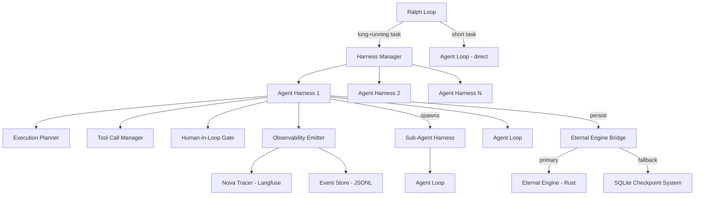
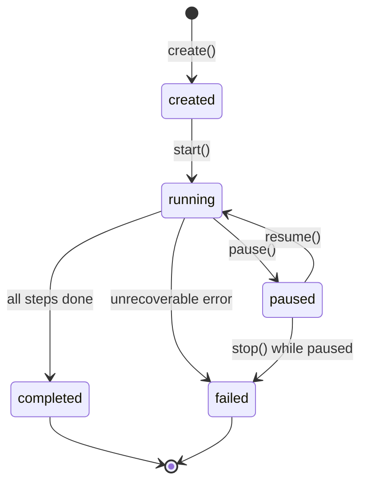

# Design Document: Agent Harnesses

## Overview

The Agent Harness layer introduces a durable execution wrapper around Nova26's 21 Planetary Agents for long-running tasks. It sits between the Ralph Loop orchestrator and the individual agent execution (AgentLoop), providing state persistence, tool call management, human-in-loop checkpoints, task decomposition, and sub-agent spawning.

The harness does not replace the existing AgentLoop or Ralph Loop — it wraps them. When a task is marked as long-running, the Ralph Loop delegates to the Harness_Manager instead of directly invoking the AgentLoop. The harness then manages the full lifecycle: planning, execution with checkpoints, persistence via the Eternal Engine bridge (with SQLite fallback), and observability emission.

### Key Design Decisions

1. **Composition over replacement**: The harness wraps the existing `AgentLoop` rather than replacing it. Short-lived tasks continue to use the direct path with zero overhead.
2. **Dual persistence strategy**: Primary persistence through the Eternal Engine (Rust FFI), with automatic fallback to the existing SQLite `checkpoint-system.ts` when the Rust core is unavailable.
3. **Autonomy-driven gating**: Human-in-loop checkpoints are controlled by the existing `AutonomyLevel` (1-5) system, requiring no new configuration surface.
4. **Event-sourced state**: Harness operations emit events through the existing `EventStore` pattern, enabling full replay and resumption.
5. **Bounded sub-agent depth**: Sub-agent spawning is capped at 3 levels to prevent unbounded recursion while still supporting meaningful delegation.

## Architecture



### Data Flow

1. Ralph Loop identifies a task as long-running (via task metadata or duration estimate)
2. Harness Manager creates an Agent Harness instance
3. Agent Harness produces an Execution Plan (decomposed steps)
4. For each step:
   a. Check autonomy level → insert Human-in-Loop Gate if needed
   b. Execute step via AgentLoop (or spawn Sub-Agent for different agent)
   c. Tool Call Manager handles tool invocations with retries
   d. Persist state checkpoint via Eternal Engine Bridge
   e. Emit observability events
5. On completion/failure, report result back to Ralph Loop

## Components and Interfaces

### HarnessManager

Central registry and lifecycle coordinator. Singleton accessed via `getHarnessManager()`.

```typescript
interface HarnessManager {
  create(agentName: string, task: Task, options?: HarnessOptions): AgentHarness;
  get(harnessId: string): AgentHarness | undefined;
  list(): HarnessInfo[];
  stop(harnessId: string): Promise<void>;
  resumeFromCheckpoint(harnessId: string): Promise<AgentHarness>;
}

interface HarnessOptions {
  autonomyLevel?: AutonomyLevel;
  maxToolCalls?: number;
  checkpointIntervalMs?: number;
  maxSubAgentDepth?: number;
  eternalEngineEnabled?: boolean;
}

interface HarnessInfo {
  id: string;
  agentName: string;
  taskId: string;
  status: HarnessStatus;
  createdAt: string;
  lastCheckpointAt: string | null;
  subAgentCount: number;
}
```

### AgentHarness

The core wrapper around a single agent execution.

```typescript
type HarnessStatus = 'created' | 'running' | 'paused' | 'completed' | 'failed';

interface AgentHarness {
  readonly id: string;
  readonly agentName: string;
  readonly status: HarnessStatus;

  start(): Promise<HarnessResult>;
  pause(): Promise<void>;
  resume(): Promise<HarnessResult>;
  stop(): Promise<void>;

  getState(): HarnessState;
  getPlan(): ExecutionPlan | null;
  getSubAgents(): HarnessInfo[];
}

interface HarnessResult {
  output: string;
  status: 'completed' | 'failed';
  stepsCompleted: number;
  totalSteps: number;
  toolCallCount: number;
  duration: number;
}
```

### HarnessState

Serializable snapshot of the full harness state.

```typescript
interface HarnessState {
  schemaVersion: number;       // Currently 1, for migration support
  harnessId: string;
  agentName: string;
  taskId: string;
  status: HarnessStatus;
  createdAt: string;
  updatedAt: string;

  // Execution plan
  plan: ExecutionPlan | null;
  currentStepIndex: number;

  // Tool call history
  toolCallHistory: ToolCallRecord[];
  totalToolCalls: number;

  // Sub-agent tracking
  subAgentIds: string[];
  subAgentResults: Record<string, SubAgentResult>;

  // Agent loop state (scratchpad, turns, etc.)
  agentLoopSnapshot: AgentLoopSnapshot | null;

  // Checkpoint metadata
  lastCheckpointAt: string | null;
  checkpointCount: number;
}
```

### ExecutionPlan

Structured decomposition of a long-running task.

```typescript
interface ExecutionPlan {
  taskId: string;
  steps: ExecutionStep[];
  createdAt: string;
}

interface ExecutionStep {
  id: string;
  description: string;
  assignedAgent: string;
  dependencies: string[];      // Step IDs
  critical: boolean;           // Triggers human-in-loop at autonomy level 3
  status: 'pending' | 'ready' | 'running' | 'completed' | 'failed' | 'blocked';
  output?: string;
  error?: string;
}
```

### ToolCallManager

Manages tool execution with retries, timeouts, and budget enforcement.

```typescript
interface ToolCallManager {
  execute(call: ToolCall, agentName: string, harnessId: string): Promise<ToolResult>;
  getRemainingBudget(): number;
  getHistory(): ToolCallRecord[];
}

interface ToolCallRecord {
  callName: string;
  arguments: Record<string, unknown>;
  result: ToolResult;
  duration: number;
  retryCount: number;
  timestamp: string;
}

interface ToolCallManagerConfig {
  maxRetries: number;          // Default 3
  baseBackoffMs: number;       // Default 1000
  timeoutMs: number;           // Default 30000
  maxTotalCalls: number;       // Default 100
}
```

### HumanInLoopGate

Checkpoint that pauses execution for human approval.

```typescript
interface HumanInLoopGate {
  readonly id: string;
  readonly stepId: string;
  readonly status: 'pending' | 'approved' | 'rejected';
  readonly createdAt: string;
  readonly resolvedAt: string | null;

  approve(): void;
  reject(reason: string): void;
  isPending(): boolean;
}
```

### EternalEngineBridge

TypeScript-to-Rust FFI interface for durable persistence.

```typescript
interface EternalEngineBridge {
  persist(harnessId: string, state: HarnessState): Promise<void>;
  restore(harnessId: string): Promise<HarnessState | null>;
  delete(harnessId: string): Promise<void>;
  isAvailable(): boolean;
}
```

When the Eternal Engine is unavailable, the bridge falls back to the existing `checkpoint-system.ts` SQLite storage, serializing `HarnessState` as JSON.

### ObservabilityEmitter

Structured telemetry emission using the existing NovaTracer and EventStore.

```typescript
interface ObservabilityEmitter {
  emitStateTransition(harnessId: string, from: HarnessStatus, to: HarnessStatus): void;
  emitToolCall(harnessId: string, toolName: string, duration: number, success: boolean): void;
  emitHumanGate(harnessId: string, gateId: string, action: 'waiting' | 'approved' | 'rejected', waitDuration?: number): void;
  emitSubAgent(harnessId: string, subAgentId: string, event: 'spawned' | 'completed' | 'failed'): void;
  emitCheckpoint(harnessId: string, checkpointNumber: number): void;
}
```

## Data Models

### Convex Schema Extension

New table for persisting harness metadata to the Convex dashboard:

```typescript
// Addition to convex/schema.ts
agentHarnesses: defineTable({
  harnessId: v.string(),
  agentName: v.string(),
  taskId: v.string(),
  status: v.union(
    v.literal('created'),
    v.literal('running'),
    v.literal('paused'),
    v.literal('completed'),
    v.literal('failed')
  ),
  stepsTotal: v.number(),
  stepsCompleted: v.number(),
  toolCallCount: v.number(),
  subAgentCount: v.number(),
  parentHarnessId: v.optional(v.string()),
  createdAt: v.string(),
  updatedAt: v.string(),
  completedAt: v.optional(v.string()),
  error: v.optional(v.string()),
}).index('by_harness_id', ['harnessId'])
  .index('by_status', ['status'])
  .index('by_agent', ['agentName'])
  .index('by_parent', ['parentHarnessId']),
```

### HarnessState JSON Schema (for persistence)

```json
{
  "schemaVersion": 1,
  "harnessId": "harness-abc123",
  "agentName": "MARS",
  "taskId": "p2-t1",
  "status": "running",
  "createdAt": "2026-02-20T10:00:00Z",
  "updatedAt": "2026-02-20T10:05:00Z",
  "plan": {
    "taskId": "p2-t1",
    "steps": [
      {
        "id": "step-1",
        "description": "Create data model",
        "assignedAgent": "PLUTO",
        "dependencies": [],
        "critical": false,
        "status": "completed",
        "output": "Schema created"
      },
      {
        "id": "step-2",
        "description": "Implement mutation",
        "assignedAgent": "MARS",
        "dependencies": ["step-1"],
        "critical": true,
        "status": "running"
      }
    ],
    "createdAt": "2026-02-20T10:00:00Z"
  },
  "currentStepIndex": 1,
  "toolCallHistory": [],
  "totalToolCalls": 0,
  "subAgentIds": ["harness-def456"],
  "subAgentResults": {},
  "agentLoopSnapshot": null,
  "lastCheckpointAt": "2026-02-20T10:05:00Z",
  "checkpointCount": 2
}
```

### State Machine



Valid transitions:
- `created → running`
- `running → paused`
- `running → completed`
- `running → failed`
- `paused → running`
- `paused → failed`

Invalid transitions (rejected with error):
- `completed → *` (terminal)
- `failed → *` (terminal)
- `created → paused` (must start first)
- `created → completed` (must execute)


## Correctness Properties

*A property is a characteristic or behavior that should hold true across all valid executions of a system — essentially, a formal statement about what the system should do. Properties serve as the bridge between human-readable specifications and machine-verifiable correctness guarantees.*

### Property 1: Harness state machine validity

*For any* Agent Harness and any sequence of lifecycle operations (start, pause, resume, stop), valid transitions should succeed and produce the expected target state, while invalid transitions (e.g., starting a completed harness, pausing a created harness) should be rejected with a descriptive error and leave the state unchanged.

**Validates: Requirements 1.2, 1.5, 1.7**

### Property 2: Pause/resume round-trip preserves state

*For any* running Agent Harness with arbitrary Harness_State, pausing and then resuming should produce a Harness_State equivalent to the state before pausing (excluding timestamps).

**Validates: Requirements 1.3, 1.4**

### Property 3: Harness creation invariants

*For any* valid agent name, creating a harness via the Harness_Manager should produce an instance with a unique identifier (distinct from all other harnesses), the correct agent name, and "created" status. The Harness_Manager listing should contain the newly created harness.

**Validates: Requirements 1.1, 1.6**

### Property 4: JSON serialization round-trip

*For any* valid Harness_State object, serializing to JSON and then deserializing should produce an equivalent Harness_State object (including schemaVersion, all tool call records, sub-agent results, and plan state).

**Validates: Requirements 9.3, 9.4**

### Property 5: Eternal Engine persistence round-trip

*For any* valid Harness_State object, persisting via the Eternal_Engine_Bridge and then restoring should produce an equivalent Harness_State object.

**Validates: Requirements 2.3**

### Property 6: Tool call permission enforcement

*For any* agent and any tool call, if the tool is not in the agent's permitted tool set, the Tool_Call_Manager should reject the call without executing it. If the tool is permitted, the call should proceed to execution.

**Validates: Requirements 3.1**

### Property 7: Tool call recording completeness

*For any* successful tool call, the Tool_Call_Manager should record an entry in the Harness_State containing the call name, arguments, result, and a positive duration.

**Validates: Requirements 3.2**

### Property 8: Tool call retry with exponential backoff

*For any* tool call that fails with a transient error, the Tool_Call_Manager should retry up to the configured maximum (default 3), with each retry delay being at least double the previous delay (exponential backoff).

**Validates: Requirements 3.3**

### Property 9: Tool call budget enforcement

*For any* per-harness budget limit N, after N tool calls have been executed, subsequent tool call requests should be rejected with a budget-exceeded error.

**Validates: Requirements 3.6**

### Property 10: Autonomy-level gate placement

*For any* Execution_Plan and any autonomy level, the number and placement of Human_In_Loop_Gates should match the autonomy rules: levels 1-2 gate every step, level 3 gates only critical steps, levels 4-5 gate no steps.

**Validates: Requirements 4.1, 4.2, 4.3**

### Property 11: Human-in-loop gate suspend behavior

*For any* Human_In_Loop_Gate that is reached during execution, the harness should persist state, emit a "waiting_for_human" event, and suspend. Approving should resume execution; rejecting should transition to "paused" with the rejection reason recorded.

**Validates: Requirements 4.4, 4.5, 4.6**

### Property 12: Execution plan step structure

*For any* Execution_Plan produced by the harness, every step should contain a unique step identifier, a non-empty description, a valid assigned agent name, a list of dependency step identifiers (all referencing other steps in the plan), and a criticality flag.

**Validates: Requirements 5.1, 5.2**

### Property 13: Dependency resolution correctness

*For any* Execution_Plan and any step that completes or fails, dependent steps should be updated correctly: completion should make dependents ready (if all their dependencies are done), and failure should mark all transitive dependents as blocked.

**Validates: Requirements 5.3, 5.4**

### Property 14: Plan completion triggers harness completion

*For any* Execution_Plan where all steps reach "completed" status, the Agent_Harness should transition to "completed" status and emit a "plan_completed" event.

**Validates: Requirements 5.5**

### Property 15: Sub-agent spawning and tracking

*For any* Execution_Plan step assigned to a different agent than the parent harness, a Sub_Agent harness should be spawned, and the parent should track it in its sub-agent list with the correct status.

**Validates: Requirements 6.1, 6.2**

### Property 16: Sub-agent result incorporation

*For any* completed Sub_Agent, the parent harness should incorporate the sub-agent's output into the corresponding step of the parent Execution_Plan.

**Validates: Requirements 6.3**

### Property 17: Sub-agent failure retry protocol

*For any* Sub_Agent that fails, the parent harness should retry exactly once with error context before marking the step as failed.

**Validates: Requirements 6.4**

### Property 18: Sub-agent depth enforcement

*For any* chain of nested sub-agent spawning, the Harness_Manager should reject spawning attempts that would exceed the configured maximum depth (default 3).

**Validates: Requirements 6.5**

### Property 19: Observability event completeness

*For any* harness operation (state transition, tool call, gate event, sub-agent lifecycle event), the Observability_Emitter should emit a structured event containing all required fields for that event type (harness ID, timestamp, and type-specific fields).

**Validates: Requirements 8.1, 8.2, 8.3, 8.4**

### Property 20: Ralph Loop integration — long-running task wrapping

*For any* task dispatched by the Ralph Loop that is marked as long-running, the Harness_Manager should wrap the execution in an Agent_Harness. For tasks not marked as long-running, the direct AgentLoop path should be used.

**Validates: Requirements 7.1, 7.2**

## Error Handling

### Eternal Engine Unavailability
When the Eternal Engine (Rust core) is not available (not compiled, FFI failure, etc.), the `EternalEngineBridge` falls back to the existing SQLite `checkpoint-system.ts`. A warning is emitted via the Observability_Emitter. This is the expected state during early development before the Rust core is integrated.

### Tool Call Failures
- Transient errors (network timeouts, rate limits): exponential backoff retry up to 3 attempts
- Permission errors: immediate rejection, no retry
- Budget exceeded: immediate rejection with descriptive error
- Timeout: cancel in-flight call, record timeout error

### Sub-Agent Failures
- First failure: retry once with error context (Ralph Loop protocol)
- Second failure: mark step as failed, block dependents, emit event
- Depth exceeded: reject spawn attempt with error

### State Corruption
- If deserialization fails (corrupt JSON, unknown schema version): return descriptive error, do not silently use partial state
- If checkpoint write fails: log error, continue execution (best-effort persistence)

### Invalid State Transitions
- Rejected with descriptive error message including current state and requested transition
- No side effects on rejection (state unchanged)

## Testing Strategy

### Property-Based Testing

Use `fast-check` as the property-based testing library for TypeScript. Each correctness property maps to a single property-based test with a minimum of 100 iterations.

Property tests should focus on:
- State machine transition validity (Property 1)
- Serialization round-trips (Properties 4, 5)
- Autonomy-level gate placement rules (Property 10)
- Dependency resolution correctness (Property 13)
- Tool call budget enforcement (Property 9)
- Sub-agent depth enforcement (Property 18)

Each test must be tagged with: **Feature: agent-harnesses, Property {N}: {title}**

### Unit Testing

Unit tests complement property tests for specific examples and edge cases:
- Specific state transition sequences (created → running → paused → running → completed)
- Eternal Engine fallback to SQLite when unavailable
- Tool call timeout handling
- Human-in-loop gate approval and rejection flows
- Sub-agent result incorporation
- Observability event field validation
- Schema version mismatch error handling

### Integration Testing

Integration tests verify the harness works within the broader Nova26 system:
- Ralph Loop dispatching long-running tasks to the Harness Manager
- End-to-end harness lifecycle with mocked AgentLoop
- Dream Mode auto-checkpointing at intervals
- Overnight evolution persistence across simulated restarts

### Test File Organization

```
src/harness/
  __tests__/
    harness-manager.test.ts          # Unit tests for HarnessManager
    agent-harness.test.ts            # Unit tests for AgentHarness lifecycle
    harness-state.property.test.ts   # Property tests for state machine + serialization
    tool-call-manager.test.ts        # Unit tests for ToolCallManager
    tool-call-manager.property.test.ts # Property tests for retries + budget
    execution-plan.test.ts           # Unit tests for ExecutionPlan
    execution-plan.property.test.ts  # Property tests for dependency resolution
    human-in-loop.test.ts            # Unit tests for HumanInLoopGate
    human-in-loop.property.test.ts   # Property tests for autonomy-level gating
    sub-agent.test.ts                # Unit tests for sub-agent spawning
    sub-agent.property.test.ts       # Property tests for depth + tracking
    eternal-engine-bridge.test.ts    # Unit + integration tests for persistence
    observability-emitter.test.ts    # Unit tests for event emission
    observability.property.test.ts   # Property tests for event completeness
    integration/
      ralph-loop-harness.test.ts     # Integration with Ralph Loop
      dream-mode-harness.test.ts     # Dream Mode checkpointing
```
