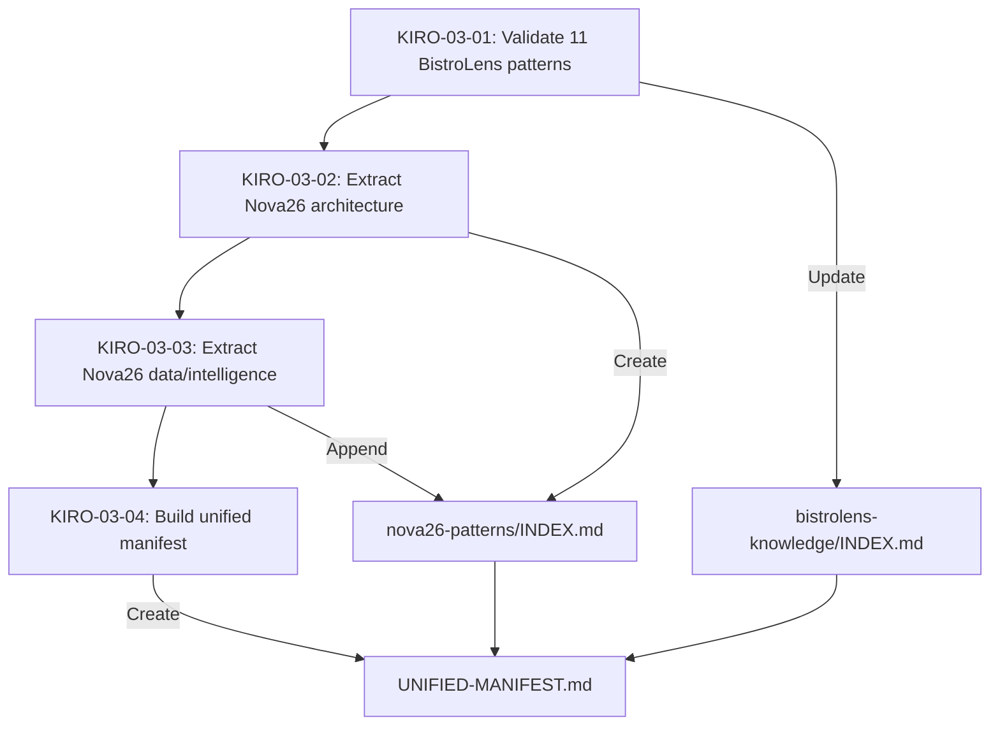

# Comprehensive Pattern Extraction — Design

## Overview

This design covers a four-phase pattern extraction and cataloging effort:

1. **KIRO-03-01** — Validate the 11 previously-missing BistroLens patterns (already extracted) for quality and cross-reference integrity
2. **KIRO-03-02** — Extract 25+ architecture patterns from Nova26 core modules (orchestrator, agents, CLI, gates, retry, sandbox, swarm, templates, browser, IDE, preview)
3. **KIRO-03-03** — Extract 25+ data/intelligence patterns from Nova26 modules (LLM, memory, persistence, security, observability, cost, codebase, dependency-analysis, git, integrations, types)
4. **KIRO-03-04** — Produce a unified manifest and relationship map across all ~140 patterns

The BistroLens Knowledge_Base lives at `.nova/bistrolens-knowledge/` (16 category folders, 90 patterns after KIRO-03-01). The Nova26 Knowledge_Base lives at `.nova/nova26-patterns/` (new directory, ~50 patterns).

## Architecture

### Directory Structure

```
.nova/
├── bistrolens-knowledge/          # Existing — 90 patterns (79 original + 11 gap-fill)
│   ├── 01-convex-patterns/
│   ├── 02-react-patterns/
│   ├── ...
│   ├── 16-deployment/
│   ├── INDEX.md                   # Updated in KIRO-03-01
│   └── EXTRACTION-TASK-LIST.md
│
├── nova26-patterns/               # NEW — ~50 patterns
│   ├── 01-orchestration/          # Ralph Loop, task picker, parallel runner
│   ├── 02-agent-system/           # Agent loader, PRD generator, council runner
│   ├── 03-quality-gates/          # TypeScript gate, test runner gate, Piston client
│   ├── 04-cli-and-commands/       # CLI entry, slash commands, extended commands
│   ├── 05-execution/              # Sandbox, Docker executor, swarm mode
│   ├── 06-llm-integration/        # Model router, Ollama client, structured output, response cache
│   ├── 07-memory-and-persistence/ # Session memory, checkpoint system
│   ├── 08-security/               # Security scanner
│   ├── 09-observability/          # Tracer, metrics
│   ├── 10-cost-management/        # Cost tracker
│   ├── 11-codebase-analysis/      # Repo map, dependency analyzer
│   ├── 12-git-and-integrations/   # Git workflow, issue importer, Xcode integration
│   ├── 13-browser-and-preview/    # Visual validator, preview server
│   ├── 14-templates-and-skills/   # Template engine, skill loader
│   ├── 15-type-system/            # Core type definitions
│   ├── INDEX.md                   # Created in KIRO-03-02, extended in KIRO-03-03
│   └── EXTRACTION-TASK-LIST.md
│
└── UNIFIED-MANIFEST.md            # Created in KIRO-03-04
```

### Extraction Flow



## Components and Interfaces

### Pattern Template (Shared)

Every pattern file — BistroLens or Nova26 — follows this template:

```markdown
# Pattern Name

## Source
Extracted from [BistroLens|Nova26] `[file path]`

---

## Pattern: [Pattern Name]

[Description of what this pattern does and why it exists]

---

## Implementation

### Code Example

```typescript
// Full working code with types, imports
```

### Key Concepts

- Concept 1
- Concept 2

---

## Anti-Patterns

### ❌ Don't Do This

```typescript
// Bad example with explanation
```

### ✅ Do This Instead

```typescript
// Good example
```

---

## When to Use This Pattern

✅ **Use for:**
- Scenario 1
- Scenario 2

❌ **Don't use for:**
- Scenario 3

---

## Benefits

1. Benefit 1
2. Benefit 2
3. Benefit 3

---

## Related Patterns

- See `[relative-path/pattern.md]` for [relationship description]

---

*Extracted: [date]*
```

### Validation Checker (KIRO-03-01)

A validation pass over each pattern file that checks:
1. Required sections present (Source, Code Example, Anti-Patterns or When to Use, Benefits, Related Patterns)
2. At least one TypeScript/TSX code block exists
3. No placeholder text (`[TODO]`, `[TBD]`, `[placeholder]`)
4. All Cross_References resolve to existing files

### Cross-Reference Resolver (KIRO-03-01 & KIRO-03-04)

Scans all `## Related Patterns` sections across both knowledge bases:
- Extracts file references (e.g., `See [pattern.md]`)
- Resolves relative paths against the pattern's directory
- Reports broken references
- For KIRO-03-04: also validates cross-base references (bistrolens ↔ nova26)

### Nova26 Pattern Extractor (KIRO-03-02 & KIRO-03-03)

For each source file in the target directories:
1. Read the TypeScript source
2. Identify the primary pattern(s) implemented (class structure, exported functions, design patterns)
3. Write a Pattern_File following the template
4. Include real code from the source (not invented examples)
5. Document anti-patterns based on the code's defensive patterns and error handling
6. Add cross-references to related patterns

### Manifest Builder (KIRO-03-04)

Produces `UNIFIED-MANIFEST.md` with:
1. A table of all patterns (name, category, knowledge base, file path, one-line description)
2. A relationship map section with typed edges (depends on, alternative to, extends, used with)
3. A statistics section (totals, per-category counts, cross-base relationship count)

## Data Models

### Pattern Metadata

Each pattern has implicit metadata derived from its file location and content:

```typescript
interface PatternMetadata {
  name: string;              // Derived from filename (kebab-case → Title Case)
  category: string;          // Parent folder name (e.g., "01-orchestration")
  knowledgeBase: "bistrolens" | "nova26";
  filePath: string;          // Relative path from .nova/
  source: string;            // Original source file path
  description: string;       // First paragraph of the Pattern section
  relatedPatterns: string[]; // File paths from Related Patterns section
}
```

### Relationship Types

```typescript
type RelationshipType = "depends_on" | "alternative_to" | "extends" | "used_with";

interface PatternRelationship {
  from: string;              // Pattern file path
  to: string;                // Pattern file path
  type: RelationshipType;
  description: string;       // One-line explanation
}
```

### Manifest Statistics

```typescript
interface ManifestStats {
  totalPatterns: number;
  bistrolensCount: number;
  nova26Count: number;
  categoryCounts: Record<string, number>;
  crossBaseRelationships: number;
}
```


## Correctness Properties

*A property is a characteristic or behavior that should hold true across all valid executions of a system — essentially, a formal statement about what the system should do. Properties serve as the bridge between human-readable specifications and machine-verifiable correctness guarantees.*

### Property 1: Template section conformance

*For any* pattern file in either the BistroLens Knowledge_Base or the Nova26_Knowledge_Base, the file SHALL contain all required sections: a Source section, at least one heading-level section with content, and a Related Patterns section.

**Validates: Requirements 1.1, 2.3, 3.3**

### Property 2: Category folder structure

*For any* pattern file in the Nova26_Knowledge_Base, the file SHALL reside inside a directory whose name matches the pattern `\d{2}-[a-z-]+` (a two-digit number followed by a kebab-case name).

**Validates: Requirements 2.2, 3.2**

### Property 3: Cross-reference integrity

*For any* pattern file in either knowledge base, every file path referenced in its Related Patterns section SHALL resolve to an existing file in one of the two knowledge bases.

**Validates: Requirements 1.3, 4.6**

### Property 4: Manifest entry completeness

*For any* row in the UNIFIED-MANIFEST.md pattern table, the row SHALL contain all five fields: pattern name, category, source knowledge base, relative file path, and a non-empty description.

**Validates: Requirements 4.2**

### Property 5: Cross-base relationship coverage

*For any* cross-base reference (a pattern in one knowledge base referencing a pattern in the other), there SHALL exist a corresponding entry in the Manifest's Relationship_Map section.

**Validates: Requirements 4.4**

### Property 6: Code block presence

*For any* pattern file in either knowledge base, the file SHALL contain at least one fenced code block with a `typescript` or `tsx` language tag.

**Validates: Requirements 5.1**

### Property 7: Anti-pattern completeness

*For any* pattern file that contains an "Anti-Patterns" section, that section SHALL contain both a "Don't Do This" subsection and a "Do This Instead" subsection.

**Validates: Requirements 5.2**

### Property 8: When-to-use completeness

*For any* pattern file in either knowledge base, the "When to Use This Pattern" section SHALL contain at least two "Use for" items and at least one "Don't use for" item.

**Validates: Requirements 5.3**

### Property 9: Related patterns non-empty

*For any* pattern file in either knowledge base, the Related Patterns section SHALL contain at least one cross-reference to another pattern file.

**Validates: Requirements 5.4**

## Error Handling

### Missing Source Code

If a Nova26 source file referenced in the extraction plan does not exist or is empty:
- Skip the pattern and log a warning in the EXTRACTION-TASK-LIST.md
- Do not create a placeholder pattern file

### Ambiguous Pattern Boundaries

If a single source file contains multiple distinct patterns:
- Extract each as a separate Pattern_File
- Cross-reference them in their Related Patterns sections

### Broken Cross-References During Extraction

If a newly written pattern references another pattern that doesn't exist yet:
- Use a `[TODO: link to X]` placeholder
- Track it in the task list
- Resolve all placeholders in the final cross-reference validation pass (KIRO-03-04)

### Duplicate Pattern Names

If a Nova26 pattern has the same name as an existing BistroLens pattern:
- Prefix the Nova26 pattern with `nova26-` (e.g., `nova26-error-handling.md`)
- Document the distinction in both patterns' Related Patterns sections

## Testing Strategy

### Validation Script Approach

Since this is a documentation extraction effort (not application code), testing focuses on structural validation of the output artifacts rather than unit/integration tests of runtime behavior.

### Property-Based Tests

Use a Node.js script with `fast-check` to validate the correctness properties above. Each property maps to a property-based test that generates random selections from the pattern file set and checks the invariant.

**Library:** `fast-check` (TypeScript property-based testing)
**Minimum iterations:** 100 per property

Each test should be tagged with:
```
// Feature: comprehensive-pattern-extraction, Property N: [property text]
```

**Test structure:**

1. **Property 1 test** — Randomly sample pattern files, parse markdown headings, assert required sections exist
2. **Property 2 test** — For all Nova26 pattern files, assert parent directory matches `\d{2}-[a-z-]+`
3. **Property 3 test** — Randomly sample pattern files, extract Related Patterns references, assert each resolves to a file
4. **Property 4 test** — Parse UNIFIED-MANIFEST.md table rows, assert each has 5 non-empty fields
5. **Property 5 test** — Find all cross-base references in pattern files, assert each appears in the Relationship_Map
6. **Property 6 test** — Randomly sample pattern files, assert at least one `typescript`/`tsx` code fence
7. **Property 7 test** — For all pattern files with Anti-Patterns section, assert both subsections present
8. **Property 8 test** — Randomly sample pattern files, parse When to Use section, count items
9. **Property 9 test** — Randomly sample pattern files, assert Related Patterns section has at least one reference

### Unit Tests (Examples and Edge Cases)

- Verify INDEX.md in BistroLens knowledge base lists exactly 90 patterns
- Verify Nova26 INDEX.md lists at least 50 patterns
- Verify UNIFIED-MANIFEST.md statistics section totals match actual file counts
- Verify specific named patterns exist (Ralph Loop, model router, etc.)
- Verify no pattern file contains `[TODO]`, `[TBD]`, or `[placeholder]` text

---

*Created: 2026-02-18*
