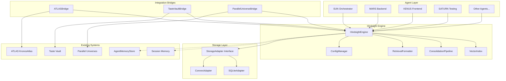

# Design Document: Hindsight Persistent Memory

## Overview

Hindsight is a persistent memory layer for NOVA26 agents that provides vector-indexed long-term recall with semantic search. It sits between the existing memory subsystems (ATLAS triple-write, AgentMemoryStore/SQLite, Taste Vault graph memory, session memory) and unifies them under a single retrieval and persistence API.

The key differentiator from existing Mem0/Letta-style append-only logs is semantic vector indexing with approximate nearest neighbor (ANN) search, enabling sub-100ms retrieval across a 50M-token corpus. Hindsight uses a pluggable storage backend (local SQLite or cloud Convex) and integrates with the existing ATLAS bridge, Taste Vault, and Parallel Universes systems.

### Design Decisions

1. **SQLite + sqlite-vec for local vector search** — Keeps the "least-GB locally" philosophy. sqlite-vec provides ANN search without a separate vector DB process. Falls back to brute-force cosine similarity for small corpora (<100k fragments).
2. **Adapter pattern for storage backends** — A `StorageAdapter` interface abstracts SQLite vs Convex, enabling seamless switching and export/import between backends.
3. **Layered on existing AgentMemory types** — Hindsight's `MemoryFragment` extends the existing `AgentMemory` type from `src/memory/agent-memory.ts` rather than replacing it, preserving backward compatibility.
4. **Bridge pattern for ATLAS/Taste Vault** — Dedicated bridge classes subscribe to events from ATLAS and Taste Vault, converting their domain objects into Hindsight MemoryFragments.
5. **Namespace isolation via composite keys** — Memory namespaces use `{projectId}:{agentId}` composite keys with index-based filtering, avoiding separate databases per namespace.

## Architecture



### Data Flow

1. **Ingest**: Agent completes task → HindsightEngine.store() → Embedding computed → StorageAdapter.write() → VectorIndex updated
2. **Retrieve**: Agent starts task → HindsightEngine.retrieve(query) → VectorIndex.search() → StorageAdapter.read() → RetrievalFormatter.format() → Prompt prefix injected
3. **Consolidate**: Scheduled/triggered → ConsolidationPipeline.run() → Dedup + merge + decay + archive → StorageAdapter.bulkWrite()
4. **Bridge Ingest**: ATLAS logs build → ATLASBridge.onBuildLogged() → HindsightEngine.store() (same as #1)

## Components and Interfaces

### HindsightEngine (Core)

The main entry point. Coordinates storage, retrieval, consolidation, and configuration.

```typescript
interface HindsightEngine {
  // Core operations
  store(fragment: MemoryFragmentInput): Promise<MemoryFragment>;
  retrieve(query: RetrievalQuery): Promise<RetrievalResult>;
  search(query: SemanticSearchQuery): Promise<MemoryFragment[]>;
  
  // Lifecycle
  initialize(config: HindsightConfig): Promise<void>;
  shutdown(): Promise<void>;
  healthCheck(): Promise<HealthStatus>;
  
  // Consolidation
  consolidate(): Promise<ConsolidationReport>;
  
  // Namespace management
  forkNamespace(source: string, target: string): Promise<void>;
  mergeNamespaces(source: string, target: string): Promise<MergeReport>;
  
  // Export/Import
  exportMemories(namespace?: string): Promise<string>; // JSON
  importMemories(json: string): Promise<ImportReport>;
}
```

### StorageAdapter (Interface)

Abstracts the persistence backend. Two implementations: SQLiteAdapter and ConvexAdapter.

```typescript
interface StorageAdapter {
  write(fragment: MemoryFragment): Promise<void>;
  read(id: string): Promise<MemoryFragment | null>;
  bulkWrite(fragments: MemoryFragment[]): Promise<void>;
  bulkRead(ids: string[]): Promise<MemoryFragment[]>;
  delete(id: string): Promise<boolean>;
  
  query(filter: FragmentFilter): Promise<MemoryFragment[]>;
  count(filter?: FragmentFilter): Promise<number>;
  
  // Vector operations
  searchByVector(embedding: number[], topK: number, filter?: FragmentFilter): Promise<ScoredFragment[]>;
  
  // Export/Import
  exportAll(): Promise<MemoryFragment[]>;
  importAll(fragments: MemoryFragment[]): Promise<number>;
  
  // Health
  isAvailable(): Promise<boolean>;
  getStats(): Promise<StorageStats>;
}

interface FragmentFilter {
  namespace?: string;
  agentId?: string;
  projectId?: string;
  type?: MemoryType;
  minRelevance?: number;
  timeRange?: { start: Date; end: Date };
  tags?: string[];
}

interface ScoredFragment {
  fragment: MemoryFragment;
  score: number; // composite: similarity * recency * frequency
}
```

### VectorIndex

Manages embedding computation and ANN search. Uses sqlite-vec for local, Convex vector search for cloud.

```typescript
interface VectorIndex {
  index(id: string, embedding: number[]): Promise<void>;
  search(query: number[], topK: number, filter?: FragmentFilter): Promise<ScoredFragment[]>;
  remove(id: string): Promise<void>;
  rebuild(): Promise<void>;
  getSize(): number;
}
```

### ConsolidationPipeline

Handles deduplication, merging, decay, and archival of memory fragments.

```typescript
interface ConsolidationPipeline {
  run(): Promise<ConsolidationReport>;
  deduplicateFragments(fragments: MemoryFragment[]): Promise<DeduplicationResult>;
  applyDecay(fragments: MemoryFragment[]): Promise<DecayResult>;
  archiveFragments(fragments: MemoryFragment[]): Promise<ArchiveResult>;
}

interface ConsolidationReport {
  merged: number;
  compressed: number;
  archived: number;
  decayed: number;
  durationMs: number;
  timestamp: string;
}
```

### RetrievalFormatter

Formats retrieved memories into structured prompt context.

```typescript
interface RetrievalFormatter {
  format(memories: ScoredFragment[], budget: TokenBudget): RetrievalContext;
}

interface TokenBudget {
  maxTokens: number;       // default: 1200
  episodicRatio: number;   // default: 0.5
  semanticRatio: number;   // default: 0.3
  proceduralRatio: number; // default: 0.2
}

interface RetrievalContext {
  promptPrefix: string;
  memoriesUsed: number;
  tokensUsed: number;
  truncated: boolean;
}
```

### ATLASBridge

Connects Hindsight with the existing ATLAS triple-write system.

```typescript
interface ATLASBridge {
  onBuildLogged(log: BuildLog, project: string, phase: number): Promise<void>;
  onRetrospectiveComplete(insights: string[]): Promise<void>;
  enrichRetrieval(query: RetrievalQuery): Promise<MemoryFragment[]>;
  mapSemanticTags(atlasTags: string[]): string[];
}
```

### TasteVaultBridge

Connects Hindsight with the Taste Vault pattern memory.

```typescript
interface TasteVaultBridge {
  onPatternLearned(node: GraphNode): Promise<void>;
  onPatternReinforced(nodeId: string): Promise<void>;
  onConflictResolved(resolution: ConflictResolution): Promise<void>;
  supplementRetrieval(context: string, limit: number): Promise<MemoryFragment[]>;
}
```

### ParallelUniverseBridge

Manages memory namespace forking and merging for parallel agent executions.

```typescript
interface ParallelUniverseBridge {
  onBranchCreated(branchId: string, sourceNamespace: string): Promise<void>;
  onBranchMerged(branchId: string, targetNamespace: string): Promise<MergeReport>;
}
```

### ConfigManager

Validates and manages Hindsight configuration.

```typescript
interface ConfigManager {
  validate(config: unknown): HindsightConfig;
  getDefaults(): HindsightConfig;
  merge(base: HindsightConfig, overrides: Partial<HindsightConfig>): HindsightConfig;
}
```

## Data Models

### MemoryFragment

The core data unit. Extends the existing AgentMemory pattern.

```typescript
interface MemoryFragment {
  id: string;                          // UUID
  namespace: string;                   // "{projectId}:{agentId}" or "{projectId}:shared"
  type: 'episodic' | 'semantic' | 'procedural';
  content: string;                     // Natural language, max 2000 chars
  embedding: number[];                 // Vector embedding (dimension depends on provider)
  
  // Provenance
  agentId: string;
  projectId: string;
  workflowId?: string;
  sourceType: 'task' | 'atlas' | 'taste-vault' | 'retrospective' | 'manual';
  sourceId?: string;                   // ID of originating event
  
  // Scoring
  relevanceScore: number;              // 0-1, decays over time
  accessCount: number;
  isPinned: boolean;
  isArchived: boolean;
  
  // Metadata
  tags: string[];
  outcome?: 'positive' | 'negative' | 'neutral';
  createdAt: string;                   // ISO 8601
  updatedAt: string;
  lastAccessedAt?: string;
  
  // Type-specific fields (stored as JSON)
  extra: Record<string, unknown>;
}
```

### MemoryFragmentInput

Input type for creating new fragments (auto-generates id, timestamps, defaults).

```typescript
interface MemoryFragmentInput {
  namespace?: string;                  // Auto-derived from agentId + projectId if omitted
  type: 'episodic' | 'semantic' | 'procedural';
  content: string;
  agentId: string;
  projectId: string;
  workflowId?: string;
  sourceType: 'task' | 'atlas' | 'taste-vault' | 'retrospective' | 'manual';
  sourceId?: string;
  tags?: string[];
  outcome?: 'positive' | 'negative' | 'neutral';
  extra?: Record<string, unknown>;
}
```

### HindsightConfig

```typescript
interface HindsightConfig {
  storage: {
    backend: 'sqlite' | 'convex';
    sqlitePath?: string;               // default: '~/.nova/hindsight.db'
    convexUrl?: string;
  };
  embedding: {
    provider: 'ollama' | 'openai' | 'custom';
    model?: string;                    // default: 'nomic-embed-text' for ollama
    dimensions?: number;               // default: 768
  };
  retrieval: {
    topK: number;                      // default: 10
    similarityThreshold: number;       // default: 0.7
    tokenBudget: number;               // default: 1200
    includesCrossAgent: boolean;       // default: true
    crossAgentThreshold: number;       // default: 0.8
  };
  consolidation: {
    deduplicationThreshold: number;    // default: 0.95
    decayRate: number;                 // default: 0.05
    deletionThreshold: number;         // default: 0.1
    archiveThreshold: number;          // default: 0.15
    scheduleIntervalMs: number;        // default: 3600000 (1 hour)
  };
  limits: {
    maxTokens: number;                 // default: 50_000_000
    maxFragments: number;              // default: 500_000
    maxContentLength: number;          // default: 2000
  };
}
```

### Convex Schema Extension

New tables added to `convex/schema.ts` for the cloud backend:

```typescript
// Hindsight Memory Fragments
hindsightFragments: defineTable({
  namespace: v.string(),
  type: v.union(v.literal('episodic'), v.literal('semantic'), v.literal('procedural')),
  content: v.string(),
  embeddingVector: v.array(v.number()),
  agentId: v.string(),
  projectId: v.string(),
  workflowId: v.optional(v.string()),
  sourceType: v.union(
    v.literal('task'), v.literal('atlas'), v.literal('taste-vault'),
    v.literal('retrospective'), v.literal('manual')
  ),
  sourceId: v.optional(v.string()),
  relevanceScore: v.number(),
  accessCount: v.number(),
  isPinned: v.boolean(),
  isArchived: v.boolean(),
  tags: v.array(v.string()),
  outcome: v.optional(v.union(v.literal('positive'), v.literal('negative'), v.literal('neutral'))),
  extra: v.string(), // JSON-serialized
  createdAt: v.string(),
  updatedAt: v.string(),
  lastAccessedAt: v.optional(v.string()),
}).index('by_namespace', ['namespace'])
  .index('by_project', ['projectId'])
  .index('by_agent', ['agentId'])
  .index('by_relevance', ['namespace', 'relevanceScore'])
  .index('by_type', ['namespace', 'type'])
  .index('by_archived', ['isArchived']),

// Hindsight Consolidation Logs
hindsightConsolidations: defineTable({
  merged: v.number(),
  compressed: v.number(),
  archived: v.number(),
  decayed: v.number(),
  durationMs: v.number(),
  timestamp: v.string(),
}).index('by_timestamp', ['timestamp']),
```

### SQLite Schema (Local Backend)

```sql
CREATE TABLE IF NOT EXISTS fragments (
  id TEXT PRIMARY KEY,
  namespace TEXT NOT NULL,
  type TEXT NOT NULL CHECK(type IN ('episodic', 'semantic', 'procedural')),
  content TEXT NOT NULL,
  embedding BLOB NOT NULL,
  agent_id TEXT NOT NULL,
  project_id TEXT NOT NULL,
  workflow_id TEXT,
  source_type TEXT NOT NULL,
  source_id TEXT,
  relevance_score REAL NOT NULL DEFAULT 1.0,
  access_count INTEGER NOT NULL DEFAULT 0,
  is_pinned INTEGER NOT NULL DEFAULT 0,
  is_archived INTEGER NOT NULL DEFAULT 0,
  tags TEXT NOT NULL DEFAULT '[]',
  outcome TEXT,
  extra TEXT NOT NULL DEFAULT '{}',
  created_at TEXT NOT NULL,
  updated_at TEXT NOT NULL,
  last_accessed_at TEXT
);

CREATE INDEX IF NOT EXISTS idx_fragments_namespace ON fragments(namespace);
CREATE INDEX IF NOT EXISTS idx_fragments_project ON fragments(project_id);
CREATE INDEX IF NOT EXISTS idx_fragments_agent ON fragments(agent_id);
CREATE INDEX IF NOT EXISTS idx_fragments_relevance ON fragments(namespace, relevance_score DESC);
CREATE INDEX IF NOT EXISTS idx_fragments_type ON fragments(namespace, type);
CREATE INDEX IF NOT EXISTS idx_fragments_archived ON fragments(is_archived);

-- sqlite-vec virtual table for ANN search
CREATE VIRTUAL TABLE IF NOT EXISTS fragment_vectors USING vec0(
  id TEXT PRIMARY KEY,
  embedding float[768]
);
```


## Correctness Properties

*A property is a characteristic or behavior that should hold true across all valid executions of a system — essentially, a formal statement about what the system should do. Properties serve as the bridge between human-readable specifications and machine-verifiable correctness guarantees.*

### Property 1: Fragment creation completeness

*For any* agent task completion event with valid agent ID, project ID, and content, the resulting MemoryFragment SHALL contain all required fields: non-empty content, valid embedding vector, agent identifier matching the input, project identifier matching the input, a valid ISO 8601 timestamp, and the agent ID in the tags array.

**Validates: Requirements 1.1, 7.1**

### Property 2: Retrieval ranking correctness

*For any* set of stored MemoryFragments and a retrieval query, the returned results SHALL be sorted in descending order by composite score (semantic similarity × recency weight × access frequency weight), such that for every adjacent pair (result[i], result[i+1]), score(result[i]) >= score(result[i+1]).

**Validates: Requirements 1.3, 1.5**

### Property 3: Export/import round-trip across backends

*For any* set of MemoryFragments stored in one storage backend, exporting all fragments and importing them into a different backend SHALL produce a set of fragments where each fragment's content, embedding, metadata, tags, and scores are equivalent to the original.

**Validates: Requirements 2.5**

### Property 4: JSON serialization round-trip

*For any* valid MemoryFragment object, serializing to JSON and deserializing back SHALL produce an object that is deeply equal to the original, including the embedding vector (with floating-point tolerance of 1e-6).

**Validates: Requirements 2.6, 3.6**

### Property 5: Search filter correctness

*For any* semantic search with filter criteria (namespace, agent ID, project ID, time range, similarity threshold), ALL returned MemoryFragments SHALL satisfy every specified filter criterion, and no fragment satisfying all criteria with similarity above the threshold SHALL be excluded from results (up to the top-k limit).

**Validates: Requirements 3.2, 3.3**

### Property 6: Pretty-printer contains key fields

*For any* valid MemoryFragment, the pretty-printed string representation SHALL contain the fragment's type label, a substring of the content (first 100 chars), the agent ID, and the project ID.

**Validates: Requirements 3.5**

### Property 7: Deduplication merges similar fragments

*For any* set of MemoryFragments where at least two fragments have cosine similarity above the deduplication threshold (0.95), running consolidation SHALL reduce the count of those near-duplicate fragments to one, and the total fragment count after consolidation SHALL be less than or equal to the count before.

**Validates: Requirements 4.1**

### Property 8: Merge preserves highest relevance and combines provenance

*For any* group of MemoryFragments being merged during consolidation, the resulting merged fragment SHALL have a relevance score greater than or equal to the maximum relevance score of the input fragments, and the provenance (sourceId list) SHALL contain all source IDs from the input fragments.

**Validates: Requirements 4.2**

### Property 9: Forgetting curve exponential decay

*For any* MemoryFragment with initial relevance R, decay rate D, and days since last access T (where isPinned is false), the decayed relevance SHALL equal R × exp(-D × T) (within floating-point tolerance of 1e-6). For pinned fragments, the relevance SHALL remain unchanged regardless of T.

**Validates: Requirements 4.4**

### Property 10: Below-threshold fragments archived not deleted

*For any* MemoryFragment whose relevance score falls below the configured deletion threshold after decay, running consolidation SHALL set isArchived to true on that fragment, and the fragment SHALL still be retrievable by ID (not permanently deleted).

**Validates: Requirements 4.5**

### Property 11: Consolidation report accuracy

*For any* consolidation run, the ConsolidationReport's merged, compressed, and archived counts SHALL equal the actual number of fragments that were merged, compressed, and archived respectively (verified by comparing fragment counts and states before and after).

**Validates: Requirements 4.6**

### Property 12: Bridge fragment creation correctness

*For any* ATLAS BuildLog or retrospective insight string, the corresponding bridge SHALL create a MemoryFragment where: the content contains the source information, the sourceType matches the origin ('atlas' or 'retrospective'), and for retrospective insights the fragment type is 'semantic'.

**Validates: Requirements 5.1, 5.4**

### Property 13: ATLAS tag mapping determinism

*For any* set of ATLAS CodeNode semantic tags, the ATLASBridge tag mapping function SHALL produce the same output when called multiple times with the same input (deterministic), and the output tag set SHALL be a non-empty subset of valid Hindsight tags.

**Validates: Requirements 5.3**

### Property 14: Taste Vault bridge fragment creation

*For any* Taste Vault GraphNode (pattern learned) or conflict resolution event, the TasteVaultBridge SHALL create a MemoryFragment where: the content matches the pattern content, the extra field contains the confidence value, and for conflict resolutions the fragment type is 'procedural'.

**Validates: Requirements 6.1, 6.4**

### Property 15: Taste Vault reinforcement boosts relevance

*For any* MemoryFragment corresponding to a Taste Vault pattern, calling the reinforcement handler SHALL result in the fragment's relevance score being strictly greater than its previous value (up to the maximum of 1.0).

**Validates: Requirements 6.3**

### Property 16: Cross-agent retrieval inclusion

*For any* retrieval query scoped to a project with cross-agent retrieval enabled, the results SHALL include MemoryFragments from other agents in the same project that have relevance scores above the cross-agent threshold, in addition to the querying agent's own fragments.

**Validates: Requirements 7.2**

### Property 17: Namespace isolation

*For any* two distinct project namespaces A and B, storing a MemoryFragment in namespace A and then retrieving from namespace B (with cross-agent disabled) SHALL return zero fragments from namespace A. After forking namespace A to create namespace C, writes to C SHALL not appear in A and vice versa.

**Validates: Requirements 7.3, 7.5**

### Property 18: Branch merge reconciliation

*For any* two branch namespaces with overlapping MemoryFragments (same sourceId), merging the branches SHALL retain the fragment with the higher relevance score and discard the lower-relevance duplicate, resulting in no duplicate sourceIds in the merged namespace.

**Validates: Requirements 7.4**

### Property 19: Token budget enforcement and priority

*For any* set of retrieved MemoryFragments whose total estimated tokens exceed the configured budget, the formatted RetrievalContext SHALL use no more tokens than the budget, and the included memories SHALL be those with the highest relevance scores (i.e., no lower-relevance memory is included while a higher-relevance memory is excluded).

**Validates: Requirements 8.2**

### Property 20: Type-specific formatting completeness

*For any* episodic MemoryFragment, the formatted output SHALL contain the date, project, agent, and outcome. *For any* procedural MemoryFragment, the formatted output SHALL contain the trigger pattern and steps. *For any* semantic MemoryFragment, the formatted output SHALL contain the confidence level and supporting evidence count.

**Validates: Requirements 8.1, 8.3, 8.4, 8.5**

## Error Handling

### Storage Backend Failures

- **SQLite unavailable**: If the SQLite database file is locked or corrupted, the engine falls back to an in-memory Map-based cache. Queued writes are retried with exponential backoff (100ms, 200ms, 400ms, max 5 retries). If all retries fail, the error is logged and the operation returns a degraded result.
- **Convex unavailable**: If the Convex backend is unreachable, the engine operates in local-only mode. A background sync process retries pending writes when connectivity is restored.
- **Embedding provider failure**: If the embedding provider fails, the engine stores the fragment without an embedding and marks it for re-embedding on the next consolidation cycle.

### Data Integrity

- **Corrupted embeddings**: If a deserialized embedding has unexpected dimensions, the fragment is flagged for re-embedding rather than silently using bad data.
- **Schema migration**: When the SQLite schema version changes, the engine runs migrations automatically on startup. If migration fails, the engine refuses to start and logs a descriptive error.
- **Concurrent access**: SQLite WAL mode handles concurrent reads. Writes are serialized through a single connection. The Convex backend handles concurrency natively.

### Consolidation Failures

- **Partial consolidation**: If consolidation fails mid-run (e.g., OOM), the engine rolls back to the pre-consolidation state using SQLite transactions. The ConsolidationReport includes the error and partial progress.
- **Embedding computation timeout**: If embedding computation takes longer than 30 seconds per fragment during consolidation, the fragment is skipped and flagged for retry.

### Configuration Errors

- **Invalid config**: The Zod schema validator rejects invalid configurations at initialization time with descriptive error messages. The engine does not start with invalid config.
- **Missing embedding provider**: If no embedding provider is configured, the engine logs a warning and uses a zero-vector placeholder, degrading search quality but maintaining functionality.

## Testing Strategy

### Unit Tests

Unit tests cover specific examples, edge cases, and error conditions:

- Fragment CRUD operations (create, read, update, delete)
- Configuration validation (valid configs accepted, invalid rejected with errors)
- Forgetting curve math (specific decay calculations)
- Pretty-printer output for each memory type
- Error handling paths (backend unavailable, corrupted data)
- Namespace string parsing and construction
- Token estimation accuracy

### Property-Based Tests

Property-based tests verify universal correctness properties using the `fast-check` library (TypeScript). Each property test runs a minimum of 100 iterations with randomly generated inputs.

Properties to implement as PBT:
- Property 1: Fragment creation completeness
- Property 2: Retrieval ranking correctness
- Property 3: Export/import round-trip
- Property 4: JSON serialization round-trip
- Property 5: Search filter correctness
- Property 6: Pretty-printer key fields
- Property 7: Deduplication merges similar fragments
- Property 8: Merge preserves highest relevance
- Property 9: Forgetting curve exponential decay
- Property 10: Below-threshold archived not deleted
- Property 11: Consolidation report accuracy
- Property 12: Bridge fragment creation
- Property 13: ATLAS tag mapping determinism
- Property 14: Taste Vault bridge fragment creation
- Property 15: Taste Vault reinforcement boosts relevance
- Property 16: Cross-agent retrieval inclusion
- Property 17: Namespace isolation
- Property 18: Branch merge reconciliation
- Property 19: Token budget enforcement
- Property 20: Type-specific formatting completeness

Each test is tagged with: `Feature: hindsight-persistent-memory, Property {N}: {title}`

### Integration Tests

Integration tests verify cross-system behavior:
- ATLAS bridge end-to-end (build log → fragment → retrieval)
- Taste Vault bridge end-to-end (pattern learned → fragment → supplemented retrieval)
- SQLite backend full lifecycle (init → store → retrieve → consolidate → export)
- Convex backend sync (store locally → sync to Convex → retrieve from Convex)

### Test Framework

- **Unit & Property tests**: Vitest + fast-check
- **Integration tests**: Vitest with test fixtures
- **Minimum iterations**: 100 per property test
- **Coverage target**: 80% line coverage for core engine, 90% for serialization/deserialization
