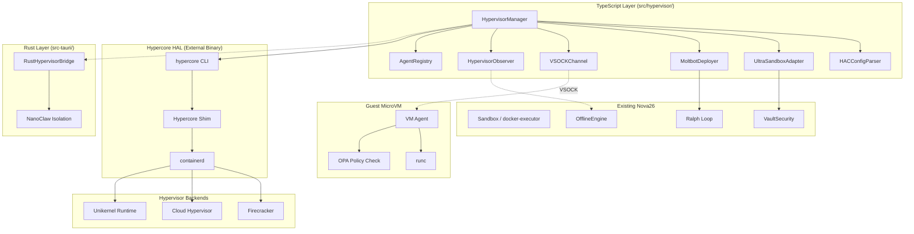

# Design Document: Hypervisor Hypercore Integration (Reel 2)

## Overview

This design integrates the Vistara-Labs Hypercore Hypervisor Abstraction Layer (HAL) into Nova26 as a microVM management layer. The integration adds a new `src/hypervisor/` module that wraps the Hypercore HAL CLI and containerd shim into a `HypervisorManager` TypeScript service, plus Rust FFI bindings in `src-tauri/src/hypervisor_bridge.rs`.

The system provides a consistent API for spawning microVMs across Firecracker, Cloud Hypervisor, and Unikernel backends. It integrates with the existing Ultra-Sandbox (`src/sandbox/`), security layer (`src/security/`), observability (`src/observability/`), and the Ralph Loop orchestrator (`src/orchestrator/`). Hardware-as-Code configuration via hac.toml files enables declarative, version-controlled VM provisioning.

### Key Design Decisions

1. **CLI wrapper over library binding** — Hypercore HAL is a Rust binary with a CLI interface (`hypercore spawn`, `hypercore status`, etc.). The TypeScript layer wraps CLI invocations via `child_process` rather than attempting native bindings, keeping the integration thin and maintainable. The Rust Eternal Engine uses direct FFI to the HAL library.
2. **Event-driven lifecycle** — The HypervisorManager emits typed events (ready, vm-spawned, vm-terminated, health-warning, security-violation) matching the existing OfflineEngine and HypercoreManager event patterns.
3. **hac.toml as source of truth** — All VM configurations are defined in TOML files under `.nova/hypervisor/configs/`. The parser produces validated VMSpec objects; the pretty printer writes them back. Round-trip consistency is enforced.
4. **OPA sidecar policy evaluation** — OPA policies are evaluated before VM spawn and during runtime via the VM Agent's policy check hook. Policies live under `.nova/hypervisor/policies/`.
5. **VSOCK for host-guest I/O** — All communication between HypervisorManager and VM Agents uses VSOCK (virtio-vsock), avoiding network stack overhead. Payloads use length-prefixed MessagePack encoding for compact binary serialization.
6. **Agent registry as in-memory map** — Deployed Planetary Agent → VM mappings are kept in memory with periodic persistence to `.nova/hypervisor/registry.json`, matching the ATLAS in-memory index pattern.

## Architecture



### Data Flow

1. **Spawn path**: Agent/Moltbot → HypervisorManager.spawn(vmSpec) → HACConfigParser.format(vmSpec) → writes temp hac.toml → `hypercore spawn --config <path> --provider <provider>` → Shim provisions VM → VSOCK channel established → VM Agent ready → returns VM ID
2. **Task execution path**: HypervisorManager.executeTask(vmId, taskPayload) → VSOCKChannel.send(vmId, serialize(taskPayload)) → VM Agent receives → OPA policy check → runc spawns process → result collected → VSOCKChannel receives result → deserialize → return to caller
3. **Terminate path**: HypervisorManager.terminate(vmId) → `hypercore terminate <vmId>` → Shim graceful shutdown → cleanup guest state → verify no host residue → remove from registry → emit vm-terminated event
4. **Moltbot deploy path**: MoltbotDeployer.deployAgent(agentName) → load agent hac.toml from `.nova/hypervisor/configs/agents/<agent>.toml` → HypervisorManager.spawn(vmSpec) → VM Agent loads agent prompt → connects to Ralph Loop via VSOCK → AgentRegistry.register(agentName, vmId)
5. **Security audit path**: Any lifecycle event → HypervisorObserver.logEvent(event) → structured audit log → if security violation → emit security-violation event → terminate offending VM

## Components and Interfaces

### HypervisorManager (src/hypervisor/manager.ts)

Central service managing all microVM operations via the Hypercore HAL CLI.

```typescript
interface HypervisorManagerConfig {
  halBinaryPath: string;           // Path to hypercore binary
  configDir: string;               // Default: '.nova/hypervisor/configs'
  policyDir: string;               // Default: '.nova/hypervisor/policies'
  maxConcurrentVMs: number;        // Default: 10
  bootTimeoutMs: number;           // Default: 30000
  gracePeriodMs: number;           // Default: 5000
  heartbeatIntervalMs: number;     // Default: 3000
  healthWarningThreshold: number;  // Error count threshold
  healthWarningWindowMs: number;   // Time window for threshold
}

type VMState = 'provisioning' | 'running' | 'stopping' | 'terminated' | 'error';

interface VMInstance {
  id: string;
  provider: HypervisorProvider;
  spec: VMSpec;
  state: VMState;
  pid: number;
  vsockCid: number;
  createdAt: number;
  metrics: VMResourceMetrics;
}

interface VMResourceMetrics {
  cpuUsagePercent: number;
  memoryUsedMB: number;
  vsockBytesIn: number;
  vsockBytesOut: number;
}

interface HypervisorManagerEvents {
  'ready': (providers: ProviderInfo[]) => void;
  'vm-spawned': (vm: VMInstance) => void;
  'vm-terminated': (vmId: string, reason: string) => void;
  'vm-state-change': (vmId: string, prev: VMState, next: VMState, reason: string) => void;
  'health-warning': (vmId: string, errorCount: number) => void;
  'security-violation': (vmId: string, violation: string) => void;
  'error': (vmId: string, error: HypervisorError) => void;
}

class HypervisorManager extends TypedEventEmitter<HypervisorManagerEvents> {
  constructor(config: Partial<HypervisorManagerConfig>);
  
  // Lifecycle
  initialize(): Promise<void>;
  close(): Promise<void>;
  
  // Provider discovery
  getProviders(): ProviderInfo[];
  
  // VM operations
  spawn(spec: VMSpec): Promise<string>;
  terminate(vmId: string): Promise<void>;
  getStatus(vmId: string): VMInstance;
  listVMs(): VMInstance[];
  
  // Task execution
  executeTask(vmId: string, payload: TaskPayload): Promise<TaskResult>;
  
  // Metrics
  getMetrics(): AggregateHypervisorMetrics;
}
```

### HACConfigParser (src/hypervisor/hac-config.ts)

Parses and formats Hardware-as-Code TOML configuration files.

```typescript
type HypervisorProvider = 'firecracker' | 'cloud-hypervisor' | 'unikernel';

interface VMSpec {
  name: string;
  provider: HypervisorProvider;
  vcpus: number;
  memoryMB: number;
  kernelPath: string;
  rootfsPath: string;
  networkEnabled: boolean;
  drives: DriveSpec[];
  metadata: Record<string, string>;
}

interface DriveSpec {
  path: string;
  readOnly: boolean;
}

class HACConfigParser {
  // Parse hac.toml string → VMSpec
  parse(toml: string): VMSpec;
  
  // Format VMSpec → hac.toml string (pretty printer)
  format(spec: VMSpec): string;
  
  // Validate VMSpec against host capacity
  validate(spec: VMSpec, hostCapacity: HostCapacity): ValidationResult;
  
  // Load default template for a provider
  getDefaultTemplate(provider: HypervisorProvider): VMSpec;
}
```

### UltraSandboxAdapter (src/hypervisor/ultra-sandbox.ts)

Bridges Ultra-Sandbox security requirements to microVM isolation.

```typescript
interface SandboxPolicy {
  agentId: string;
  allowedOperations: string[];
  maxMemoryMB: number;
  maxCpuPercent: number;
  networkAccess: boolean;
  filesystemAccess: string[];  // allowed paths
}

interface PolicyEvaluationResult {
  allowed: boolean;
  deniedReason?: string;
  policyId: string;
}

class UltraSandboxAdapter {
  constructor(manager: HypervisorManager, policyDir: string);
  
  // Spawn a sandboxed VM for an agent task
  spawnSandboxed(agentId: string, task: TaskPayload): Promise<string>;
  
  // Evaluate OPA policy for an operation
  evaluatePolicy(agentId: string, operation: string): Promise<PolicyEvaluationResult>;
  
  // Destroy sandbox and verify cleanup
  destroySandbox(vmId: string): Promise<CleanupVerification>;
}

interface CleanupVerification {
  vmTerminated: boolean;
  hostStateClean: boolean;
  residualPaths: string[];  // should be empty
}
```

### MoltbotDeployer (src/hypervisor/moltbot-deployer.ts)

Deploys Planetary Agents into dedicated microVMs.

```typescript
interface AgentDeployment {
  agentName: string;
  vmId: string;
  status: VMState;
  config: VMSpec;
  deployedAt: number;
}

class MoltbotDeployer {
  constructor(manager: HypervisorManager, registry: AgentRegistry);
  
  // Deploy a Planetary Agent into a microVM
  deployAgent(agentName: string, overrides?: Partial<VMSpec>): Promise<AgentDeployment>;
  
  // Undeploy an agent
  undeployAgent(agentName: string): Promise<void>;
  
  // Get deployment status
  getDeployment(agentName: string): AgentDeployment | undefined;
  
  // List all deployments
  listDeployments(): AgentDeployment[];
}
```

### AgentRegistry (src/hypervisor/agent-registry.ts)

Tracks deployed Planetary Agents and their VM mappings.

```typescript
class AgentRegistry {
  constructor(persistPath: string);  // '.nova/hypervisor/registry.json'
  
  register(agentName: string, vmId: string, config: VMSpec): void;
  unregister(agentName: string): void;
  get(agentName: string): AgentDeployment | undefined;
  list(): AgentDeployment[];
  
  // Persistence
  save(): Promise<void>;
  load(): Promise<void>;
}
```

### VSOCKChannel (src/hypervisor/vsock-channel.ts)

Host-guest communication via VSOCK with binary serialization.

```typescript
interface TaskPayload {
  taskId: string;
  command: string;
  args: string[];
  env: Record<string, string>;
  timeout: number;
}

interface TaskResult {
  taskId: string;
  exitCode: number;
  stdout: string;
  stderr: string;
  duration: number;
}

class VSOCKChannel {
  constructor(vmId: string, cid: number, port: number);
  
  // Send task to VM Agent
  send(payload: TaskPayload): Promise<string>;  // returns taskId acknowledgment
  
  // Receive result from VM Agent
  receive(taskId: string, timeout: number): Promise<TaskResult>;
  
  // Health check
  isConnected(): boolean;
  
  // Serialization
  static serialize(payload: TaskPayload): Buffer;
  static deserialize(data: Buffer): TaskResult;
  
  close(): Promise<void>;
}
```

### HypervisorObserver (src/hypervisor/observer.ts)

Structured logging, audit trail, and metrics for all hypervisor operations.

```typescript
interface HypervisorAuditEvent {
  timestamp: number;
  vmId: string;
  eventType: 'spawn' | 'terminate' | 'policy-violation' | 'resource-change' | 
             'state-change' | 'checksum-failure' | 'plugin-verification';
  actor: string;
  details: Record<string, unknown>;
  duration?: number;
}

interface AggregateHypervisorMetrics {
  totalSpawns: number;
  activeVMs: number;
  totalCpuAllocated: number;
  totalMemoryAllocatedMB: number;
  errorCount: number;
  policyDenials: number;
  checksumFailures: number;
  pluginVerificationFailures: number;
}

interface SecurityMetrics {
  totalSpawns: number;
  policyDenials: number;
  checksumFailures: number;
  pluginVerificationFailures: number;
}

class HypervisorObserver {
  constructor(manager: HypervisorManager);
  
  getMetrics(): AggregateHypervisorMetrics;
  getSecurityMetrics(): SecurityMetrics;
  getRecentEvents(limit?: number): HypervisorAuditEvent[];
}
```

### RustHypervisorBridge (src-tauri/src/hypervisor_bridge.rs)

Rust-side microVM operations exposed via Tauri commands.

```rust
use serde::{Deserialize, Serialize};
use std::collections::HashSet;

#[derive(Serialize, Deserialize, Debug)]
pub struct RustVMSpec {
    pub name: String,
    pub provider: String,
    pub vcpus: u32,
    pub memory_mb: u32,
    pub kernel_path: String,
    pub rootfs_path: String,
}

#[derive(Serialize, Deserialize, Debug)]
pub struct RustVMStatus {
    pub id: String,
    pub state: String,
    pub cpu_usage: f64,
    pub memory_used_mb: u32,
}

#[derive(Serialize, Deserialize, Debug)]
pub struct HypervisorError {
    pub code: String,
    pub message: String,
    pub vm_id: Option<String>,
}

// NanoClaw isolation scope for hypervisor operations
pub struct NanoClawHypervisorScope {
    allowed_providers: HashSet<String>,
    allowed_vm_ids: HashSet<String>,
    max_vms: u32,
}

#[tauri::command]
pub async fn hypervisor_spawn(spec: RustVMSpec) -> Result<String, HypervisorError>;

#[tauri::command]
pub async fn hypervisor_terminate(vm_id: String) -> Result<(), HypervisorError>;

#[tauri::command]
pub async fn hypervisor_status(vm_id: String) -> Result<RustVMStatus, HypervisorError>;

#[tauri::command]
pub async fn hypervisor_list() -> Result<Vec<RustVMStatus>, HypervisorError>;
```

### Image Verification (src/hypervisor/image-verifier.ts)

Verifies VM image and kernel checksums against a trusted manifest.

```typescript
interface TrustedManifest {
  images: Record<string, string>;   // path → sha256 checksum
  kernels: Record<string, string>;  // path → sha256 checksum
  plugins: Record<string, string>;  // plugin name → signature
  updatedAt: number;
}

class ImageVerifier {
  constructor(manifestPath: string);
  
  verifyImage(imagePath: string): Promise<VerificationResult>;
  verifyKernel(kernelPath: string): Promise<VerificationResult>;
  verifyPlugin(pluginName: string, pluginData: Buffer): Promise<VerificationResult>;
  
  loadManifest(): Promise<TrustedManifest>;
}

interface VerificationResult {
  valid: boolean;
  expectedChecksum?: string;
  actualChecksum?: string;
  error?: string;
}
```

## Data Models

### Zod Schemas

```typescript
// src/hypervisor/types.ts

import { z } from 'zod';

export const HypervisorProviderSchema = z.enum([
  'firecracker', 
  'cloud-hypervisor', 
  'unikernel'
]);

export const DriveSpecSchema = z.object({
  path: z.string(),
  readOnly: z.boolean(),
});

export const VMSpecSchema = z.object({
  name: z.string().min(1).max(64).regex(/^[a-zA-Z0-9\-_]+$/),
  provider: HypervisorProviderSchema,
  vcpus: z.number().int().min(1).max(64),
  memoryMB: z.number().int().min(128).max(65536),
  kernelPath: z.string().min(1),
  rootfsPath: z.string().min(1),
  networkEnabled: z.boolean(),
  drives: z.array(DriveSpecSchema),
  metadata: z.record(z.string()),
});

export const VMStateSchema = z.enum([
  'provisioning', 'running', 'stopping', 'terminated', 'error'
]);

export const VMResourceMetricsSchema = z.object({
  cpuUsagePercent: z.number().min(0).max(100),
  memoryUsedMB: z.number().min(0),
  vsockBytesIn: z.number().min(0),
  vsockBytesOut: z.number().min(0),
});

export const VMInstanceSchema = z.object({
  id: z.string(),
  provider: HypervisorProviderSchema,
  spec: VMSpecSchema,
  state: VMStateSchema,
  pid: z.number().int(),
  vsockCid: z.number().int(),
  createdAt: z.number(),
  metrics: VMResourceMetricsSchema,
});

export const TaskPayloadSchema = z.object({
  taskId: z.string(),
  command: z.string(),
  args: z.array(z.string()),
  env: z.record(z.string()),
  timeout: z.number().int().min(0),
});

export const TaskResultSchema = z.object({
  taskId: z.string(),
  exitCode: z.number().int(),
  stdout: z.string(),
  stderr: z.string(),
  duration: z.number().min(0),
});

export const ProviderInfoSchema = z.object({
  name: HypervisorProviderSchema,
  version: z.string(),
  available: z.boolean(),
  reason: z.string().optional(),
});

export const SandboxPolicySchema = z.object({
  agentId: z.string(),
  allowedOperations: z.array(z.string()),
  maxMemoryMB: z.number().int().min(128),
  maxCpuPercent: z.number().min(0).max(100),
  networkAccess: z.boolean(),
  filesystemAccess: z.array(z.string()),
});

export const PolicyEvaluationResultSchema = z.object({
  allowed: z.boolean(),
  deniedReason: z.string().optional(),
  policyId: z.string(),
});

export const CleanupVerificationSchema = z.object({
  vmTerminated: z.boolean(),
  hostStateClean: z.boolean(),
  residualPaths: z.array(z.string()),
});

export const HypervisorAuditEventSchema = z.object({
  timestamp: z.number(),
  vmId: z.string(),
  eventType: z.enum([
    'spawn', 'terminate', 'policy-violation', 'resource-change',
    'state-change', 'checksum-failure', 'plugin-verification'
  ]),
  actor: z.string(),
  details: z.record(z.unknown()),
  duration: z.number().optional(),
});

export const AggregateHypervisorMetricsSchema = z.object({
  totalSpawns: z.number().min(0),
  activeVMs: z.number().min(0),
  totalCpuAllocated: z.number().min(0),
  totalMemoryAllocatedMB: z.number().min(0),
  errorCount: z.number().min(0),
  policyDenials: z.number().min(0),
  checksumFailures: z.number().min(0),
  pluginVerificationFailures: z.number().min(0),
});

export const SecurityMetricsSchema = z.object({
  totalSpawns: z.number().min(0),
  policyDenials: z.number().min(0),
  checksumFailures: z.number().min(0),
  pluginVerificationFailures: z.number().min(0),
});

export const HypervisorErrorSchema = z.object({
  code: z.enum([
    'HAL_NOT_FOUND',
    'CONTAINERD_UNAVAILABLE',
    'PROVIDER_UNAVAILABLE',
    'INVALID_CONFIG',
    'RESOURCE_EXCEEDED',
    'MAX_VMS_EXCEEDED',
    'BOOT_TIMEOUT',
    'VM_NOT_FOUND',
    'VSOCK_DISCONNECTED',
    'POLICY_DENIED',
    'SECURITY_VIOLATION',
    'CHECKSUM_MISMATCH',
    'PLUGIN_UNVERIFIED',
    'CLEANUP_FAILED',
    'REMOTE_UNREACHABLE',
    'IO_ERROR',
  ]),
  message: z.string(),
  vmId: z.string().optional(),
});

export const AgentDeploymentSchema = z.object({
  agentName: z.string(),
  vmId: z.string(),
  status: VMStateSchema,
  config: VMSpecSchema,
  deployedAt: z.number(),
});

export const TrustedManifestSchema = z.object({
  images: z.record(z.string()),
  kernels: z.record(z.string()),
  plugins: z.record(z.string()),
  updatedAt: z.number(),
});

export const VerificationResultSchema = z.object({
  valid: z.boolean(),
  expectedChecksum: z.string().optional(),
  actualChecksum: z.string().optional(),
  error: z.string().optional(),
});

// Type exports
export type HypervisorProvider = z.infer<typeof HypervisorProviderSchema>;
export type DriveSpec = z.infer<typeof DriveSpecSchema>;
export type VMSpec = z.infer<typeof VMSpecSchema>;
export type VMState = z.infer<typeof VMStateSchema>;
export type VMResourceMetrics = z.infer<typeof VMResourceMetricsSchema>;
export type VMInstance = z.infer<typeof VMInstanceSchema>;
export type TaskPayload = z.infer<typeof TaskPayloadSchema>;
export type TaskResult = z.infer<typeof TaskResultSchema>;
export type ProviderInfo = z.infer<typeof ProviderInfoSchema>;
export type SandboxPolicy = z.infer<typeof SandboxPolicySchema>;
export type PolicyEvaluationResult = z.infer<typeof PolicyEvaluationResultSchema>;
export type CleanupVerification = z.infer<typeof CleanupVerificationSchema>;
export type HypervisorAuditEvent = z.infer<typeof HypervisorAuditEventSchema>;
export type AggregateHypervisorMetrics = z.infer<typeof AggregateHypervisorMetricsSchema>;
export type SecurityMetrics = z.infer<typeof SecurityMetricsSchema>;
export type HypervisorError = z.infer<typeof HypervisorErrorSchema>;
export type AgentDeployment = z.infer<typeof AgentDeploymentSchema>;
export type TrustedManifest = z.infer<typeof TrustedManifestSchema>;
export type VerificationResult = z.infer<typeof VerificationResultSchema>;
```

### Storage Layout

```
.nova/
  hypervisor/
    configs/
      agents/
        sun.toml
        mercury.toml
        venus.toml
        ... (21 agent configs)
      defaults/
        firecracker.toml
        cloud-hypervisor.toml
        unikernel.toml
    policies/
      default.rego          # Default OPA policy
      ultra-sandbox.rego    # Ultra-Sandbox restrictive policy
      agent-specific/
        pluto.rego          # Per-agent overrides
    registry.json           # Deployed agent → VM mappings
    manifest.json           # Trusted image/kernel checksums
    audit.jsonl             # Structured audit log
```

### Example hac.toml

```toml
[vm]
name = "pluto-reflection"
provider = "firecracker"

[resources]
vcpus = 2
memory_mb = 4096

[boot]
kernel_path = "/opt/nova/kernels/vmlinux-5.10"
rootfs_path = "/opt/nova/images/nova-agent.ext4"

[network]
enabled = false

[[drives]]
path = "/opt/nova/data/pluto-state.ext4"
read_only = false

[metadata]
agent = "PLUTO"
mode = "reflection"
ralph_loop_endpoint = "vsock://2:5000"
```


## Correctness Properties

*A property is a characteristic or behavior that should hold true across all valid executions of a system — essentially, a formal statement about what the system should do. Properties serve as the bridge between human-readable specifications and machine-verifiable correctness guarantees.*

### Property 1: hac.toml round-trip consistency

*For any* valid VMSpec object, formatting it to a hac.toml string and then parsing that string back should produce a VMSpec deeply equal to the original.

**Validates: Requirements 3.1, 3.3, 3.4**

### Property 2: Invalid config produces descriptive errors

*For any* TOML string that violates the VMSpec schema (missing required fields, out-of-range values, invalid provider names), parsing should return an error that identifies the invalid field and expected format.

**Validates: Requirements 3.2**

### Property 3: Resource validation against host capacity

*For any* VMSpec and host capacity, if the VMSpec requests more vCPUs or memory than available, validation should reject the spec. If the total resource allocation of all running VMs plus the new spec exceeds host capacity, the spawn should be rejected.

**Validates: Requirements 3.5, 5.3**

### Property 4: VM spawn uniqueness and independent tracking

*For any* set of N valid VMSpecs spawned concurrently, each spawn should return a distinct VM identifier, and querying status for each ID should return the correct state and spec independently of other VMs.

**Validates: Requirements 2.1, 2.6**

### Property 5: VM termination releases resources

*For any* running microVM, after termination the VM should no longer appear in the active VM list, and the total resource allocation should decrease by the terminated VM's allocation.

**Validates: Requirements 2.3**

### Property 6: Max concurrent VM limit enforcement

*For any* HypervisorManager configured with max concurrent VM limit N, spawning N VMs should succeed, and attempting to spawn VM N+1 should be rejected with a MAX_VMS_EXCEEDED error.

**Validates: Requirements 2.7**

### Property 7: Sandbox isolation guarantees

*For any* agent task submitted for sandboxed execution, the resulting VMSpec should have networkEnabled set to false and should share no filesystem mounts with any other running VM.

**Validates: Requirements 4.1**

### Property 8: OPA policy enforcement and denial reporting

*For any* agent and operation, if the OPA policy for that agent denies the operation, the system should block execution and return a PolicyEvaluationResult with allowed=false and a non-empty deniedReason.

**Validates: Requirements 4.2, 4.3**

### Property 9: Security violation terminates VM

*For any* microVM that attempts to access a resource outside its OPA-defined scope, the HypervisorManager should terminate that VM and emit a security-violation event containing the VM ID and violation description.

**Validates: Requirements 4.6**

### Property 10: Sandbox cleanup leaves no residual state

*For any* sandboxed task that completes (success or failure), after cleanup the CleanupVerification should report vmTerminated=true, hostStateClean=true, and an empty residualPaths array.

**Validates: Requirements 4.4**

### Property 11: Agent deployment uses correct config

*For any* Planetary Agent name that has a corresponding hac.toml in the agents config directory, deploying that agent should spawn a VM whose spec matches the parsed config from that agent's hac.toml file.

**Validates: Requirements 5.1**

### Property 12: Agent registry accuracy

*For any* sequence of deploy and undeploy operations on Planetary Agents, the registry should contain exactly the currently deployed agents, each with the correct VM ID, status, and config.

**Validates: Requirements 5.5, 5.6**

### Property 13: VSOCK task payload round-trip

*For any* valid TaskPayload object, serializing it to binary and deserializing back should produce an object deeply equal to the original. Similarly, for any valid TaskResult.

**Validates: Requirements 6.5**

### Property 14: VSOCK task execution protocol

*For any* task payload sent to a VM Agent over VSOCK, the agent should acknowledge with the correct taskId, and upon completion should return a TaskResult with the same taskId.

**Validates: Requirements 6.2, 6.3**

### Property 15: VSOCK multiplexing independence

*For any* set of K concurrent tasks sent to the same microVM over a single VSOCK connection, all K tasks should complete independently, and each TaskResult should match its corresponding TaskPayload by taskId.

**Validates: Requirements 6.6**

### Property 16: Audit log completeness

*For any* microVM lifecycle event (spawn, terminate, policy violation, resource change), the HypervisorObserver should emit an audit event containing a positive timestamp, the correct VM ID, the correct event type, and a non-empty actor string.

**Validates: Requirements 8.1**

### Property 17: Image and kernel checksum verification

*For any* image or kernel path and a trusted manifest, if the file's SHA-256 checksum matches the manifest entry, verification should return valid=true. If the checksum does not match, verification should return valid=false with both expected and actual checksums.

**Validates: Requirements 8.2**

### Property 18: Plugin signature verification

*For any* Moltbot plugin and a trusted keyring, if the plugin signature matches the keyring entry, verification should return valid=true. If the signature does not match, verification should return valid=false.

**Validates: Requirements 8.4**

### Property 19: Metrics accuracy

*For any* sequence of K spawns, J terminations, and E errors, the aggregate metrics should report totalSpawns=K, activeVMs=K-J, and errorCount=E. Security metrics should accurately reflect policyDenials, checksumFailures, and pluginVerificationFailures.

**Validates: Requirements 8.5, 9.3**

### Property 20: Health warning threshold

*For any* HypervisorManager configured with error threshold T and time window W, if T+1 errors occur within W milliseconds, a health-warning event should be emitted.

**Validates: Requirements 9.4**

### Property 21: State change events

*For any* microVM state transition (e.g., provisioning→running, running→stopping, stopping→terminated), the HypervisorManager should emit a state-change event with the correct previous state, new state, and a non-empty transition reason.

**Validates: Requirements 9.5**

### Property 22: Cross-runtime VM visibility

*For any* microVM spawned via the RustHypervisorBridge, querying the TypeScript HypervisorManager should return the same VM with matching ID, state, and spec. And vice versa.

**Validates: Requirements 10.2**

### Property 23: NanoClaw scope enforcement

*For any* NanoClawHypervisorScope with a set of allowed VM IDs and providers, attempting to operate on a VM ID or provider not in the allowed set should return an error, while operations on allowed resources should succeed.

**Validates: Requirements 10.4**

### Property 24: VM status returns valid state and metrics

*For any* running microVM, querying its status should return a VMInstance with a valid VMState, non-negative resource metrics, and a createdAt timestamp less than or equal to the current time.

**Validates: Requirements 2.4**

## Error Handling

### Error Types and Codes

| Error Code | Trigger | Response |
|---|---|---|
| `HAL_NOT_FOUND` | Hypercore HAL binary not found at configured path | Return error with configured path and search locations |
| `CONTAINERD_UNAVAILABLE` | containerd not running or not accessible | Return error with connection details |
| `PROVIDER_UNAVAILABLE` | Requested hypervisor provider not installed | Return error with provider name and installation hint |
| `INVALID_CONFIG` | hac.toml parse failure or schema validation error | Return error with field name and expected format |
| `RESOURCE_EXCEEDED` | VMSpec requests more resources than host capacity | Return error with requested vs available resources |
| `MAX_VMS_EXCEEDED` | Spawn request exceeds concurrent VM limit | Return error with current count and limit |
| `BOOT_TIMEOUT` | MicroVM fails to boot within timeout | Terminate failed VM, return error with diagnostic output |
| `VM_NOT_FOUND` | Operation on non-existent VM ID | Return error with the requested VM ID |
| `VSOCK_DISCONNECTED` | VSOCK channel lost during operation | Mark VM as unhealthy, emit error event |
| `POLICY_DENIED` | OPA policy denies an operation | Block operation, return denial reason |
| `SECURITY_VIOLATION` | VM attempts out-of-scope resource access | Terminate VM, emit security-violation event |
| `CHECKSUM_MISMATCH` | Image/kernel checksum doesn't match manifest | Reject boot, emit supply-chain-violation event |
| `PLUGIN_UNVERIFIED` | Plugin signature doesn't match trusted keyring | Reject plugin load, emit audit event |
| `CLEANUP_FAILED` | Post-termination cleanup finds residual state | Report residual paths, emit warning |
| `REMOTE_UNREACHABLE` | Remote deployment target not reachable | Mark target offline, queue operations for retry |
| `IO_ERROR` | Disk or network I/O failure | Return structured error with OS error details |

### Error Recovery Strategies

1. **Boot timeout**: Automatically terminate the failed VM, release resources, and return diagnostic output (kernel logs, shim stderr) to the caller for debugging.
2. **VSOCK disconnection**: Detect via heartbeat, mark VM as unhealthy, attempt reconnection once. If reconnection fails, terminate the VM and report to the caller.
3. **Checksum mismatch**: Hard reject — never boot a VM with an unverified image. Log the mismatch details for forensic analysis.
4. **Resource exhaustion**: Reject the spawn request with clear resource accounting. Do not attempt to terminate existing VMs to make room (that's the caller's decision).
5. **Remote target unreachable**: Queue pending operations with exponential backoff retry. Mark target as offline in the deployment registry. Resume when connectivity is restored.
6. **Cleanup failure**: Log residual paths, emit a warning event, and attempt cleanup again on next HypervisorManager initialization.

## Testing Strategy

### Property-Based Testing

Library: **fast-check** (already in project dependencies as `fast-check`)

Each correctness property maps to a single property-based test with minimum 100 iterations. Tests are tagged with the format:

```
Feature: hypervisor-hypercore, Property N: [property title]
```

Test file locations:
- `src/hypervisor/__tests__/hac-config.property.test.ts` — Properties 1-3 (config parsing)
- `src/hypervisor/__tests__/manager.property.test.ts` — Properties 4-6, 24 (VM lifecycle)
- `src/hypervisor/__tests__/ultra-sandbox.property.test.ts` — Properties 7-10 (sandbox/security)
- `src/hypervisor/__tests__/moltbot-deployer.property.test.ts` — Properties 11-12 (agent deployment)
- `src/hypervisor/__tests__/vsock-channel.property.test.ts` — Properties 13-15 (VSOCK)
- `src/hypervisor/__tests__/observer.property.test.ts` — Properties 16, 19-21 (observability)
- `src/hypervisor/__tests__/image-verifier.property.test.ts` — Properties 17-18 (verification)
- `src/hypervisor/__tests__/rust-bridge.property.test.ts` — Properties 22-23 (Rust FFI)

### Generators

Custom fast-check arbitraries needed:
- `arbVMSpec()` — generates valid VMSpec objects with realistic resource ranges
- `arbDriveSpec()` — generates valid DriveSpec objects
- `arbTaskPayload()` — generates valid TaskPayload objects
- `arbTaskResult()` — generates valid TaskResult objects
- `arbHypervisorProvider()` — generates one of the three provider types
- `arbSandboxPolicy()` — generates valid SandboxPolicy objects
- `arbHostCapacity()` — generates realistic host capacity constraints
- `arbHACToml()` — generates valid hac.toml strings (derived from arbVMSpec + format)
- `arbInvalidHACToml()` — generates TOML strings with specific schema violations
- `arbAgentName()` — generates one of the 21 Planetary Agent names
- `arbNanoClawScope()` — generates NanoClaw scopes with allowed/disallowed sets

### Unit Testing

Unit tests complement property tests for:
- Specific error conditions (edge cases: 1.3, 2.5, 6.4, 7.5, 8.3, 10.5)
- Provider discovery with mocked system state (1.1, 1.2, 1.4, 1.5)
- Default template loading for each provider (3.6)
- NanoClaw integration point (4.5)
- Remote deployment validation (7.1, 7.2, 7.3)
- Periodic metric collection (9.2)

Test file locations:
- `src/hypervisor/__tests__/manager.test.ts`
- `src/hypervisor/__tests__/hac-config.test.ts`
- `src/hypervisor/__tests__/ultra-sandbox.test.ts`
- `src/hypervisor/__tests__/moltbot-deployer.test.ts`
- `src/hypervisor/__tests__/vsock-channel.test.ts`
- `src/hypervisor/__tests__/observer.test.ts`
- `src/hypervisor/__tests__/image-verifier.test.ts`

### Integration Testing

Integration tests for infrastructure-dependent behavior:
- End-to-end VM spawn/execute/terminate with a real Firecracker backend (requires Linux + KVM)
- VSOCK communication with a real guest VM Agent
- Cross-runtime Rust↔TypeScript VM visibility (requires Tauri test harness)
- Remote deployment to a test edge node
- OPA policy evaluation with real Rego policies
