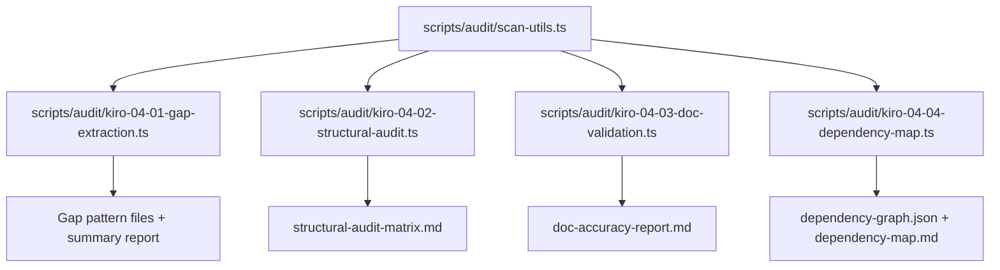

# Design Document: KIRO-04 Knowledge Base Audit

## Overview

KIRO-04 audits the output of the KIRO-03 pattern extraction phase. It consists of four sub-tasks that analyze the combined knowledge base (140 patterns across 31 module categories in two knowledge bases) and ~20 documentation files. The audit produces new gap-fill patterns, a structural consistency matrix, documentation accuracy scores, and a cross-module dependency graph.

All audit outputs are new files — existing pattern files and documentation are read-only during the audit. The audit scripts are TypeScript files executed via `tsx` that scan the file system, parse markdown, and produce structured reports.

## Architecture

The audit is organized as four independent TypeScript scripts, each corresponding to one KIRO-04 sub-task. They share a common utility layer for file system scanning and markdown parsing.



### Execution Flow

1. Each script runs independently via `npx tsx scripts/audit/<script>.ts`
2. Scripts read from `.nova/bistrolens-knowledge/` and `.nova/nova26-patterns/`
3. Scripts write outputs to `.nova/audit-reports/` (new directory)
4. Gap patterns (KIRO-04-01) are written directly into the knowledge base directories

## Components and Interfaces

### Shared Utilities (`scripts/audit/scan-utils.ts`)

```typescript
interface PatternFile {
  name: string;
  path: string;         // relative to .nova/
  module: string;       // e.g., "01-convex-patterns"
  knowledgeBase: "bistrolens" | "nova26";
  sections: string[];   // detected section headings
  relatedPatterns: string[]; // extracted from Related Patterns section
  hasCodeExamples: boolean;
  hasAntiPatterns: boolean;
  hasWhenToUse: boolean;
  hasBenefits: boolean;
}

interface Module {
  name: string;
  path: string;
  knowledgeBase: "bistrolens" | "nova26";
  patterns: PatternFile[];
}

function scanKnowledgeBases(): Module[];
function parsePatternFile(filePath: string): PatternFile;
function getMarkdownDocs(): string[];  // returns paths to .nova/*.md files
```

### KIRO-04-01: Gap Extraction (`scripts/audit/kiro-04-01-gap-extraction.ts`)

```typescript
interface GapReport {
  module: string;
  knowledgeBase: "bistrolens" | "nova26";
  existingCount: number;
  gapsFound: GapPattern[];
}

interface GapPattern {
  name: string;
  filePath: string;
  reason: string;  // why this was identified as a gap
}

function identifyGaps(module: Module): GapPattern[];
function createPatternFile(gap: GapPattern): void;
function updateIndex(knowledgeBase: string, newPatterns: GapPattern[]): void;
function generateGapReport(reports: GapReport[]): string;
```

### KIRO-04-02: Structural Audit (`scripts/audit/kiro-04-02-structural-audit.ts`)

```typescript
interface AuditCriteria {
  name: string;
  check: (pattern: PatternFile) => boolean;
}

interface ModuleAuditResult {
  module: string;
  knowledgeBase: "bistrolens" | "nova26";
  results: Record<string, "pass" | "fail">;  // criterion name -> result
  failures: string[];  // details of failures
}

const CRITERIA: AuditCriteria[] = [
  { name: "has-source-section", check: (p) => p.sections.includes("Source") },
  { name: "has-code-examples", check: (p) => p.hasCodeExamples },
  { name: "has-anti-patterns", check: (p) => p.hasAntiPatterns },
  { name: "has-when-to-use", check: (p) => p.hasWhenToUse },
  { name: "has-benefits", check: (p) => p.hasBenefits },
  { name: "has-related-patterns", check: (p) => p.relatedPatterns.length > 0 },
  { name: "kebab-case-filename", check: (p) => /^[a-z0-9]+(-[a-z0-9]+)*\.md$/.test(p.name) },
  { name: "in-index", check: (p) => /* verified against INDEX.md */ true },
];

function auditModule(module: Module): ModuleAuditResult;
function generateMatrix(results: ModuleAuditResult[]): string;
```

### KIRO-04-03: Documentation Validation (`scripts/audit/kiro-04-03-doc-validation.ts`)

```typescript
interface DocValidationResult {
  filePath: string;
  totalReferences: number;
  validReferences: number;
  staleReferences: StaleReference[];
  countMismatches: CountMismatch[];
  accuracyScore: number;  // validReferences / totalReferences
}

interface StaleReference {
  line: number;
  referenceText: string;
  expectedPath: string;
}

interface CountMismatch {
  line: number;
  statedCount: number;
  actualCount: number;
  context: string;
}

function validateDocument(filePath: string): DocValidationResult;
function generateAccuracyReport(results: DocValidationResult[]): string;
```

### KIRO-04-04: Dependency Mapping (`scripts/audit/kiro-04-04-dependency-map.ts`)

```typescript
interface DependencyNode {
  id: string;           // e.g., "bistrolens/01-convex-patterns/schema-conventions"
  name: string;
  module: string;
  knowledgeBase: "bistrolens" | "nova26";
  inDegree: number;
  outDegree: number;
}

interface DependencyEdge {
  source: string;  // node id
  target: string;  // node id
  type: "related" | "depends_on" | "alternative_to" | "extends" | "used_with";
}

interface DependencyGraph {
  nodes: DependencyNode[];
  edges: DependencyEdge[];
  islands: string[];      // node ids with 0 in-degree and 0 out-degree
  cycles: string[][];     // arrays of node ids forming cycles
  hubs: { id: string; inDegree: number }[];  // top-10 most referenced
}

function buildGraph(modules: Module[]): DependencyGraph;
function detectCycles(graph: DependencyGraph): string[][];
function findIslands(graph: DependencyGraph): string[];
function rankByInDegree(graph: DependencyGraph): { id: string; inDegree: number }[];
function generateAsciiVisualization(graph: DependencyGraph): string;
function generateJsonOutput(graph: DependencyGraph): string;
```

## Data Models

### Output File Structure

```
.nova/audit-reports/
├── kiro-04-01-gap-report.md          # Gap extraction summary
├── kiro-04-02-structural-matrix.md   # Pass/fail matrix
├── kiro-04-03-doc-accuracy.md        # Documentation accuracy scores
├── kiro-04-04-dependency-graph.json  # JSON dependency graph
└── kiro-04-04-dependency-map.md      # ASCII visualization + analysis
```

### Pattern_Template Required Sections

The structural audit checks for these sections (derived from existing pattern files):

1. `# <Pattern Name>` — top-level heading
2. `## Source` — origin of the pattern
3. `## Pattern: <name>` or `## Implementation` — description/code
4. Code blocks (` ```typescript ` or ` ```tsx `)
5. `## Anti-Patterns` — what not to do
6. `## When to Use` — applicability guidance
7. `## Benefits` — value proposition
8. `## Related Patterns` — cross-references

### Dependency Graph JSON Schema

```json
{
  "nodes": [
    { "id": "string", "name": "string", "module": "string", "knowledgeBase": "string", "inDegree": 0, "outDegree": 0 }
  ],
  "edges": [
    { "source": "string", "target": "string", "type": "string" }
  ],
  "islands": ["string"],
  "cycles": [["string"]],
  "hubs": [{ "id": "string", "inDegree": 0 }]
}
```


## Correctness Properties

*A property is a characteristic or behavior that should hold true across all valid executions of a system — essentially, a formal statement about what the system should do. Properties serve as the bridge between human-readable specifications and machine-verifiable correctness guarantees.*

### Property 1: Gap pattern template conformance

*For any* newly created gap pattern file, the file SHALL contain all required Pattern_Template sections: a top-level heading, Source, Implementation/Code Examples, Anti-Patterns, When to Use, Benefits, and Related Patterns.

**Validates: Requirements 1.2**

### Property 2: INDEX completeness

*For any* module in either knowledge base, every `.md` file in the module directory (excluding INDEX.md and EXTRACTION-*.md) SHALL have a corresponding entry in that knowledge base's INDEX.md file.

**Validates: Requirements 1.3, 2.2**

### Property 3: Manifest completeness for new patterns

*For any* newly created gap pattern file, the Unified_Manifest SHALL contain an entry with the pattern's name and file path.

**Validates: Requirements 1.4**

### Property 4: Section detection accuracy

*For any* pattern file content with a known set of present/absent sections, the section detection function SHALL correctly identify which sections are present and which are absent, and the Pass_Fail_Matrix SHALL record failures for absent required sections.

**Validates: Requirements 2.1, 2.5**

### Property 5: Kebab-case filename validation

*For any* pattern file in the knowledge bases, the filename SHALL match the pattern `^[a-z0-9]+(-[a-z0-9]+)*\.md$`.

**Validates: Requirements 2.3**

### Property 6: File path reference resolution

*For any* file path reference extracted from a documentation file, the reference SHALL either resolve to an existing file on disk or be recorded as a stale reference.

**Validates: Requirements 3.1, 3.3**

### Property 7: Count accuracy validation

*For any* numeric pattern count stated in a documentation file alongside a directory reference, the stated count SHALL equal the actual count of `.md` pattern files in that directory.

**Validates: Requirements 3.2**

### Property 8: Stale reference recording completeness

*For any* stale reference detected by the scanner, the report entry SHALL include the source file path, the line number, and the broken reference text.

**Validates: Requirements 3.4**

### Property 9: Accuracy score calculation

*For any* document validation result, the accuracy score SHALL equal `validReferences / totalReferences`, and SHALL be 1.0 when totalReferences is 0.

**Validates: Requirements 3.5**

### Property 10: Graph structural invariant

*For any* set of pattern files with Related Patterns sections, the dependency graph SHALL contain exactly one node per pattern file and exactly one directed edge per extracted reference.

**Validates: Requirements 4.1, 4.2**

### Property 11: Island detection correctness

*For any* dependency graph, every node reported as an island SHALL have inDegree = 0 and outDegree = 0, and every node with inDegree = 0 and outDegree = 0 SHALL be reported as an island.

**Validates: Requirements 4.3**

### Property 12: Cycle detection correctness

*For any* dependency graph containing a planted cycle, the cycle detector SHALL report at least one cycle that includes all nodes in the planted cycle.

**Validates: Requirements 4.4**

### Property 13: Hub ranking sort order

*For any* dependency graph, the hub ranking list SHALL be sorted in descending order by inDegree, and the top entry SHALL have the highest inDegree of all nodes.

**Validates: Requirements 4.5**

## Error Handling

| Scenario | Handling |
|---|---|
| Pattern file cannot be parsed (malformed markdown) | Log warning with file path, skip file, continue scanning. Record as "parse-error" in matrix. |
| INDEX.md is missing from a module | Log warning, record all patterns in that module as "no-index" failures. |
| Documentation file references a non-existent path | Record as stale reference with line number. Do not fail the entire scan. |
| Circular dependency detected | Record in cycles array. Do not treat as an error — cycles are expected findings. |
| File system permission error | Log error with path, skip file, continue. Include in report as "access-denied". |
| Empty module directory (no pattern files) | Record module with 0 patterns. Include in matrix with all criteria as "N/A". |

## Testing Strategy

### Property-Based Testing

Use `fast-check` as the property-based testing library. Each property test runs a minimum of 100 iterations.

Property tests focus on the core analysis functions:
- Section detection (`parsePatternFile`)
- Filename validation (kebab-case regex)
- Accuracy score calculation
- Graph operations (island detection, cycle detection, hub ranking)
- Reference extraction and resolution

Each test is tagged with: **Feature: kiro-04-audit, Property {N}: {title}**

### Unit Testing

Unit tests complement property tests for specific examples and edge cases:
- Verify a known pattern file parses correctly
- Verify a known broken reference is detected
- Verify the matrix output format matches expected markdown
- Verify JSON graph schema compliance
- Verify ASCII visualization contains expected module groupings

### Test Organization

Tests live in `scripts/audit/__tests__/` alongside the audit scripts. Run via `npx vitest --run scripts/audit/__tests__/`.
