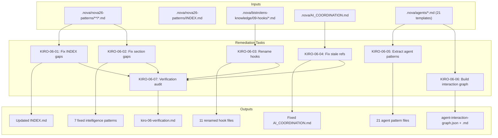

# Design Document: KIRO-06 Audit Remediation + Agent Template Extraction

## Overview

KIRO-06 remediates 87 structural audit failures identified in KIRO-05 and extends the knowledge base with agent template patterns and an interaction graph. All work produces markdown and JSON files under `.nova/` — no TypeScript source code is modified.

The sprint is organized into 7 sequential tasks:
1. Fix INDEX.md gaps (49 missing entries)
2. Fix intelligence pattern sections (28 missing sections across 7 files)
3. Rename BistroLens hook files to kebab-case (11 files)
4. Fix stale references in AI_COORDINATION.md
5. Extract patterns from 21 agent templates
6. Build agent interaction graph (JSON + markdown)
7. Re-run structural audit to verify zero failures

## Architecture

This is a documentation-only sprint. There is no runtime architecture — all artifacts are static markdown and JSON files read by humans and AI agents.



### Task Dependencies

- KIRO-06-01 through KIRO-06-04 are independent and can be done in any order
- KIRO-06-05 and KIRO-06-06 are independent of 01–04 but share the same input (agent templates)
- KIRO-06-07 depends on completion of 01–04 (remediation tasks that fix audit failures)

## Components and Interfaces

Since this sprint produces only documentation artifacts, "components" are the file structures and conventions that must be followed.

### Component 1: INDEX.md Structure

The INDEX.md file uses a table-per-category format:

```markdown
## NN — Category Name

| Pattern Name | File | Description |
|---|---|---|
| Pattern Title | `NN-category/filename.md` | One-line description |
```

With a summary table at the top:

```markdown
| # | Category | Pattern Count |
|---|----------|---------------|
| 01 | Orchestration | 10 |
```

**Interface**: Each row maps 1:1 to a `.md` file on disk. The summary count per category must equal the actual file count (excluding .gitkeep and non-pattern files).

### Component 2: Pattern File Template (8 Required Sections)

Every pattern file must contain these sections in order:

```markdown
# Pattern Title                    ← Section 1: Title (H1)
## Overview / Problem              ← Section 2: Problem/Overview
## Source                          ← Section 3: Source (file path reference)
## Pattern / Solution              ← Section 4: Solution/Pattern
## Usage / Example                 ← Section 5: Example/Usage
## Anti-Patterns                   ← Section 6: Anti-Pattern
## When to Use                     ← Section 7: When to Use
## Benefits                        ← Section 8: Benefits
```

Optional: `## Related Patterns` (not counted in the 8 required).

### Component 3: Kebab-Case Filename Convention

All pattern files must use lowercase-kebab-case:
- Valid: `use-auth.md`, `checkpoint-system.md`
- Invalid: `useAuth.md`, `CheckpointSystem.md`

Conversion rule: Insert a hyphen before each uppercase letter, then lowercase everything.
- `useAuth.md` → `use-auth.md`
- `useAuthWithRecaptcha.md` → `use-auth-with-recaptcha.md`

### Component 4: Agent Pattern File Template

Each agent pattern file in `.nova/nova26-knowledge/agents/` follows:

```markdown
# {AGENT_NAME} — {Full Title} Pattern

**Category:** agents
**Source:** `.nova/agents/{AGENT_NAME}.md`

---

## Problem
What coordination/development challenge does this agent solve?

## Solution
Role, domain, and key behaviors extracted from agent_profile.

## Constraints
What this agent NEVER does (from constraints element).

## Input/Output Flows
- **Inputs**: Data required from other agents (from input_requirements)
- **Outputs**: Artifacts produced and handoff targets (from output_format)

## Example
Concrete usage scenario from the markdown body.

## Anti-Pattern
Common misuse patterns (from constraints/never elements).

## When to Use
Situations where this agent should be invoked.

## Benefits
Value provided by this agent's specialization.
```

### Component 5: Agent Interaction Graph Schema

**JSON format** (`agent-interaction-graph.json`):

```json
{
  "nodes": [
    { "id": "SUN", "role": "Orchestrator", "domain": "Task planning..." }
  ],
  "edges": [
    { "from": "USER", "to": "SUN", "dataType": "Project descriptions, feature requests" },
    { "from": "SUN", "to": "MARS", "dataType": "Task assignments" }
  ]
}
```

**Markdown format** (`agent-interaction-graph.md`):
- ASCII visualization showing agent connections
- Edge table: From → To → Data Type
- Hub analysis: agents ranked by total connections (in-degree + out-degree)

## Data Models

This sprint has no runtime data models. The "data" is the file system structure itself:

### File Inventory

| Location | Current Count | Expected After |
|---|---|---|
| `.nova/nova26-patterns/**/*.md` (patterns only) | 51 | 51 (no new patterns, just INDEX fix) |
| `.nova/nova26-patterns/INDEX.md` entries | ~28 listed | 51 listed |
| `.nova/nova26-patterns/02-intelligence/*.md` sections | Incomplete (28 gaps) | All 7 files × 8 sections = 56 sections |
| `.nova/bistrolens-knowledge/09-hooks/*.md` | 11 (camelCase) | 11 (kebab-case) |
| `.nova/nova26-knowledge/agents/*.md` | 0 | 21 |
| `.nova/nova26-knowledge/agent-interaction-graph.json` | 0 | 1 |
| `.nova/nova26-knowledge/agent-interaction-graph.md` | 0 | 1 |
| `.nova/audit-reports/kiro-06-verification.md` | 0 | 1 |

### Naming Conventions

| Convention | Scope | Rule |
|---|---|---|
| Kebab-case filenames | All pattern files | `[a-z0-9]+(-[a-z0-9]+)*\.md` |
| Category directories | Module folders | `NN-category-name/` |
| Agent pattern files | Agent patterns | `{agent-name-lowercase}.md` |
| Commit messages | All commits | `docs(knowledge): KIRO-06-XX description` |

## Correctness Properties

*A property is a characteristic or behavior that should hold true across all valid executions of a system — essentially, a formal statement about what the system should do. Properties serve as the bridge between human-readable specifications and machine-verifiable correctness guarantees.*

Since this sprint produces only documentation artifacts (no TypeScript code), correctness properties are verified through file system checks (shell scripts or manual inspection) rather than property-based testing libraries. Each property below can be verified with simple `find`, `grep`, and `jq` commands.

### Property 1: INDEX completeness

*For any* `.md` pattern file on disk under `.nova/nova26-patterns/` (excluding INDEX.md, EXTRACTION-TASK-LIST.md, and .gitkeep), that file's relative path SHALL appear as an entry in the INDEX.md file, and the per-category count in the summary table SHALL equal the actual file count in that category directory.

**Validates: Requirements 1.3, 1.4**

Verification: `find .nova/nova26-patterns -name "*.md" -not -name "INDEX.md" -not -name "EXTRACTION-TASK-LIST.md" | while read f; do grep -q "$(basename $f)" .nova/nova26-patterns/INDEX.md || echo "MISSING: $f"; done`

### Property 2: Intelligence pattern section completeness

*For any* of the 7 intelligence pattern files in `.nova/nova26-patterns/02-intelligence/`, the file SHALL contain all 8 required section headers: a H1 title, and H2 sections for Overview/Problem, Source, Pattern/Solution, Usage/Example, Anti-Patterns, When to Use, and Benefits.

**Validates: Requirements 2.1, 2.4**

Verification: For each file, grep for the 8 required section patterns and assert all are present.

### Property 3: Kebab-case filename compliance

*For any* `.md` file in `.nova/bistrolens-knowledge/09-hooks/`, the filename SHALL match the regex `^[a-z0-9]+(-[a-z0-9]+)*\.md$` (lowercase kebab-case only).

**Validates: Requirements 3.2, 3.4**

Verification: `ls .nova/bistrolens-knowledge/09-hooks/*.md | while read f; do basename "$f" | grep -qE '^[a-z0-9]+(-[a-z0-9]+)*\.md$' || echo "NON-KEBAB: $f"; done`

### Property 4: Zero stale hook references

*For any* of the 11 original camelCase hook filenames (useAuth.md, useToast.md, etc.), zero occurrences of that filename SHALL exist in any file under `.nova/bistrolens-knowledge/`.

**Validates: Requirements 3.3**

Verification: `grep -r "useAuth\.md\|useToast\.md\|useDebounce\.md\|useFreemium\.md\|useIntersectionObserver\.md\|useLocalStorage\.md\|useMediaQuery\.md\|useSubscription\.md\|useSwipeGesture\.md\|useTierGates\.md\|useAuthWithRecaptcha\.md" .nova/bistrolens-knowledge/ && echo "STALE REFS FOUND" || echo "CLEAN"`

### Property 5: AI_COORDINATION reference validity

*For any* file path reference in `.nova/AI_COORDINATION.md`, the referenced file SHALL exist on disk.

**Validates: Requirements 4.3**

Verification: Extract all file path patterns from AI_COORDINATION.md and check each resolves to an existing file.

### Property 6: Agent pattern file completeness

*For any* of the 21 agent pattern files in `.nova/nova26-knowledge/agents/`, the file SHALL contain all required sections: Problem, Solution, Constraints, Input/Output Flows, Example, Anti-Pattern, When to Use, and Benefits.

**Validates: Requirements 5.1, 5.2, 5.3, 5.5**

Verification: For each of the 21 files, grep for required H2 section headers.

### Property 7: Agent count invariant

The count of `.md` files in `.nova/nova26-knowledge/agents/` SHALL equal exactly 21, matching the count of `.md` files in `.nova/agents/`.

**Validates: Requirements 5.6**

Verification: `[ $(ls .nova/nova26-knowledge/agents/*.md | wc -l) -eq 21 ] && echo "PASS" || echo "FAIL"`

### Property 8: Interaction graph structural validity

The JSON file `.nova/nova26-knowledge/agent-interaction-graph.json` SHALL contain a `nodes` array with exactly 21 entries, and an `edges` array where every edge object has non-empty `from`, `to`, and `dataType` fields.

**Validates: Requirements 6.2, 6.3**

Verification: `jq '.nodes | length == 21' .nova/nova26-knowledge/agent-interaction-graph.json && jq '.edges[] | select(.dataType == "" or .from == "" or .to == "")' .nova/nova26-knowledge/agent-interaction-graph.json`

## Error Handling

Since this sprint involves only file creation and modification (no runtime code), error handling is about preventing data loss and ensuring idempotent operations:

1. **File not found**: If a referenced source file doesn't exist (e.g., a Source section points to a deleted `.ts` file), document the discrepancy in the pattern file's Source section with a note rather than failing silently.

2. **Duplicate INDEX entries**: Before adding a new entry to INDEX.md, check that the filename doesn't already appear. Skip duplicates.

3. **Rename conflicts**: Before renaming a hook file to kebab-case, verify the target filename doesn't already exist. If it does, the file was likely already renamed in a previous run — skip it.

4. **Missing XML elements**: Not all 21 agent templates have all EARTH XML elements (e.g., `self_check` may be absent). When an element is missing, omit that section from the agent pattern file or note "Not specified in template."

5. **Malformed JSON**: When writing the interaction graph JSON, validate the output is parseable JSON before writing to disk.

## Testing Strategy

Since this sprint produces no executable code, traditional unit tests and property-based tests don't apply. Instead, verification is done through file system assertions that can be run as shell commands.

### Verification Script Approach

Each correctness property maps to a shell command or short script that can be run to verify the property holds. These are documented inline with each property above.

### Verification Checklist (for KIRO-06-07)

The final verification audit (KIRO-06-07) runs all 8 property checks and produces a pass/fail report:

| Check | Property | Target |
|---|---|---|
| INDEX completeness | Property 1 | 0 missing entries |
| Section completeness | Property 2 | 0 missing sections across 7 files |
| Kebab-case compliance | Property 3 | 0 non-kebab filenames |
| Stale hook references | Property 4 | 0 old camelCase references |
| AI_COORDINATION refs | Property 5 | 0 stale file references |
| Agent pattern files | Property 6 | 21 complete files |
| Agent count | Property 7 | Exactly 21 files |
| Graph validity | Property 8 | 21 nodes, all edges labeled |

### Commit Convention

Every commit in this sprint follows: `docs(knowledge): KIRO-06-XX description`

Where XX is the task number (01–07).
