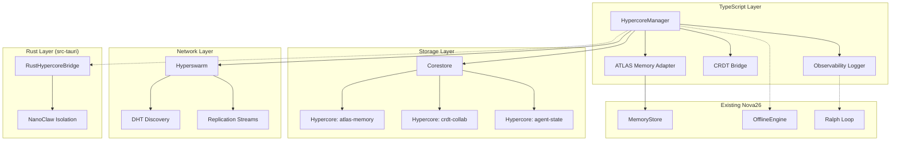

# Design Document: P2P Hypercore Protocol Integration (Reel 1)

## Overview

This design integrates Hypercore Protocol into Nova26 as a distributed P2P append-only log backbone. The integration adds a new `src/hypercore/` module that wraps Hypercore, Corestore, and Hyperswarm into a `HypercoreManager` service. This service plugs into the existing ATLAS memory system (`src/atlas/`), the offline engine (`src/sync/`), and the Tauri/Rust Eternal Engine (`src-tauri/`) via FFI bindings.

The design follows Nova26's existing patterns: singleton service with event-based lifecycle, Zod-validated data models, and integration with the Ralph Loop orchestrator. The TypeScript layer uses the `hypercore`, `corestore`, and `hyperswarm` npm packages. The Rust layer uses `hypercore` crate bindings exposed through Tauri commands.

### Key Design Decisions

1. **Corestore as multi-log manager** — Rather than managing individual Hypercore instances, we use Corestore for namespaced storage and key derivation. This aligns with how the existing MemoryStore uses a singleton pattern.
2. **Event-driven architecture** — The HypercoreManager emits typed events (ready, append, replicate, error, health-warning) that other subsystems subscribe to, matching the OfflineEngine's event pattern.
3. **Shared storage directory** — Hypercore data lives under `.nova/hypercore/` alongside the existing `.nova/offline.db`, keeping all persistent state co-located.
4. **Incremental index** — ATLAS memory queries use an in-memory index rebuilt from the log on startup, with incremental updates on append. This avoids external database dependencies.
5. **Rust FFI via Tauri commands** — The RustHypercoreBridge exposes Hypercore operations as Tauri invoke commands, keeping the bridge thin and using the existing Tauri IPC channel.

## Architecture



### Data Flow

1. **Append path**: Agent → HypercoreManager.append(logName, payload) → Corestore.get(logName) → hypercore.append(serialize(payload)) → returns sequence number → emits 'append' event → ObservabilityLogger records it
2. **Read path**: Agent → HypercoreManager.read(logName, seq) → hypercore.get(seq) → verify signature → deserialize → return payload
3. **Replication path**: HypercoreManager.enableReplication(logName) → Hyperswarm.join(discoveryKey) → on peer connect → hypercore.replicate(stream) → bidirectional sync → emits 'replicate' event
4. **ATLAS path**: ATLAS agent → ATLASMemoryAdapter.storeNode(node) → HypercoreManager.append('atlas-memory', node) → updates in-memory index
5. **CRDT path**: Local CRDT update → CRDTBridge.broadcast(update) → HypercoreManager.append('crdt-collab', update) → replication propagates to peers → remote peer emits 'crdt-update' event

## Components and Interfaces

### HypercoreManager (src/hypercore/manager.ts)

The central service managing all Hypercore instances.

```typescript
interface HypercoreManagerConfig {
  storagePath: string;          // Default: '.nova/hypercore'
  replicationEnabled: boolean;  // Default: false
  maxPayloadBytes: number;      // Default: 1_048_576 (1MB)
  healthWarningThreshold: number; // Error count threshold
  healthWarningWindowMs: number;  // Time window for threshold
}

interface HypercoreManagerEvents {
  'ready': (metadata: StorageMetadata) => void;
  'append': (logName: string, seq: number, byteLength: number) => void;
  'replicate': (logName: string, peerId: string, direction: 'send' | 'receive', bytes: number) => void;
  'crdt-update': (payload: Buffer) => void;
  'error': (logName: string, error: HypercoreError) => void;
  'health-warning': (logName: string, errorCount: number) => void;
  'peer-connect': (logName: string, peerId: string) => void;
  'peer-disconnect': (logName: string, peerId: string) => void;
}

class HypercoreManager extends TypedEventEmitter<HypercoreManagerEvents> {
  constructor(config: Partial<HypercoreManagerConfig>);
  
  // Lifecycle
  initialize(): Promise<void>;
  close(): Promise<void>;
  
  // Log management
  getLog(name: string): Promise<ManagedHypercore>;
  getStatus(): ManagerStatus;
  
  // Core operations (delegated to ManagedHypercore)
  append(logName: string, payload: Buffer): Promise<number>;
  read(logName: string, seq: number): Promise<Buffer>;
  readRange(logName: string, start: number, end: number): Promise<Buffer[]>;
  getLength(logName: string): Promise<number>;
  
  // Replication
  enableReplication(logName: string): Promise<void>;
  disableReplication(logName: string): Promise<void>;
  getReplicationStatus(logName: string): ReplicationStatus;
  
  // Metrics
  getMetrics(): AggregateMetrics;
}
```

### ManagedHypercore (src/hypercore/managed-core.ts)

Wrapper around a single Hypercore instance with signature verification and serialization.

```typescript
interface ManagedHypercore {
  readonly name: string;
  readonly publicKey: Buffer;
  readonly discoveryKey: Buffer;
  readonly length: number;
  readonly byteLength: number;
  
  append(data: Buffer): Promise<number>;
  get(seq: number): Promise<Buffer>;
  getRange(start: number, end: number): Promise<Buffer[]>;
  verifySignature(seq: number): Promise<boolean>;
  close(): Promise<void>;
}
```

### ATLASMemoryAdapter (src/hypercore/atlas-adapter.ts)

Bridges ATLAS memory operations to Hypercore storage.

```typescript
interface MemoryNodeEntry {
  id: string;
  agentSource: string;
  category: string;
  content: string;
  tags: string[];
  importance: number;
  timestamp: number;
}

interface MemoryIndex {
  byTimestamp: Map<number, number[]>;  // timestamp bucket → seq numbers
  byAgent: Map<string, number[]>;      // agent id → seq numbers
  byCategory: Map<string, number[]>;   // category → seq numbers
  totalEntries: number;
}

class ATLASMemoryAdapter {
  constructor(manager: HypercoreManager, logName?: string);
  
  storeNode(node: MemoryNodeEntry): Promise<number>;
  queryByTimeRange(start: number, end: number): Promise<MemoryNodeEntry[]>;
  queryByAgent(agentSource: string): Promise<MemoryNodeEntry[]>;
  rebuildIndex(): Promise<MemoryIndex>;
  getIndex(): MemoryIndex;
}
```

### CRDTBridge (src/hypercore/crdt-bridge.ts)

Bridges CRDT state updates to Hypercore for P2P propagation.

```typescript
interface CRDTUpdateEntry {
  sourceId: string;
  timestamp: number;
  causalClock: Record<string, number>;  // vector clock
  payload: Buffer;
}

class CRDTBridge {
  constructor(manager: HypercoreManager, logName?: string);
  
  broadcast(update: Buffer, sourceId: string): Promise<number>;
  onUpdate(handler: (entry: CRDTUpdateEntry) => void): () => void;
}
```

### ObservabilityLogger (src/hypercore/observability.ts)

Structured logging and metrics for all Hypercore operations.

```typescript
interface HypercoreLogEvent {
  operation: 'append' | 'read' | 'replicate' | 'error' | 'lifecycle';
  logName: string;
  seq?: number;
  timestamp: number;
  peerId?: string;
  direction?: 'send' | 'receive';
  byteCount?: number;
  errorMessage?: string;
}

interface AggregateMetrics {
  totalAppends: number;
  totalReads: number;
  replicationBytesTransferred: number;
  errorCount: number;
  activePeers: number;
  managedLogs: number;
  totalByteSize: number;
}

class ObservabilityLogger {
  constructor(manager: HypercoreManager);
  
  getMetrics(): AggregateMetrics;
  getRecentEvents(limit?: number): HypercoreLogEvent[];
}
```

### RustHypercoreBridge (src-tauri/src/hypercore_bridge.rs)

Rust-side Hypercore operations exposed via Tauri commands.

```rust
// Tauri commands exposed to TypeScript
#[tauri::command]
fn hypercore_append(log_name: String, data: Vec<u8>) -> Result<u64, HypercoreError>;

#[tauri::command]
fn hypercore_read(log_name: String, seq: u64) -> Result<Vec<u8>, HypercoreError>;

#[tauri::command]
fn hypercore_length(log_name: String) -> Result<u64, HypercoreError>;

// NanoClaw isolation wrapper
struct NanoClawScope {
    allowed_logs: HashSet<String>,
}

impl NanoClawScope {
    fn check_access(&self, log_name: &str) -> Result<(), HypercoreError>;
}
```

### Serialization (src/hypercore/serialization.ts)

Binary encoding/decoding for Hypercore payloads.

```typescript
// Uses a simple length-prefixed JSON encoding for Reel 1
// Future reels may switch to protobuf or msgpack

function serialize<T>(value: T): Buffer;
function deserialize<T>(data: Buffer, schema: z.ZodSchema<T>): T;
```

## Data Models

### Zod Schemas

```typescript
// src/hypercore/types.ts

import { z } from 'zod';

export const MemoryNodeEntrySchema = z.object({
  id: z.string(),
  agentSource: z.string(),
  category: z.string(),
  content: z.string(),
  tags: z.array(z.string()),
  importance: z.number().min(0).max(1),
  timestamp: z.number(),
});

export const CRDTUpdateEntrySchema = z.object({
  sourceId: z.string(),
  timestamp: z.number(),
  causalClock: z.record(z.number()),
  payload: z.instanceof(Buffer),
});

export const HypercoreLogEventSchema = z.object({
  operation: z.enum(['append', 'read', 'replicate', 'error', 'lifecycle']),
  logName: z.string(),
  seq: z.number().optional(),
  timestamp: z.number(),
  peerId: z.string().optional(),
  direction: z.enum(['send', 'receive']).optional(),
  byteCount: z.number().optional(),
  errorMessage: z.string().optional(),
});

export const StorageMetadataSchema = z.object({
  storagePath: z.string(),
  logCount: z.number(),
  totalByteSize: z.number(),
  createdAt: z.number(),
});

export const ManagerStatusSchema = z.object({
  initialized: z.boolean(),
  logCount: z.number(),
  totalByteSize: z.number(),
  replicationEnabled: z.boolean(),
  activePeers: z.number(),
});

export const ReplicationStatusSchema = z.object({
  logName: z.string(),
  localLength: z.number(),
  remoteLengths: z.record(z.number()),  // peerId → length
  activePeers: z.number(),
  bytesTransferred: z.number(),
});

export const HypercoreErrorSchema = z.object({
  code: z.enum([
    'STORAGE_INACCESSIBLE',
    'OUT_OF_RANGE',
    'PAYLOAD_TOO_LARGE',
    'SIGNATURE_INVALID',
    'REPLICATION_FAILED',
    'DESERIALIZATION_FAILED',
    'UNAUTHORIZED',
    'STORAGE_CORRUPTED',
    'IO_ERROR',
  ]),
  message: z.string(),
  logName: z.string().optional(),
  seq: z.number().optional(),
});

export type MemoryNodeEntry = z.infer<typeof MemoryNodeEntrySchema>;
export type CRDTUpdateEntry = z.infer<typeof CRDTUpdateEntrySchema>;
export type HypercoreLogEvent = z.infer<typeof HypercoreLogEventSchema>;
export type StorageMetadata = z.infer<typeof StorageMetadataSchema>;
export type ManagerStatus = z.infer<typeof ManagerStatusSchema>;
export type ReplicationStatus = z.infer<typeof ReplicationStatusSchema>;
export type HypercoreError = z.infer<typeof HypercoreErrorSchema>;
```

### Storage Layout

```
.nova/
  hypercore/
    corestore/          # Corestore managed directory
      cores/            # Individual Hypercore data files
      primary-key       # Corestore master key
    keys/               # Separate secure key storage
      atlas-memory.key
      crdt-collab.key
      agent-state.key
    replication-state.json  # Last synced seq numbers per peer
```

## Correctness Properties

*A property is a characteristic or behavior that should hold true across all valid executions of a system — essentially, a formal statement about what the system should do. Properties serve as the bridge between human-readable specifications and machine-verifiable correctness guarantees.*

### Property 1: Initialization produces ready event with valid metadata

*For any* valid HypercoreManagerConfig with an accessible storage path, calling initialize() should complete successfully and emit a 'ready' event containing a StorageMetadata object with the configured storage path and non-negative logCount and totalByteSize.

**Validates: Requirements 1.1, 1.2**

### Property 2: Close flushes all managed logs

*For any* HypercoreManager with N open logs and pending writes, calling close() should result in all logs reporting closed and zero pending writes remaining.

**Validates: Requirements 1.4**

### Property 3: Idempotent log retrieval

*For any* log name, calling getLog(name) twice on the same HypercoreManager should return the same ManagedHypercore instance (same publicKey and discoveryKey).

**Validates: Requirements 1.5**

### Property 4: Status count accuracy

*For any* sequence of N distinct getLog() calls, the ManagerStatus.logCount should equal N, and totalByteSize should equal the sum of individual log byteLengths.

**Validates: Requirements 1.6**

### Property 5: Monotonically increasing sequence numbers

*For any* Hypercore log and any sequence of K appends, the returned sequence numbers should form a strictly increasing sequence where each number equals the previous plus one.

**Validates: Requirements 2.1**

### Property 6: Append-read round trip

*For any* valid byte payload, appending it to a Hypercore log and then reading at the returned sequence number should yield a byte-identical payload.

**Validates: Requirements 2.2**

### Property 7: Range read returns correct ordered entries

*For any* Hypercore log with N appended entries and any valid range [start, end) where 0 ≤ start < end ≤ N, readRange should return exactly (end - start) entries matching the individually read entries at those positions, in order.

**Validates: Requirements 2.3**

### Property 8: Signature verification succeeds for all appended entries

*For any* entry appended to a Hypercore log, verifySignature at that entry's sequence number should return true.

**Validates: Requirements 2.5**

### Property 9: Serialization round trip

*For any* valid MemoryNodeEntry (or any Zod-validated object), serialize then deserialize should produce an object deeply equal to the original.

**Validates: Requirements 2.6**

### Property 10: ATLAS store and query correctness

*For any* set of MemoryNodeEntry objects stored via ATLASMemoryAdapter, querying by a time range [t1, t2] should return exactly those entries whose timestamp falls within [t1, t2], and querying by agentSource should return exactly those entries with matching agentSource.

**Validates: Requirements 3.1, 3.2, 3.3**

### Property 11: Index rebuild consistency

*For any* sequence of MemoryNodeEntry appends to the ATLASMemoryAdapter, the in-memory index built incrementally during appends should be deeply equal to the index produced by rebuildIndex() from the underlying Hypercore log.

**Validates: Requirements 3.5**

### Property 12: Replication completeness

*For any* Hypercore log with N entries on peer A, after a complete replication to peer B, peer B's log should have length N and each entry at position i should be byte-identical to peer A's entry at position i.

**Validates: Requirements 4.3**

### Property 13: CRDT append preservation with causal metadata

*For any* set of CRDT updates broadcast by different sources, each update should be stored as a separate entry in the collaboration log, the total entry count should equal the number of updates, and each stored CRDTUpdateEntry should contain a non-empty causalClock.

**Validates: Requirements 5.3, 5.4**

### Property 14: Cross-runtime append-read round trip

*For any* byte payload appended via the RustHypercoreBridge, reading the same sequence number via the TypeScript HypercoreManager (on the same storage) should return byte-identical data, and vice versa.

**Validates: Requirements 6.2**

### Property 15: NanoClaw isolation enforcement

*For any* NanoClawScope with a set of allowed log names, attempting to access a log name not in the allowed set should return an UNAUTHORIZED error, while accessing allowed log names should succeed.

**Validates: Requirements 6.4**

### Property 16: Offline append and read

*For any* HypercoreManager with replication disabled (simulating offline), append and read operations should succeed identically to when replication is enabled — same sequence numbers, same payloads returned.

**Validates: Requirements 7.1**

### Property 17: Incremental sync transfers only new entries

*For any* two peers where peer A has N entries synced to peer B, and peer A then appends M additional entries, replication should transfer exactly M entries (not N+M).

**Validates: Requirements 7.3**

### Property 18: Replication state persistence round trip

*For any* replication state (map of peer IDs to last synced sequence numbers), persisting it to disk and loading it back should produce a deeply equal object.

**Validates: Requirements 7.4**

### Property 19: Operation log events contain required fields

*For any* append or read operation on a Hypercore log, the emitted HypercoreLogEvent should contain a valid operation type, the correct logName, a non-negative seq (for append/read), and a positive timestamp.

**Validates: Requirements 8.1**

### Property 20: Metrics accuracy

*For any* sequence of K appends and J reads across all managed logs, getMetrics() should report totalAppends = K and totalReads = J.

**Validates: Requirements 8.3**

### Property 21: Health warning threshold

*For any* HypercoreManager configured with threshold T and window W, if T+1 errors occur for a single log within W milliseconds, a 'health-warning' event should be emitted for that log.

**Validates: Requirements 8.4**

### Property 22: Unique key generation

*For any* two distinct Hypercore logs created by the same HypercoreManager, their publicKey values should be different.

**Validates: Requirements 9.1**

### Property 23: Default access mode

*For any* newly created Hypercore log, the local peer should have read-write access (append succeeds) and the log should be configured as read-only for remote replication peers.

**Validates: Requirements 9.3**

### Property 24: Key storage separation

*For any* Hypercore log created by the HypercoreManager, the private key file should exist under the `keys/` subdirectory and should not exist within the `corestore/` subdirectory.

**Validates: Requirements 9.5**

## Error Handling

### Error Types and Codes

| Error Code | Trigger | Response |
|---|---|---|
| `STORAGE_INACCESSIBLE` | Storage path doesn't exist or no permissions | Return error with path and OS error message |
| `OUT_OF_RANGE` | Read seq >= log length | Return error with current log length |
| `PAYLOAD_TOO_LARGE` | Append payload > maxPayloadBytes | Reject append, return error with size limit |
| `SIGNATURE_INVALID` | Cryptographic verification fails on read | Return error with log name and seq |
| `DESERIALIZATION_FAILED` | Payload can't be decoded by schema | Log error, skip entry (CRDT bridge), or return error (direct read) |
| `REPLICATION_FAILED` | Stream error during replication | Log error, close stream, retry on next peer discovery |
| `UNAUTHORIZED` | NanoClaw scope violation or unauthorized peer write | Reject operation, emit security log event |
| `STORAGE_CORRUPTED` | Cryptographic verification detects tampered data | Report affected log and sequence range |
| `IO_ERROR` | Disk I/O failure during read/write | Return structured error with OS error details |

### Error Recovery Strategies

1. **Replication interruption**: Persist last confirmed seq, resume from that point on reconnect (leverages Hypercore's built-in sparse sync)
2. **Storage corruption**: Detect via signature verification, report range, allow re-replication from healthy peers
3. **CRDT deserialization failure**: Skip malformed entry, log with seq number, continue processing remaining entries
4. **Health threshold breach**: Emit warning event, allow operator to investigate; do not auto-disable the log

## Testing Strategy

### Property-Based Testing

Library: **fast-check** (already in project dependencies as `fast-check@^4.5.3`)

Each correctness property maps to a single property-based test with minimum 100 iterations. Tests are tagged with the format:

```
Feature: p2p-hypercore-protocol, Property N: [property title]
```

Test file locations:
- `src/hypercore/__tests__/manager.property.test.ts` — Properties 1-4 (lifecycle)
- `src/hypercore/__tests__/append-log.property.test.ts` — Properties 5-9 (core operations)
- `src/hypercore/__tests__/atlas-adapter.property.test.ts` — Properties 10-11 (ATLAS)
- `src/hypercore/__tests__/replication.property.test.ts` — Properties 12, 17 (replication)
- `src/hypercore/__tests__/crdt-bridge.property.test.ts` — Property 13 (CRDT)
- `src/hypercore/__tests__/rust-bridge.property.test.ts` — Properties 14-15 (Rust FFI)
- `src/hypercore/__tests__/offline.property.test.ts` — Properties 16, 18 (offline)
- `src/hypercore/__tests__/observability.property.test.ts` — Properties 19-21 (observability)
- `src/hypercore/__tests__/security.property.test.ts` — Properties 22-24 (security)

### Generators

Custom fast-check arbitraries needed:
- `arbMemoryNodeEntry()` — generates valid MemoryNodeEntry objects
- `arbCRDTUpdateEntry()` — generates valid CRDTUpdateEntry objects
- `arbPayload(maxSize)` — generates random Buffer payloads up to maxSize
- `arbLogName()` — generates valid Hypercore log names (alphanumeric + hyphens)
- `arbTimeRange()` — generates valid [start, end] timestamp pairs
- `arbNanoClawScope()` — generates NanoClaw scopes with allowed/disallowed log sets

### Unit Testing

Unit tests complement property tests for:
- Specific error conditions (edge cases from prework: 1.3, 2.4, 3.6, 5.5, 6.5, 7.5, 9.4)
- Integration points between HypercoreManager and existing OfflineEngine
- Event emission ordering and timing
- Configuration validation and defaults

Test file locations:
- `src/hypercore/__tests__/manager.test.ts`
- `src/hypercore/__tests__/serialization.test.ts`
- `src/hypercore/__tests__/atlas-adapter.test.ts`
- `src/hypercore/__tests__/crdt-bridge.test.ts`
- `src/hypercore/__tests__/observability.test.ts`

### Integration Testing

Integration tests for network-dependent behavior:
- Two-peer replication using in-process Hyperswarm test instances
- Simulated disconnect/reconnect for offline recovery
- Cross-runtime Rust↔TypeScript round trips (requires Tauri test harness)
