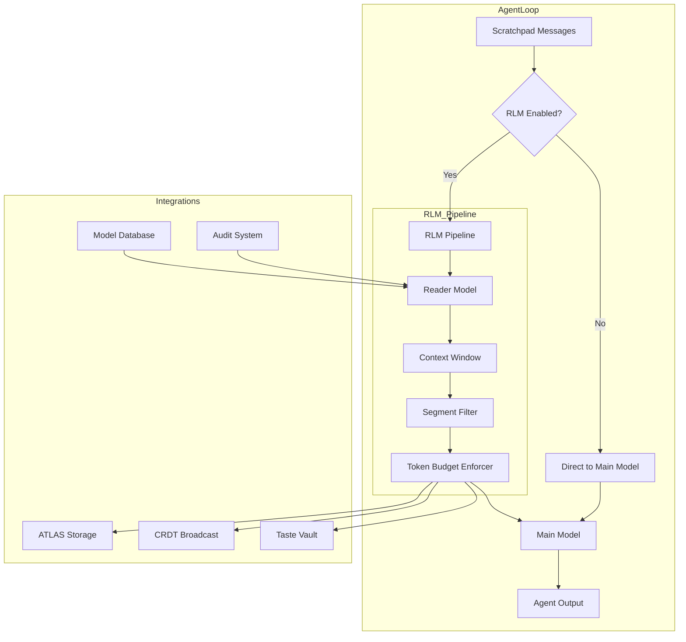

# Design Document: Recursive Language Models (RLMs)

## Overview

The RLM system introduces a two-stage inference pipeline into NOVA26's AgentLoop. A lightweight "reader" model compresses and scores conversation history before the main agent model sees it. This is implemented as a transparent middleware layer inside the existing `AgentLoop` class, so all 21 planetary agents benefit without individual code changes.

The core insight: instead of growing prompts linearly with conversation length, the reader model produces a fixed-budget compressed context window. The main model then reasons over a smaller, higher-signal input — yielding 12–18% token savings on long tasks while maintaining (or improving) recall.

### Key Design Decisions

1. **Middleware, not fork**: The RLM pipeline is injected into the AgentLoop's `callModel` path as a pre-processing step, not a separate execution path. This keeps the existing agent contract intact.

2. **Reader model is configurable**: Any model in the Model_Database with the `context-compression` capability can serve as the reader. Defaults to the cheapest qualifying model.

3. **Graceful degradation**: If the reader model fails, the pipeline falls back to uncompressed context. Agents never break because of RLM.

4. **Segment-level scoring**: The reader doesn't just summarize — it assigns a Relevance_Score to each context segment, enabling fine-grained filtering and auditing.

5. **Serializable context windows**: Compressed Context_Window objects are JSON-serializable for storage in ATLAS, transmission via CRDT, and session persistence.

## Architecture



### Data Flow

1. The `AgentLoop` collects messages in the `Scratchpad` as it does today.
2. Before calling the main model, the `RlmPipeline` intercepts the messages.
3. The pipeline sends the full message history to the configured Reader_Model.
4. The Reader_Model returns a `ContextWindow` — an array of scored, compressed segments.
5. Segments below the relevance threshold are dropped. Remaining segments are packed into the token budget.
6. The compressed context replaces the original messages for the main model call.
7. Metrics (compression ratio, drift score) are recorded for auditing.

## Components and Interfaces

### RlmPipeline

The central orchestrator. Sits between the Scratchpad and the LLM call.

```typescript
interface RlmPipelineConfig {
  enabled: boolean;
  readerModelId: string | null;       // null = auto-select cheapest
  relevanceThreshold: number;          // default 0.3, drop segments below this
  highRelevanceThreshold: number;      // default 0.7, always keep segments above this
  maxOutputTokens: number;             // token budget for compressed output
  compressionTimeoutMs: number;        // max time for reader model call
  enableAudit: boolean;                // compute drift scores
  auditSampleRate: number;             // fraction of turns to audit (0.0–1.0)
}

interface RlmPipeline {
  compress(messages: ScratchpadMessage[], config: RlmPipelineConfig): Promise<CompressionResult>;
  getConfig(): RlmPipelineConfig;
  updateConfig(partial: Partial<RlmPipelineConfig>): void;
  getAuditHistory(limit?: number): AuditEntry[];
}
```

### ContextWindow

The compressed representation produced by the reader model.

```typescript
interface ContextSegment {
  id: string;                          // unique segment identifier
  role: 'user' | 'assistant' | 'tool' | 'system';
  content: string;                     // compressed content
  originalTokens: number;              // token count before compression
  compressedTokens: number;            // token count after compression
  relevanceScore: number;              // 0.0–1.0
  sourceMessageIds: string[];          // which scratchpad messages this came from
  metadata?: Record<string, unknown>;
}

interface ContextWindow {
  segments: ContextSegment[];
  totalOriginalTokens: number;
  totalCompressedTokens: number;
  compressionRatio: number;            // original / compressed
  readerModelId: string;
  createdAt: number;                   // timestamp
  taskContext?: string;                 // optional task description for relevance scoring
}
```

### CompressionResult

Returned by the pipeline after processing.

```typescript
interface CompressionResult {
  contextWindow: ContextWindow;
  success: boolean;
  fallbackUsed: boolean;               // true if reader model failed
  compressionTimeMs: number;
  auditEntry?: AuditEntry;
}
```

### AuditEntry

Tracks compression quality over time.

```typescript
interface AuditEntry {
  turnId: string;
  timestamp: number;
  readerModelId: string;
  compressionRatio: number;
  driftScore: number;                  // 0.0 = no drift, 1.0 = total drift
  relevanceDistribution: {
    high: number;                      // count of segments >= 0.7
    medium: number;                    // count of segments 0.3–0.7
    low: number;                       // count of segments < 0.3
  };
  totalOriginalTokens: number;
  totalCompressedTokens: number;
}
```

### ReaderModelAdapter

Abstraction over the actual LLM call for the reader model. Allows swapping models without changing pipeline logic.

```typescript
interface ReaderModelAdapter {
  compress(
    messages: ScratchpadMessage[],
    taskContext: string,
    maxOutputTokens: number
  ): Promise<ContextSegment[]>;
  
  getModelId(): string;
  estimateCompressionTime(inputTokens: number): number;
}
```

### AgentLoop Integration Points

The `AgentLoop` class gains:

```typescript
// New fields on AgentLoopConfig
interface AgentLoopConfig {
  // ... existing fields ...
  rlm?: RlmPipelineConfig;            // optional RLM configuration
}

// New fields on AgentLoopResult
interface AgentLoopResult {
  // ... existing fields ...
  originalTokens?: number;             // pre-compression token count
  compressedTokens?: number;           // post-compression token count
  compressionRatio?: number;           // ratio achieved
  rlmFallbackUsed?: boolean;           // whether fallback was triggered
}
```

### Model Database Extension

The `ExtendedModelRegistry` gains a new capability tag:

```typescript
// New capability entry for reader models
{
  name: 'context-compression',
  score: 0.85  // how good this model is at compression
}
```

A helper function selects the best reader model:

```typescript
function selectReaderModel(
  registry: ExtendedModelRegistry,
  preferredId?: string | null
): ModelEntry;
```

## Data Models

### ContextWindow (Persisted)

Stored in ATLAS memory and transmitted via CRDT:

```typescript
// JSON-serializable form
interface SerializedContextWindow {
  version: 1;
  segments: Array<{
    id: string;
    role: string;
    content: string;
    originalTokens: number;
    compressedTokens: number;
    relevanceScore: number;
    sourceMessageIds: string[];
  }>;
  totalOriginalTokens: number;
  totalCompressedTokens: number;
  compressionRatio: number;
  readerModelId: string;
  createdAt: number;
  taskContext?: string;
}
```

### RLM Configuration (Convex Schema Extension)

```typescript
// Addition to convex/schema.ts
rlmConfigs: defineTable({
  companyId: v.id("companies"),
  agentName: v.optional(v.string()),   // null = global default
  enabled: v.boolean(),
  readerModelId: v.optional(v.string()),
  relevanceThreshold: v.number(),
  highRelevanceThreshold: v.number(),
  maxOutputTokens: v.number(),
  compressionTimeoutMs: v.number(),
  enableAudit: v.boolean(),
  auditSampleRate: v.number(),
  updatedAt: v.number(),
}).index("by_company", ["companyId"])
  .index("by_company_agent", ["companyId", "agentName"]),
```

### Audit Log (Convex Schema Extension)

```typescript
// Addition to convex/schema.ts
rlmAuditLogs: defineTable({
  companyId: v.id("companies"),
  turnId: v.string(),
  agentName: v.string(),
  readerModelId: v.string(),
  compressionRatio: v.number(),
  driftScore: v.number(),
  relevanceHigh: v.number(),
  relevanceMedium: v.number(),
  relevanceLow: v.number(),
  totalOriginalTokens: v.number(),
  totalCompressedTokens: v.number(),
  compressionTimeMs: v.number(),
  createdAt: v.number(),
}).index("by_company_time", ["companyId", "createdAt"])
  .index("by_agent", ["companyId", "agentName", "createdAt"]),
```

### Drift Warning Events

```typescript
interface DriftWarningEvent {
  type: 'rlm.drift.warning';
  agentName: string;
  turnId: string;
  driftScore: number;
  threshold: number;
  readerModelId: string;
  timestamp: number;
}
```


## Correctness Properties

*A property is a characteristic or behavior that should hold true across all valid executions of a system — essentially, a formal statement about what the system should do. Properties serve as the bridge between human-readable specifications and machine-verifiable correctness guarantees.*

### Property 1: Pipeline activation

*For any* set of Scratchpad messages and any AgentLoop turn where RLM is enabled, the RLM_Pipeline SHALL invoke the Reader_Model with the complete message history and the Main_Model SHALL receive the compressed output rather than the raw messages.

**Validates: Requirements 1.1, 3.1**

### Property 2: Segment relevance scores present

*For any* ContextWindow produced by the RLM_Pipeline, every ContextSegment SHALL have a relevanceScore in the range [0.0, 1.0].

**Validates: Requirements 1.2**

### Property 3: High-relevance segment preservation

*For any* set of ContextSegments produced by the Reader_Model, after the pipeline's filtering step, all segments with a relevanceScore above the highRelevanceThreshold (default 0.7) SHALL be present in the final ContextWindow.

**Validates: Requirements 1.4**

### Property 4: Fallback on reader failure

*For any* Reader_Model invocation that throws an error or exceeds the timeout, the RLM_Pipeline SHALL return a CompressionResult where `fallbackUsed` is true and the context passed to the Main_Model is identical to the original uncompressed Scratchpad messages.

**Validates: Requirements 1.5**

### Property 5: Model acceptance with capability

*For any* ModelEntry in the Model_Database that has a capability with name "context-compression", the RLM_Pipeline SHALL accept that model as a valid Reader_Model configuration.

**Validates: Requirements 2.2**

### Property 6: Auto-select cheapest reader model

*For any* set of models in the Model_Database with the "context-compression" capability, when no Reader_Model is explicitly configured, the RLM_Pipeline SHALL select the model with the lowest `inputPerMToken` pricing.

**Validates: Requirements 2.3**

### Property 7: Runtime reconfiguration

*For any* RLM_Pipeline instance, after `updateConfig` is called with a new `readerModelId`, the next call to `compress` SHALL use the newly configured Reader_Model.

**Validates: Requirements 2.4**

### Property 8: Token count tracking in results

*For any* AgentLoopResult produced when RLM is enabled, the result SHALL contain `originalTokens` and `compressedTokens` fields where `originalTokens >= compressedTokens` and both are non-negative integers.

**Validates: Requirements 3.2**

### Property 9: Bypass when disabled

*For any* AgentLoop turn where RLM is disabled (either globally or per-agent), the context passed to the Main_Model SHALL be identical to the Scratchpad messages, and the AgentLoopResult SHALL not contain RLM-specific fields.

**Validates: Requirements 3.3**

### Property 10: Budget uses compressed tokens

*For any* AgentLoop turn with RLM enabled, the token budget check SHALL use the compressed token count (not the original), so that the effective budget available to the Main_Model is based on post-compression size.

**Validates: Requirements 3.4**

### Property 11: ATLAS storage after compression

*For any* successful compression (where `fallbackUsed` is false), the RLM_Pipeline SHALL store the resulting ContextWindow in the ATLAS memory system as a retrievable entry.

**Validates: Requirements 4.1**

### Property 12: Budget compliance for retrieved context

*For any* set of historical ContextWindows retrieved from ATLAS (whether single-project or cross-project), re-compression SHALL produce a single ContextWindow whose `totalCompressedTokens` does not exceed the agent's configured `maxOutputTokens`.

**Validates: Requirements 4.2, 4.3**

### Property 13: CRDT compression before broadcast

*For any* CRDT session context update, the RLM_Pipeline SHALL compress the session history before the update is broadcast, so that participants receive compressed context rather than raw history.

**Validates: Requirements 5.1**

### Property 14: CRDT join summary

*For any* new participant joining a CRDT collaborative session, the RLM_Pipeline SHALL produce a ContextWindow that summarizes all session history up to the join timestamp.

**Validates: Requirements 5.2**

### Property 15: CRDT reconciliation picks most recent

*For any* two divergent compressed ContextWindows for the same CRDT session, reconciliation SHALL select the one with the later `createdAt` timestamp as authoritative.

**Validates: Requirements 5.3**

### Property 16: Audit entry completeness

*For any* audited compression turn, the resulting AuditEntry SHALL contain a valid `compressionRatio` (> 0), a `driftScore` in [0.0, 1.0], and a `relevanceDistribution` where `high + medium + low` equals the total number of segments.

**Validates: Requirements 7.1, 7.3**

### Property 17: Drift warning emission

*For any* AuditEntry where `driftScore` exceeds the configured threshold, the RLM_Pipeline SHALL emit a DriftWarningEvent with the correct `driftScore`, `threshold`, and `readerModelId`.

**Validates: Requirements 7.2**

### Property 18: ContextWindow serialization round-trip

*For any* valid ContextWindow object, serializing it to JSON and then deserializing the JSON back SHALL produce a ContextWindow that is deeply equal to the original.

**Validates: Requirements 9.1, 9.2, 9.3**

## Error Handling

### Reader Model Failures

| Failure Mode | Handling | Recovery |
|---|---|---|
| Reader model timeout | Fall back to uncompressed context | Log timeout, continue with next turn |
| Reader model error response | Fall back to uncompressed context | Log error, emit metric |
| Reader model returns empty segments | Use original messages as single segment | Log warning |
| Reader model returns invalid scores | Clamp scores to [0.0, 1.0] range | Log validation warning |
| Model not found in registry | Fall back to uncompressed context | Log missing model error |

### Pipeline Failures

| Failure Mode | Handling | Recovery |
|---|---|---|
| Serialization failure | Skip ATLAS storage, continue with compression | Log serialization error |
| ATLAS storage failure | Continue with compression (non-blocking) | Log storage error |
| CRDT broadcast failure | Continue locally, retry broadcast | Log broadcast error |
| Configuration parse error | Use previous valid configuration | Log config error |
| Token budget exceeded after compression | Truncate lowest-relevance segments | Log budget overflow |

### Drift and Quality

| Condition | Action |
|---|---|
| Drift score exceeds threshold | Emit DriftWarningEvent to Wellbeing system |
| Compression ratio below 1.5:1 on large contexts | Log performance warning |
| All segments scored below 0.3 | Log quality warning, consider model swap |

## Testing Strategy

### Dual Testing Approach

This feature requires both unit tests and property-based tests:

- **Unit tests**: Verify specific examples, edge cases, error conditions, and integration wiring
- **Property tests**: Verify universal properties across randomly generated inputs

### Property-Based Testing

**Library**: [fast-check](https://github.com/dubzzz/fast-check) (TypeScript property-based testing)

**Configuration**:
- Minimum 100 iterations per property test
- Each test tagged with: `Feature: recursive-language-models, Property {N}: {title}`
- Each correctness property maps to exactly one property-based test

**Generators needed**:
- `arbScratchpadMessage()`: Random ScratchpadMessage with varying roles, content lengths, and token counts
- `arbContextSegment()`: Random ContextSegment with valid relevance scores
- `arbContextWindow()`: Random ContextWindow with consistent token counts
- `arbRlmPipelineConfig()`: Random valid pipeline configurations
- `arbModelEntry()`: Random ModelEntry with optional context-compression capability
- `arbAuditEntry()`: Random AuditEntry with valid metric ranges

### Unit Test Coverage

- Reader model adapter: mock LLM responses, verify segment parsing
- Pipeline fallback: simulate timeouts and errors
- Configuration validation: invalid configs rejected
- ATLAS integration: verify storage calls
- CRDT integration: verify broadcast and join flows
- Audit history: verify limit and ordering
- Model selection: verify cheapest-model logic with known model sets

### Test Organization

Tests live alongside implementation:
- `src/rlm/rlm-pipeline.test.ts` — pipeline logic + properties
- `src/rlm/reader-adapter.test.ts` — reader model adapter
- `src/rlm/context-window.test.ts` — serialization + properties
- `src/rlm/audit.test.ts` — audit logic + properties
- `src/rlm/model-selection.test.ts` — model selection + properties
- `src/agent-loop/agent-loop-rlm.test.ts` — AgentLoop integration
