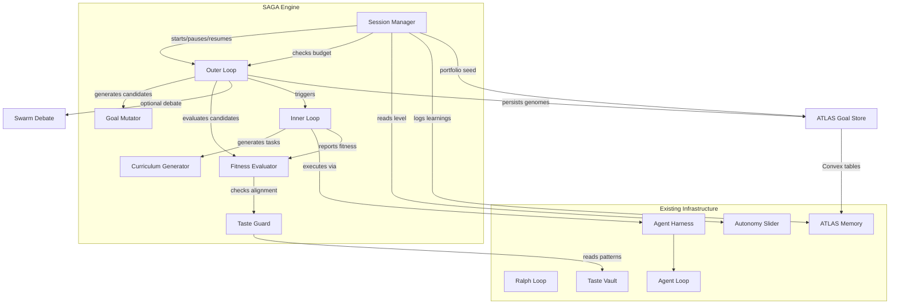
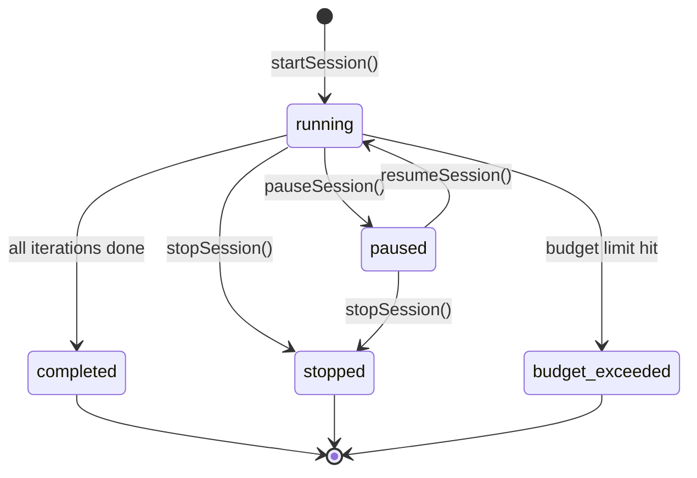

# Design Document: SAGA Self-Evolving Goal Agents

## Overview

SAGA introduces a bi-level evolutionary optimization framework into Nova26's agent architecture. The outer loop evolves agent goals (what to optimize for), while the inner loop optimizes solutions against those goals. No human training data is required — agents generate their own curricula through self-play.

SAGA sits alongside the existing Agent Harness and Ralph Loop infrastructure. It does not replace any existing agent behavior — it adds an evolutionary layer that agents can opt into via Evolution Sessions. The SAGA_Engine coordinates with the ATLAS memory system for persistence, the Taste Vault for alignment guardrails, and the Autonomy Slider for human oversight control.

### Key Design Decisions

1. **Additive, not invasive**: SAGA wraps existing agent capabilities. Agents without active Evolution Sessions behave exactly as before.
2. **Convex-first persistence**: Goal Genomes and evolution state persist to Convex tables (not local files), enabling real-time subscriptions and cross-device access. ATLAS learnings integration uses the existing `learnings` table.
3. **Population-based evolution**: Uses tournament selection with configurable population sizes (default 20, max bounded by memory). This balances exploration vs. exploitation without complex hyperparameter tuning.
4. **Taste Vault as hard constraint**: The Taste Guard is a rejection filter, not a soft penalty. Conflicting goals are excluded entirely, preventing gradual drift.
5. **Budget-first resource management**: Every Evolution Session has explicit compute time, iteration, and memory budgets. The engine checks budgets before each iteration, not after.
6. **Async, non-blocking**: All Outer Loop iterations run asynchronously. The main thread is never blocked by evolution.
7. **fast-check for property testing**: Consistent with the agent-harnesses spec and the existing vitest setup.

## Architecture



### Data Flow

1. A developer or overnight scheduler starts an Evolution Session via the Session Manager
2. Session Manager checks Autonomy Slider level and configures human-in-loop gates accordingly
3. Outer Loop loads the current Goal Genome population from ATLAS Goal Store (seeding from portfolio if configured)
4. For each generation:
   a. Goal Mutator produces candidate genomes via add/remove/perturb/recombine operations
   b. Taste Guard filters candidates against Taste Vault patterns (hard rejection)
   c. Inner Loop runs each surviving candidate: Curriculum Generator creates tasks, Agent Harness executes them
   d. Fitness Evaluator scores candidates on performance + novelty + Taste alignment
   e. If Swarm Debate is enabled (autonomy ≥ 3), top candidates go through multi-agent critique
   f. Tournament selection picks the next generation
   g. Selected genomes persist to ATLAS Goal Store
   h. Budget check — terminate if exceeded
5. On session completion, Session Manager writes summary report and logs notable discoveries to ATLAS learnings

## Components and Interfaces

### SAGAEngine

Top-level coordinator. One instance per agent that has an active Evolution Session.

```typescript
interface SAGAEngine {
  startSession(agentName: string, config: EvolutionConfig): Promise<EvolutionSession>;
  pauseSession(sessionId: string): Promise<void>;
  resumeSession(sessionId: string): Promise<EvolutionSession>;
  stopSession(sessionId: string): Promise<EvolutionSessionSummary>;
  getSession(sessionId: string): EvolutionSession | undefined;
  listSessions(): EvolutionSessionInfo[];
}

interface EvolutionConfig {
  maxIterations: number;           // Outer loop iterations
  maxComputeTimeMs: number;        // Wall-clock budget
  maxMemoryBytes: number;          // Memory budget (default 8MB)
  populationSize: number;          // Default 20
  minFitnessThreshold: number;     // Below this, increase mutation diversity
  portfolioSeedPercent: number;    // Default 0.2 (20%)
  checkpointIntervalMs: number;    // Default 600000 (10 min)
  enableSwarmDebate: boolean;      // Controlled by autonomy level
  notableFitnessThreshold: number; // Log to ATLAS learnings above this
}
```

### GoalGenome

The core data structure representing an agent's evolved objectives.

```typescript
interface GoalGenome {
  id: string;                      // Unique genome identifier
  schemaVersion: number;           // Currently 1
  agentName: string;               // Owning agent
  generation: number;              // Evolution generation counter
  parentId: string | null;         // Parent genome ID (null for seed genomes)
  objectives: ObjectiveDescriptor[];
  fitnessCriteria: FitnessCriterion[];
  createdAt: string;               // ISO timestamp
  metadata: Record<string, string>; // Extensible metadata
}

interface ObjectiveDescriptor {
  id: string;                      // Unique within the genome
  description: string;             // Human-readable objective
  domain: string;                  // e.g., "code-quality", "creativity", "efficiency"
  parameters: Record<string, number>; // Tunable parameters
  weight: number;                  // Relative importance (0-1)
}

interface FitnessCriterion {
  objectiveId: string;             // References ObjectiveDescriptor.id
  metricName: string;              // e.g., "task_success_rate", "novelty_score"
  targetValue: number;             // Goal value
  currentValue: number;            // Last measured value
}
```

### GoalMutator

Produces candidate genomes through mutation operations.

```typescript
interface GoalMutator {
  addObjective(genome: GoalGenome, objective: ObjectiveDescriptor): GoalGenome;
  removeObjective(genome: GoalGenome, objectiveId: string): GoalGenome;
  perturbObjective(genome: GoalGenome, objectiveId: string, delta: Record<string, number>): GoalGenome;
  recombine(parent1: GoalGenome, parent2: GoalGenome): GoalGenome;
  mutate(genome: GoalGenome, mutationType?: MutationType): GoalGenome;
}

type MutationType = 'add' | 'remove' | 'perturb' | 'recombine';
```

### FitnessEvaluator

Scores candidate genomes based on multiple signals.

```typescript
interface FitnessEvaluator {
  evaluate(
    genome: GoalGenome,
    innerLoopResults: InnerLoopResult,
    population: GoalGenome[],
    tastePatterns: TastePattern[]
  ): FitnessScore;
}

interface FitnessScore {
  genomeId: string;
  performanceScore: number;    // From Inner Loop results (0-1)
  noveltyScore: number;        // Distance from existing population (0-1)
  tasteAlignmentScore: number; // Compatibility with Taste Vault (0-1)
  aggregateScore: number;      // Weighted combination
  breakdown: Record<string, number>; // Per-objective scores
}

interface InnerLoopResult {
  genomeId: string;
  taskResults: CurriculumTaskResult[];
  totalDuration: number;
  iterationsCompleted: number;
  partial: boolean;            // True if budget was exceeded
}
```

### TasteGuard

Hard constraint filter against Taste Vault patterns.

```typescript
interface TasteGuard {
  check(genome: GoalGenome, patterns: TastePattern[]): TasteCheckResult;
  filterCandidates(candidates: GoalGenome[], patterns: TastePattern[]): GoalGenome[];
}

interface TasteCheckResult {
  passed: boolean;
  conflicts: TasteConflict[];
}

interface TasteConflict {
  objectiveId: string;
  patternId: string;
  reason: string;
}

interface TastePattern {
  id: string;
  canonicalContent: string;
  successScore: number;
  isActive: boolean;
  tags: string[];
}
```

### CurriculumGenerator

Creates self-generated training sequences from goal objectives.

```typescript
interface CurriculumGenerator {
  generate(genome: GoalGenome): Curriculum;
}

interface Curriculum {
  genomeId: string;
  tasks: CurriculumTask[];
  createdAt: string;
}

interface CurriculumTask {
  id: string;
  description: string;
  objectiveId: string;         // Which objective this trains
  difficulty: number;          // 0-1, progressive
  predecessorIds: string[];    // Tasks that must complete first
  status: 'pending' | 'passed' | 'failed' | 'remedial';
}

interface CurriculumTaskResult {
  taskId: string;
  objectiveId: string;
  passed: boolean;
  score: number;
  duration: number;
}
```

### SessionManager

Manages Evolution Session lifecycle, budgets, and checkpointing.

```typescript
interface SessionManager {
  create(agentName: string, config: EvolutionConfig): EvolutionSession;
  pause(sessionId: string): Promise<void>;
  resume(sessionId: string): Promise<void>;
  stop(sessionId: string): Promise<EvolutionSessionSummary>;
  checkBudget(session: EvolutionSession): BudgetStatus;
  checkpoint(session: EvolutionSession): Promise<void>;
}

interface EvolutionSession {
  id: string;
  agentName: string;
  status: 'running' | 'paused' | 'completed' | 'stopped' | 'budget_exceeded';
  config: EvolutionConfig;
  currentGeneration: number;
  population: GoalGenome[];
  bestGenome: GoalGenome | null;
  fitnessHistory: FitnessScore[][];  // Per-generation fitness scores
  startedAt: string;
  lastCheckpointAt: string | null;
  metrics: SessionMetrics;
}

interface SessionMetrics {
  outerLoopIterations: number;
  innerLoopExecutions: number;
  totalComputeTimeMs: number;
  peakMemoryBytes: number;
  candidatesGenerated: number;
  candidatesRejectedByTaste: number;
  swarmDebatesRun: number;
}

interface EvolutionSessionSummary {
  sessionId: string;
  agentName: string;
  generationsEvolved: number;
  startingBestFitness: number;
  endingBestFitness: number;
  notableDiscoveries: GoalGenome[];
  metrics: SessionMetrics;
}

interface EvolutionSessionInfo {
  id: string;
  agentName: string;
  status: string;
  currentGeneration: number;
  bestFitness: number;
  startedAt: string;
}

type BudgetStatus = 'ok' | 'time_exceeded' | 'iterations_exceeded' | 'memory_exceeded';
```

### ATLASGoalStore

Persistence layer for goal genomes, built on Convex.

```typescript
interface ATLASGoalStore {
  persistGenome(genome: GoalGenome, fitnessScore: number): Promise<void>;
  persistGeneration(genomes: GoalGenome[], fitnessScores: FitnessScore[]): Promise<void>;
  getLatestPopulation(agentName: string): Promise<GoalGenome[]>;
  getGenomesByFitness(agentName: string, minFitness: number): Promise<GoalGenome[]>;
  getGenomeByGeneration(agentName: string, generation: number): Promise<GoalGenome[]>;
  getGenomeLineage(genomeId: string): Promise<GoalGenome[]>;
  getPortfolioSeeds(excludeAgent: string, minFitness: number, limit: number): Promise<GoalGenome[]>;
  pruneOldGenomes(retentionDays: number): Promise<number>;
  persistSessionState(session: EvolutionSession): Promise<void>;
  restoreSessionState(sessionId: string): Promise<EvolutionSession | null>;
}
```

## Data Models

### Convex Schema Extension

New tables added to `convex/schema.ts`:

```typescript
// Goal Genome storage
goalGenomes: defineTable({
  genomeId: v.string(),
  schemaVersion: v.number(),
  agentName: v.string(),
  generation: v.number(),
  parentId: v.optional(v.string()),
  objectives: v.array(v.object({
    id: v.string(),
    description: v.string(),
    domain: v.string(),
    parameters: v.any(),       // Record<string, number>
    weight: v.number(),
  })),
  fitnessCriteria: v.array(v.object({
    objectiveId: v.string(),
    metricName: v.string(),
    targetValue: v.number(),
    currentValue: v.number(),
  })),
  fitnessScore: v.optional(v.number()),
  sessionId: v.optional(v.string()),
  projectId: v.optional(v.string()),
  createdAt: v.string(),
  metadata: v.optional(v.any()),
}).index('by_genome_id', ['genomeId'])
  .index('by_agent', ['agentName'])
  .index('by_agent_generation', ['agentName', 'generation'])
  .index('by_fitness', ['fitnessScore'])
  .index('by_session', ['sessionId'])
  .index('by_created', ['createdAt']),

// Evolution Session tracking
evolutionSessions: defineTable({
  sessionId: v.string(),
  agentName: v.string(),
  status: v.union(
    v.literal('running'),
    v.literal('paused'),
    v.literal('completed'),
    v.literal('stopped'),
    v.literal('budget_exceeded')
  ),
  config: v.object({
    maxIterations: v.number(),
    maxComputeTimeMs: v.number(),
    maxMemoryBytes: v.number(),
    populationSize: v.number(),
    minFitnessThreshold: v.number(),
    portfolioSeedPercent: v.number(),
    checkpointIntervalMs: v.number(),
    enableSwarmDebate: v.boolean(),
    notableFitnessThreshold: v.number(),
  }),
  currentGeneration: v.number(),
  bestGenomeId: v.optional(v.string()),
  bestFitness: v.optional(v.number()),
  startingBestFitness: v.optional(v.number()),
  metrics: v.object({
    outerLoopIterations: v.number(),
    innerLoopExecutions: v.number(),
    totalComputeTimeMs: v.number(),
    peakMemoryBytes: v.number(),
    candidatesGenerated: v.number(),
    candidatesRejectedByTaste: v.number(),
    swarmDebatesRun: v.number(),
  }),
  startedAt: v.string(),
  lastCheckpointAt: v.optional(v.string()),
  completedAt: v.optional(v.string()),
  error: v.optional(v.string()),
}).index('by_session_id', ['sessionId'])
  .index('by_agent', ['agentName'])
  .index('by_status', ['status'])
  .index('by_started', ['startedAt']),
```

### GoalGenome JSON Schema (for serialization)

```json
{
  "id": "genome-abc123",
  "schemaVersion": 1,
  "agentName": "MARS",
  "generation": 5,
  "parentId": "genome-xyz789",
  "objectives": [
    {
      "id": "obj-1",
      "description": "Maximize code correctness in generated mutations",
      "domain": "code-quality",
      "parameters": { "strictness": 0.8, "coverageWeight": 0.6 },
      "weight": 0.7
    },
    {
      "id": "obj-2",
      "description": "Minimize response latency for query handlers",
      "domain": "efficiency",
      "parameters": { "targetMs": 200 },
      "weight": 0.3
    }
  ],
  "fitnessCriteria": [
    {
      "objectiveId": "obj-1",
      "metricName": "task_success_rate",
      "targetValue": 0.95,
      "currentValue": 0.82
    },
    {
      "objectiveId": "obj-2",
      "metricName": "avg_response_ms",
      "targetValue": 200,
      "currentValue": 310
    }
  ],
  "createdAt": "2026-02-22T03:00:00Z",
  "metadata": { "source": "mutation:perturb" }
}
```

### Evolution Session State Machine




## Correctness Properties

*A property is a characteristic or behavior that should hold true across all valid executions of a system — essentially, a formal statement about what the system should do. Properties serve as the bridge between human-readable specifications and machine-verifiable correctness guarantees.*

### Property 1: Goal Genome serialization round-trip

*For any* valid GoalGenome object (with arbitrary objectives, fitness criteria, generation counter, and metadata), serializing to JSON and then deserializing should produce an equivalent GoalGenome object, including the schemaVersion field.

**Validates: Requirements 1.2, 1.3, 1.4, 1.5**

### Property 2: Inner Loop fitness summary completeness

*For any* GoalGenome with N objectives and a completed Inner Loop cycle, the produced fitness summary should contain exactly N per-objective scores (one for each objective) and a valid aggregate fitness value.

**Validates: Requirements 2.2, 2.3**

### Property 3: Outer Loop candidate generation from population

*For any* population of GoalGenomes, running an Outer Loop iteration should produce candidate genomes where each candidate is traceable to at least one parent in the input population via its parentId.

**Validates: Requirements 3.1**

### Property 4: Tournament selection preserves population size

*For any* set of scored candidate GoalGenomes and a configured population size P, tournament selection should produce exactly P genomes for the next generation, and every selected genome should have a fitness score at least as high as the lowest-scoring genome in the selection tournament.

**Validates: Requirements 3.3**

### Property 5: Lineage graph reachability

*For any* GoalGenome produced through evolution, following the chain of parentId references should eventually reach a seed genome (parentId = null) without cycles.

**Validates: Requirements 3.6**

### Property 6: Add objective mutation

*For any* GoalGenome with N objectives and any valid new ObjectiveDescriptor, applying the "add objective" mutation should produce a genome with N+1 objectives where the new objective is present.

**Validates: Requirements 4.1**

### Property 7: Remove objective mutation

*For any* GoalGenome with N > 1 objectives and any existing objective ID, applying the "remove objective" mutation should produce a genome with N-1 objectives where the removed objective is absent.

**Validates: Requirements 4.2**

### Property 8: Perturb objective mutation

*For any* GoalGenome and any existing objective ID and non-zero delta, applying the "perturb objective" mutation should produce a genome where the targeted objective has at least one modified parameter while retaining the same objective ID.

**Validates: Requirements 4.3**

### Property 9: Recombine mutation

*For any* two parent GoalGenomes, applying the "recombine" mutation should produce a child genome whose objectives are a non-empty subset of the union of both parents' objectives.

**Validates: Requirements 4.4**

### Property 10: Mutation invariants

*For any* GoalGenome and any mutation type (add, remove, perturb, recombine), the resulting genome should: (a) have generation = parent generation + 1, (b) have parentId set to the source genome's ID, (c) contain at least one objective, and (d) have no duplicate objective IDs.

**Validates: Requirements 4.5, 4.6**

### Property 11: Taste Guard filtering

*For any* GoalGenome and any set of active Taste Vault patterns, the Taste Guard should: reject genomes containing objectives that conflict with patterns having successScore > 0.5, and pass genomes whose objectives are all neutral or aligned with the patterns.

**Validates: Requirements 5.1, 5.2, 5.4**

### Property 12: Taste-rejected candidates excluded from selection

*For any* set of candidate GoalGenomes where some are rejected by the Taste Guard, the final selection pool should contain none of the rejected candidates.

**Validates: Requirements 5.3**

### Property 13: Curriculum topological ordering

*For any* GoalGenome, the generated Curriculum should have tasks ordered such that no task appears before any of its predecessors, and task difficulty should be non-decreasing.

**Validates: Requirements 6.1, 6.2**

### Property 14: Curriculum task result recording

*For any* completed Curriculum task, the SAGA_Engine should record a result containing the task ID, objective ID, a pass/fail outcome, a numeric score, and a positive duration.

**Validates: Requirements 6.3**

### Property 15: Evolution Session budget enforcement

*For any* Evolution Session with a configured budget (max iterations, max compute time, max memory), the session should terminate before exceeding any budget limit, and the final status should reflect which budget was exceeded.

**Validates: Requirements 7.3, 7.7**

### Property 16: Evolution Session pause/resume round-trip

*For any* running Evolution Session, pausing and then resuming should restore the population, generation counter, and fitness histories to their state at the time of pausing (excluding timestamps).

**Validates: Requirements 7.4, 7.5**

### Property 17: ATLAS Goal Store persistence completeness

*For any* generation of selected GoalGenomes, persisting to the ATLAS Goal Store and then querying by agent name and generation number should return all genomes with their fitness scores and parent lineage intact.

**Validates: Requirements 8.1, 8.3**

### Property 18: ATLAS Goal Store retention pruning

*For any* set of stored GoalGenomes with varying creation timestamps and a configured retention period, pruning should remove exactly those genomes older than the retention period and retain all others.

**Validates: Requirements 8.5**

### Property 19: Notable fitness logging

*For any* GoalGenome that achieves a fitness score above the configured "notable" threshold, the SAGA_Engine should log a learning entry in the ATLAS learnings table containing the genome details.

**Validates: Requirements 8.4**

### Property 20: Autonomy-level evolution gating

*For any* Evolution Session and any Autonomy Slider level: levels 1-2 should pause after every generation for human approval; level 3 should pause only when a candidate deviates significantly from the current best; levels 4-5 should run without any human approval gates. Swarm Debate should be enabled only at level 3 and above.

**Validates: Requirements 9.1, 9.5, 10.3, 10.4, 10.5**

### Property 21: Swarm Debate score incorporation

*For any* Swarm Debate result, the final fitness ranking should incorporate debate scores from all participating agents alongside Inner Loop performance and Taste alignment scores.

**Validates: Requirements 9.2, 9.3**

### Property 22: Swarm Debate consensus rejection

*For any* candidate GoalGenome that receives unanimous rejection from all Swarm Debate participants, that candidate should be excluded from the selection pool.

**Validates: Requirements 9.4**

### Property 23: Auto-checkpoint frequency

*For any* Evolution Session running longer than the configured checkpoint interval, the number of checkpoints should be at least floor(elapsed_time / checkpoint_interval).

**Validates: Requirements 10.2**

### Property 24: Overnight evolution summary completeness

*For any* completed overnight Evolution Session, the summary report should contain the starting best fitness, ending best fitness, number of generations evolved, and a list of notable discoveries.

**Validates: Requirements 10.6**

### Property 25: Portfolio seed population limit

*For any* initial population with portfolio-seeded genomes, the number of seeded genomes should not exceed the configured maximum percentage of the total population size.

**Validates: Requirements 11.3**

### Property 26: Cross-project learning logging

*For any* portfolio-seeded GoalGenome that achieves the highest fitness in the current session, the SAGA_Engine should log a cross-project learning entry in the ATLAS learnings table.

**Validates: Requirements 11.4**

### Property 27: Population size invariant

*For any* Evolution Session, the active population size should never exceed the configured maximum population size at any point during evolution.

**Validates: Requirements 12.4**

## Error Handling

### Deserialization Errors
- Unknown schema version: return descriptive error with the encountered version and the expected version range. Do not attempt partial deserialization.
- Malformed JSON: return parse error with position information. Do not silently use defaults.

### Budget Exceeded
- Time budget: terminate current Outer Loop iteration at the next checkpoint boundary, persist state, set session status to `budget_exceeded`.
- Iteration budget: same as time budget but triggered by iteration count.
- Memory budget: reduce population size to 50% of current, persist state, log `memory_pressure` warning. If still exceeded after reduction, terminate session.

### Taste Guard Conflicts
- When a candidate is rejected, log the conflict (objective ID, pattern ID, reason) to the session metrics.
- Generate a replacement mutation from the same parent. If 3 consecutive replacements are also rejected, skip that parent for the current generation.

### Inner Loop Failures
- If a Curriculum task fails, generate a remedial task. If the remedial task also fails, record a zero score for that objective and continue.
- If the entire Inner Loop fails (e.g., Agent Harness crash), record partial fitness with `partial: true` flag.

### ATLAS Goal Store Unavailability
- If Convex is unreachable during persistence, buffer the genomes in memory (up to 50 genomes) and retry on the next checkpoint.
- If the buffer fills, log a warning and drop the oldest buffered genomes.

### Swarm Debate Failures
- If a participating agent fails to respond within the debate timeout (default 30s), exclude that agent's scores and proceed with available scores.
- If fewer than 2 agents respond, skip the debate and use Fitness Evaluator scores alone.

### Evolution Stall
- If fitness does not improve for a configurable number of generations (default 5), increase mutation diversity by doubling the mutation rate and adding random seed genomes.
- Log a `stall_detected` event to the session metrics.

## Testing Strategy

### Property-Based Testing

Use `fast-check` as the property-based testing library, consistent with the agent-harnesses spec and the existing vitest setup. Each correctness property maps to a single property-based test with a minimum of 100 iterations.

Property tests should focus on:
- Serialization round-trips (Property 1)
- Mutation operations and invariants (Properties 6-10)
- Taste Guard filtering logic (Properties 11-12)
- Curriculum ordering (Property 13)
- Budget enforcement (Property 15)
- Pause/resume round-trip (Property 16)
- ATLAS store persistence and querying (Properties 17-18)
- Autonomy-level gating (Property 20)
- Tournament selection (Property 4)
- Population size invariant (Property 27)

Each test must be tagged with: **Feature: saga-self-evolving-agents, Property {N}: {title}**

### Unit Testing

Unit tests complement property tests for specific examples and edge cases:
- Schema version mismatch error handling (Req 1.6)
- Inner Loop budget exceeded producing partial results (Req 2.4)
- Low-fitness generation retention with increased diversity (Req 3.5)
- Curriculum remedial task generation on failure (Req 6.4)
- Session creation with overnight window config (Req 10.1)
- Portfolio seeding initialization (Req 11.1, 11.2)
- Memory pressure population reduction (Req 12.3)
- Swarm Debate timeout handling
- Evolution stall detection and recovery

### Integration Testing

Integration tests verify SAGA works within the broader Nova26 system:
- End-to-end evolution session: start → evolve 3 generations → stop → verify ATLAS persistence
- Overnight evolution with simulated time advancement and checkpoint verification
- Taste Vault pattern update mid-session
- Portfolio seeding from cross-project genomes
- Swarm Debate with mocked agent responses
- Ralph Loop triggering evolution via Agent Harness

### Test File Organization

```
src/saga/
  __tests__/
    goal-genome.test.ts                # Unit tests for GoalGenome
    goal-genome.property.test.ts       # Property 1: serialization round-trip
    goal-mutator.test.ts               # Unit tests for GoalMutator
    goal-mutator.property.test.ts      # Properties 6-10: mutations + invariants
    fitness-evaluator.test.ts          # Unit tests for FitnessEvaluator
    fitness-evaluator.property.test.ts # Properties 2, 4: fitness + selection
    taste-guard.test.ts                # Unit tests for TasteGuard
    taste-guard.property.test.ts       # Properties 11-12: filtering
    curriculum-generator.test.ts       # Unit tests for CurriculumGenerator
    curriculum-generator.property.test.ts # Properties 13-14: ordering + recording
    session-manager.test.ts            # Unit tests for SessionManager
    session-manager.property.test.ts   # Properties 15-16, 23, 27: budget, pause/resume, checkpoint, population
    atlas-goal-store.test.ts           # Unit tests for ATLASGoalStore
    atlas-goal-store.property.test.ts  # Properties 17-19: persistence, pruning, logging
    autonomy-gating.property.test.ts   # Property 20: autonomy-level gating
    swarm-debate.test.ts               # Unit tests for SwarmDebate
    swarm-debate.property.test.ts      # Properties 21-22: score incorporation, consensus rejection
    overnight-evolution.test.ts        # Unit tests for overnight mode
    overnight-evolution.property.test.ts # Property 24: summary completeness
    portfolio-learning.test.ts         # Unit tests for portfolio seeding
    portfolio-learning.property.test.ts # Properties 25-26: seed limit, cross-project logging
    integration/
      saga-e2e.test.ts                 # End-to-end evolution session
      saga-overnight.test.ts           # Overnight evolution integration
      saga-ralph-loop.test.ts          # Ralph Loop integration
```
