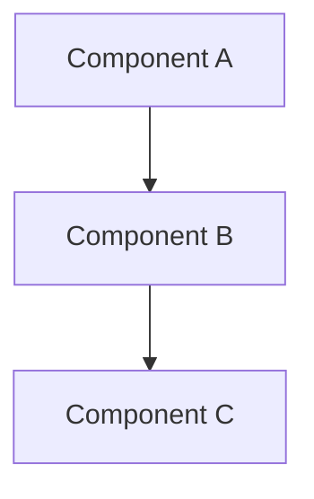
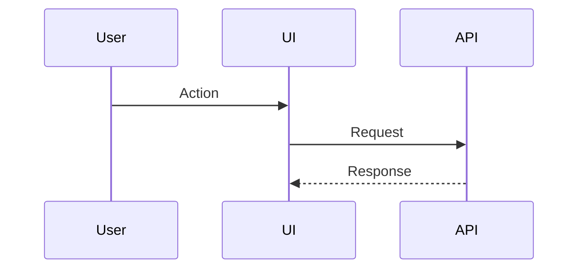

# JUPITER Style Guide - Architecture

## ADR Naming Convention
Format: `ADR-[NNN]-[kebab-case-title].md`

Examples:
- `ADR-001-state-management.md`
- `ADR-002-authentication-flow.md`
- `ADR-003-chip-calculation.md`

## ADR Required Sections
1. **Context** - What is the issue we're addressing?
2. **Decision** - What did we decide?
3. **Consequences** - What are the positive and negative impacts?
4. **Alternatives Considered** - What else did we consider?

## ADR Template
```markdown
# ADR-[NNN]: [Title]

**Date:** YYYY-MM-DD
**Status:** [Proposed | Accepted | Deprecated | Superseded]
**Supersedes:** [ADR-XXX] (if applicable)

## Context
[Problem statement]

## Decision
[What we decided]

## Consequences

### Positive
- [Benefit 1]
- [Benefit 2]

### Negative
- [Downside 1]
- [Downside 2]

## Alternatives Considered

### [Alternative A]
- Pros: ...
- Cons: ...
- Why rejected: ...

## Related
- [ADR-XXX]
- [Link to research from URANUS]
```

## Mermaid Diagram Conventions

### Component Diagram


### Data Flow


## Decision Factors to Document
- Scalability implications
- Security implications
- Performance characteristics
- Maintenance burden
- Team expertise required
- Time to implement
